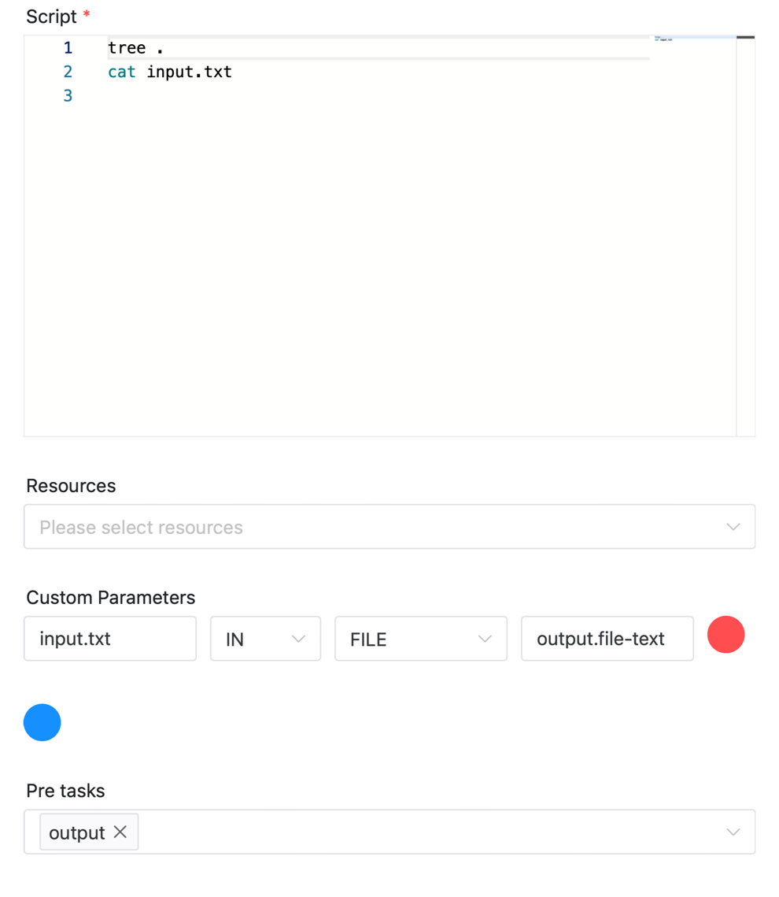

# FILE Parameter

Use the file parameter to pass files (or folders, hereinafter referred to as **files**) in the working directory of the upstream task to the downstream task in the same workflow instance. The following scenarios may be used

- In the ETL task, pass the data files processed by multiple upstream tasks to a specific downstream task.
- In the machine learning scenario, pass the data set file of the upstream data preparation task to the downstream model training task.

## Usage

### Configure file parameter

File parameter configuration method: click the plus sign on the right side of "Custom Parameters" on the task definition page to configure.

### Output file to downstream task

**Four options of custom parameters are:**

- Parameter name: the identifier used when passing tasks, such as `KEY1` and `KEY2` in the figure below
- Direction: OUT, which means outputting the file to the downstream task
- Parameter type: FILE, indicating file parameter
- Parameter value: output file path, such as `data` and `data/test2/text.txt` in the figure below

The configuration in the figure below indicates that the `output` task passes two file data to the downstream task, respectively:

- Pass out the folder `data`, and mark it as `dir-data`. The downstream task can get this folder through `output.dir-data`
- Pass out the file `data/test2/text.txt`, and mark it as `file-text`. The downstream task can get this folder through `output.file-text`


### Get the file from the upstream task

**Four options of custom parameters are:**

- Parameter name: the position where the upstream file is saved after input, such as `input_dir` used in the figure below
- Direction: IN, which means to get the file from the upstream task
- Parameter type: FILE, indicating file parameter
- Parameter value: the identifier of the upstream file, in the format of `taskName.KEY`. For example, `output.dir-data` in the figure below, where `output` is the name of the upstream task, and `dir-data` is the file identifier output by the upstream task

The configuration in the figure below indicates that the task gets the folder identified by `dir-data` from the upstream task `output` and saves it as `input_dir`


The configuration in the figure below indicates that the task gets the file identified by `file-text` from the upstream task `output` and saves it as `input.txt`



## Other

### Note

- The file transfer between upstream and downstream tasks is based on the resource center as a transfer, and the data is saved in the `DATA_TRANSFER` directory of the resource center. Therefore, **the resource center function must be enabled**, please refer to [Resource Center Configuration Details](../resource/configuration.md) for details, otherwise the file parameter function cannot be used.
- The file naming rule is `DATA_TRANSFER/DATE/ProcessDefineCode/ProcessDefineVersion_ProcessInstanceID/TaskName_TaskInstanceID_FileName`
- If the transferred file data is a folder, it will be packaged into a compressed file with a suffix of `.zip` and uploaded. The downstream task will unzip and save it in the corresponding directory after receiving it
- If you need to delete the file data, you can delete the corresponding folder in the `DATA_TRANSFER` directory of the resource center. If you delete the date subdirectory directly, all the file data under that date will be deleted. You can also use the [Open API interface](../api/open-api.md) (`resources/data-transfer`) to delete the corresponding file data (delete data N days ago).
- If there is a task chain task1->task2->tas3, then the downstream task task3 can also get the file data of task1
- Support one-to-many transmission and many-to-one transmission
- If you frequently transfer a large number of files, it is obvious that the system IO performance will be affected by the amount of transferred data

### Example

You can save the following YAML file locally and then execute `pydolphinscheduler yaml -f data-transfer.yaml` to run the Demo.

```yaml
# Define the workflow
workflow:
  name: "data-transfer"
  run: true

# Define the tasks under the workflow
tasks:
  - name: output
    task_type: Shell
    command: |
      mkdir -p data/test1 data/test2
      echo "test1 message" >> data/test1/text.txt
      echo "test2 message" >> data/test2/text.txt
      tree .
    local_params:
      - { "prop": "dir-data", "direct": "OUT", "type": "FILE", "value": "data" }
      - { "prop": "file-text", "direct": "OUT", "type": "FILE", "value": "data/test2/text.txt" }

  - name: input_dir
    task_type: Shell
    deps: [output]
    command: |
      tree .
      cat input_dir/test1/text.txt
      cat input_dir/test2/text.txt
    local_params:
      - { "prop": "input_dir", "direct": "IN", "type": "FILE", "value": "output.dir-data" }


  - name: input_file
    task_type: Shell
    deps: [output]
    command: |
      tree .
      cat input.txt
    local_params:
      - { "prop": "input.txt", "direct": "IN", "type": "FILE", "value": "output.file-text" }
```

