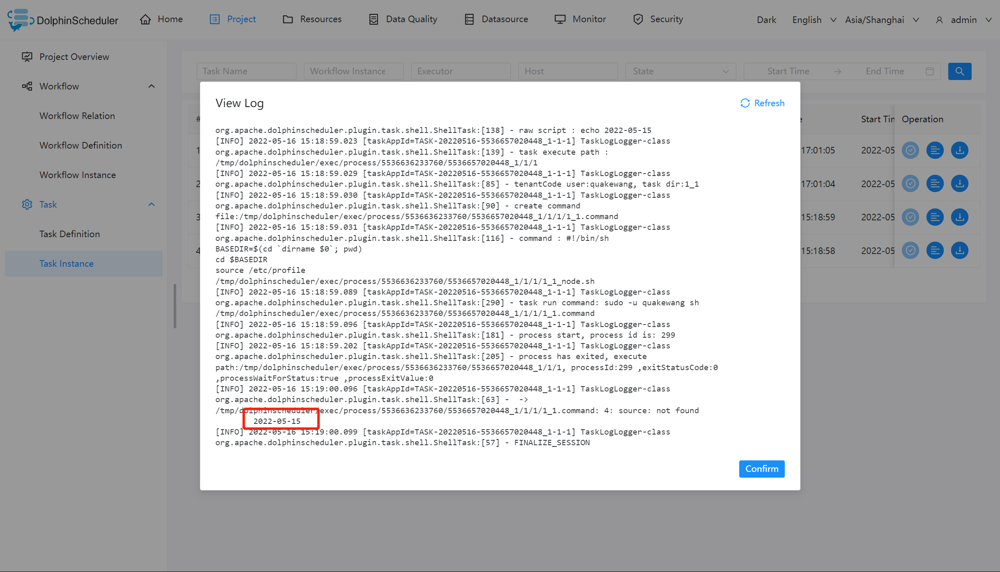

# Global Parameter

## Scope

Global parameters can be configured on the workflow definition page.

The `IN` direction parameter is valid for all task nodes of the entire workflow.

The `OUT` direction parameter is the output parameter of the workflow and passed to the downstream task of the corresponding SubProcess task in the parent workflow.

## Usage

The specific use method can be determined according to the actual production situation. This example uses a shell task to print out the date value of yesterday.

## Example

### Create a Shell task

Create a shell task and enter `echo ${dt}` in the script content. In this case, dt is the global parameter we need to declare. As shown below:

### Save the workflow and set global parameters

Set global parameter: On the workflow definition page, click the plus sign to the right of "Set Global", after filling in the variable name and value, select the appropriate parameter value type, save it.

> Note: The dt parameter defined here can be referenced by the local parameters of any other node.

### In task instance view execution result

On the task instance page, you can check the log to verify the execution result of the task and determine whether the parameters are valid.

