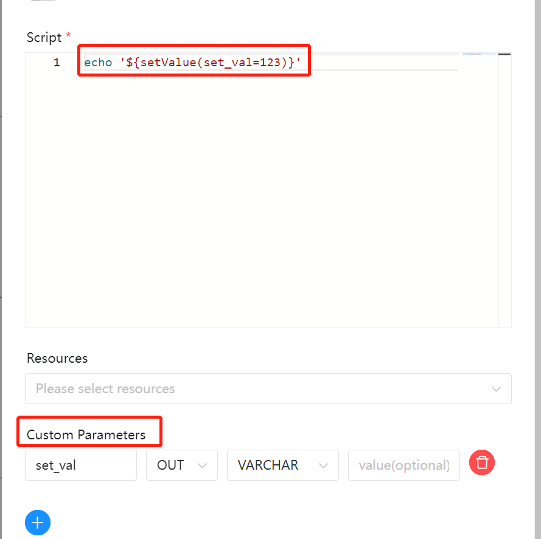

# Local Parameter

## Scope

Parameters configured on the task definition page, the scope of this parameter is inside this task only. But if you configure according to [Refer to Parameter Context](context.md), it could pass to downstream tasks.

## Usage

* If you want to use parameter in single task, see [local parameter with custom parameter](#use-local-parameter-by-custom-parameter).
* If you want to use set parameter in task and use them in downstream tasks:
  * For simple use without using custom parameter, see [export parameter via `setValue`](#export-local-parameter-by-setvalue).
  * Using custom parameter, see [export parameter via `setValue` and custom parameter](#export-local-parameter-by-setvalue-and-custom-parameter).
  * Using bash variable, see [export parameter via `setValue` and bash variable](#export-local-parameter-by-setvalue-and-bash-variable).

Usage of local parameters is: at the task define page, click the '+' beside the 'Custom Parameters' and fill in the key and value to save.

## Examples

### Use Local Parameter by Custom Parameter

This example shows how to use local parameters to print the current date.

Create a Shell task and write a script with the content `echo ${dt}`. Click **custom parameter** in the configuration bar, and the configuration is as follows:


Parameters:

- dt: indicates the parameter name.
- IN: IN indicates that local parameters can only be used on the current node, and OUT indicates that local parameters can be transmitted to the downstream.
- DATE: indicates the DATE of the data type.
- $[YYYY-MM-DD] : indicates a built-in parameter derived from a user-defined format.

Save the workflow and run it. View log of Shell task.


> Note: The local parameter can be used in the workflow of the current task node. If it is set to OUT, it can be passed to the downstream workflow. Please refer to: [Parameter Context](context.md).

### Export Local Parameter by `setValue`

If you want to simple export parameters and then use them in downstream tasks, you could use `setValue` in your task. And you can manage your parameters into one single task. You can use syntax `echo '${setValue(set_val=123)}'`(**do not forget the single quote**) in Shell task and add new `OUT` custom parameter to export it.



You can get this value in downstream task using syntax `echo '${set_val}'`.

### Export Local Parameter by `setValue` and Custom Parameter

If you want to export parameters with custom parameter instead of constants value, and then use them in downstream tasks,
you could use `setValue` in your task, which easier to maintain by change "custom parameter" block when you want to
change its value. You can use syntax `echo "#{setValue(set_val_param=${val})}"`(**do not forget the double quote, if you are
using any variable with `setValue`**) in Shell task and add new `IN` custom parameter for input variable `val` and `OUT` custom
parameter for exporting parameter `set_val_param`.


You could get this value in downstream task using syntax `echo '${set_val_param}'`.

### Export Local Parameter by `setValue` and Bash Variable

If you want to export parameters with bash variable instead of constants value, and then use them in downstream tasks,
you could use `setValue` in your task, which more flexible such as you can get variable for exists local or HTTP resource.
You can use syntax like

```shell
lines_num=$(wget https://raw.githubusercontent.com/apache/dolphinscheduler/dev/README.md -q -O - | wc -l | xargs)
echo "#{setValue(set_val_var=${lines_num})}"
```

in Shell task(**do not forget the double quote, if you are using any variable with `setValue`**) and add `OUT` custom parameter
for exporting parameter `set_val_var`
.


You could get this value in downstream task using syntax `echo '${set_val_var}'`.
