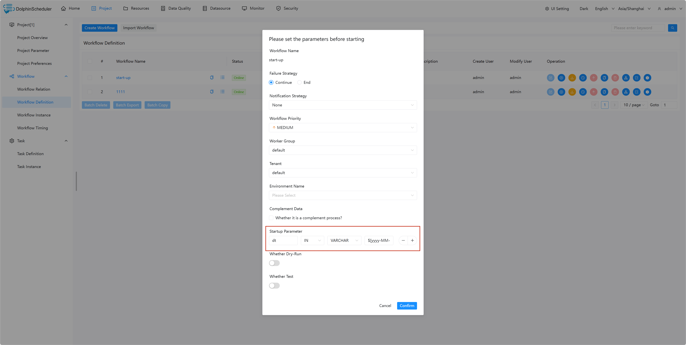
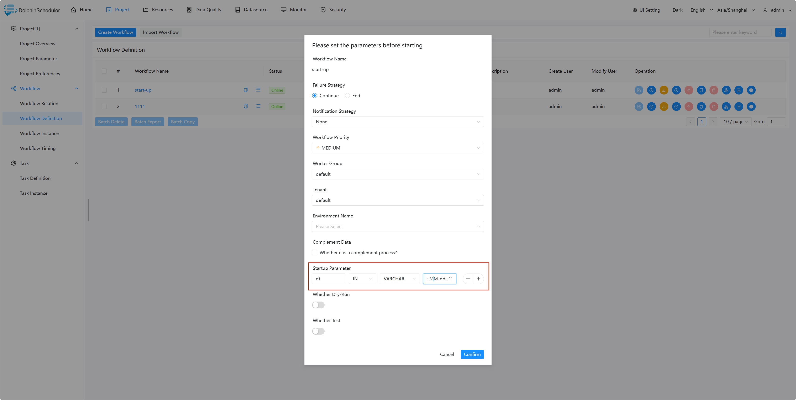

# Startup Parameter

## Scope

Parameters are valid for all task nodes of the entire workflow. It can be configured on the task launch page.

## Usage

Usage of startup parameters is: at the task launch page, click the '+' below the 'Startup Parameter' and fill in the key and value, select the appropriate parameter value type then to save. The workflow will add them into global parameters.

## Example

This example shows how to use startup parameters to print different date.

### Create a Shell task

Create a shell task and enter `echo ${dt}` in the script content. In this case, dt is the global parameter we need to declare. As shown below:

### Save the workflow and set startup parameters in task launch page

Set startup parameter as follows:

> Note: The dt parameter defined here can be referenced by the local parameters of any other node.

### In task instance view execution result

On the task instance page, you can check the log to verify the execution result of the task and determine whether the parameters are valid.

### Set different startup parameter and run again

### In task instance view execution result

You can check the log to verify whether the shell task output different dates.

