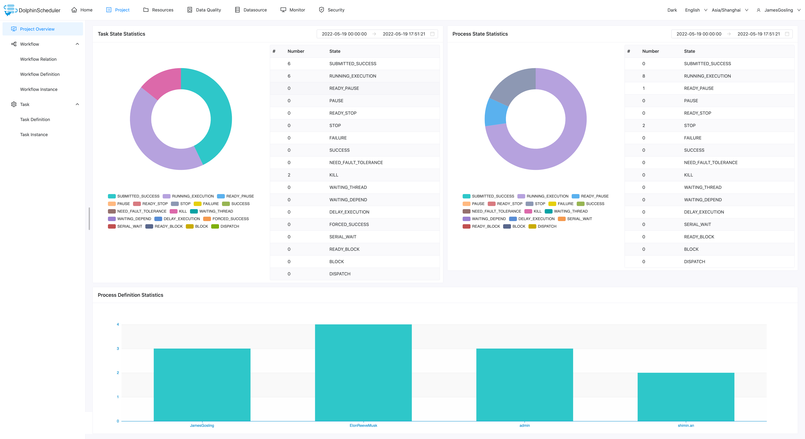

# Project

This page describes details regarding Project screen in Apache DolphinScheduler. Here, you will see all the functions which can be handled in this screen. The following table explains commonly used terms in Apache DolphinScheduler:

|      Glossary       |                                                                                                                                                        description                                                                                                                                                        |
|---------------------|---------------------------------------------------------------------------------------------------------------------------------------------------------------------------------------------------------------------------------------------------------------------------------------------------------------------------|
| DAG                 | Tasks in a workflow are assembled in form of Directed Acyclic Graph (DAG). A topological traversal is performed from nodes with zero degrees of entry until there are no subsequent nodes.                                                                                                                                |
| Workflow Definition | Visualization formed by dragging task nodes and establishing task node associations (DAG).                                                                                                                                                                                                                                |
| Workflow Instance   | Instantiation of the workflow definition, which can be generated by manual start or scheduled scheduling. Each time the process definition runs, a workflow instance is generated.                                                                                                                                        |
| Workflow Relation   | Shows dynamic status of all the workflows in a project.                                                                                                                                                                                                                                                                   |
| Task                | Task is a discrete action in a Workflow. Apache DolphinScheduler supports SHELL, SQL, SUB_PROCESS (sub-process), PROCEDURE, MR, SPARK, PYTHON, DEPENDENT ( depends), and plans to support dynamic plug-in expansion, (SUB_PROCESS). It is also a separate process definition that can be started and executed separately. |
| Task Instance       | Instantiation of the task node in the process definition, which identifies the specific task execution status.                                                                                                                                                                                                            |

## Project List

On the project screen, list of all the existing projects along with details like name, owner, workflow definition, process instance, create and update time. This page also facilitates operations like create, edit, and delete project.

## Create Project

- Click `Project Management` to enter the project management page, click the `Create Project` button, enter the project name, project description, and click "Submit" to create a new project.

## Project Overview

- Click the project name link on the project management page to enter the project home page, as shown in the figure below, the project home page contains the task status statistics, process status statistics, and workflow definition statistics of the project. The introduction for those metrics:
- Task status statistics: Within the specified time range, count the number of task instances status as successful submission, running, ready to pause, pause, ready to stop, stop, failure, success, need fault tolerance, kill and waiting threads
- Process status statistics: Within the specified time range, count the number of workflow instances status as submission success, running, ready to pause, pause, ready to stop, stop, failure, success, need fault tolerance, kill and waiting threads
- Workflow definition statistics: Count the workflow definitions created by this user and granted by the administrator

