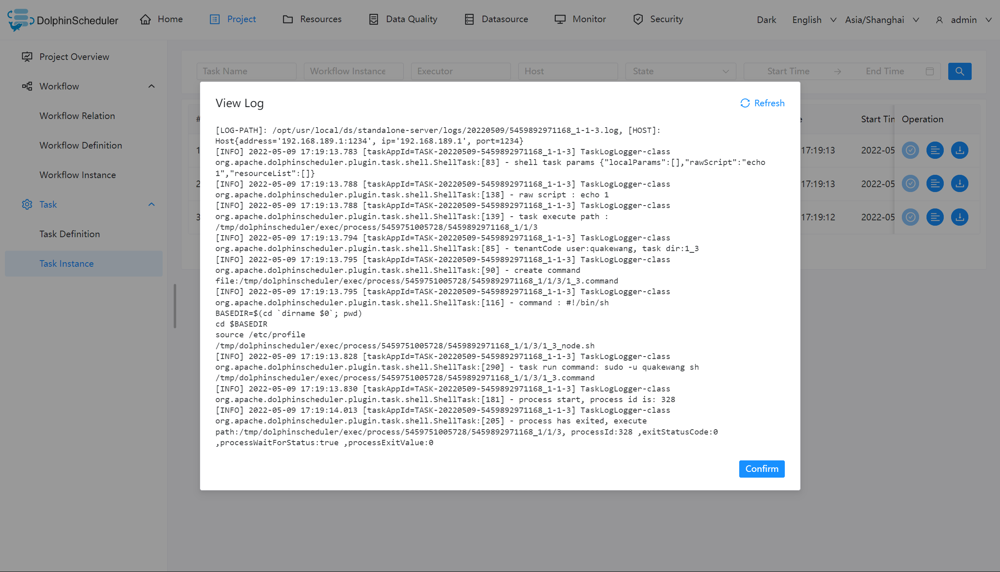

# Task Instance

## Create Task Instance

Click `Project Management -> Workflow -> Task Instance` to enter the task instance page, as shown in the figure below, click the name of the workflow instance to jump to the DAG diagram of the workflow instance to view the task status.

## View Log

Click the `View Log` button in the operation column to view the log of the task execution

