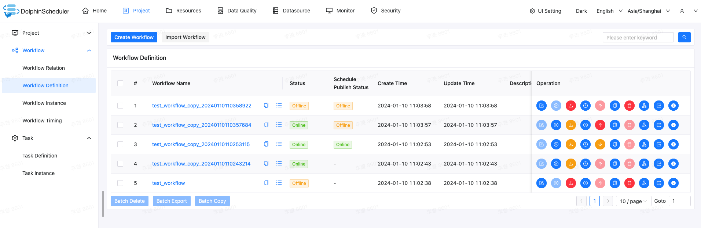
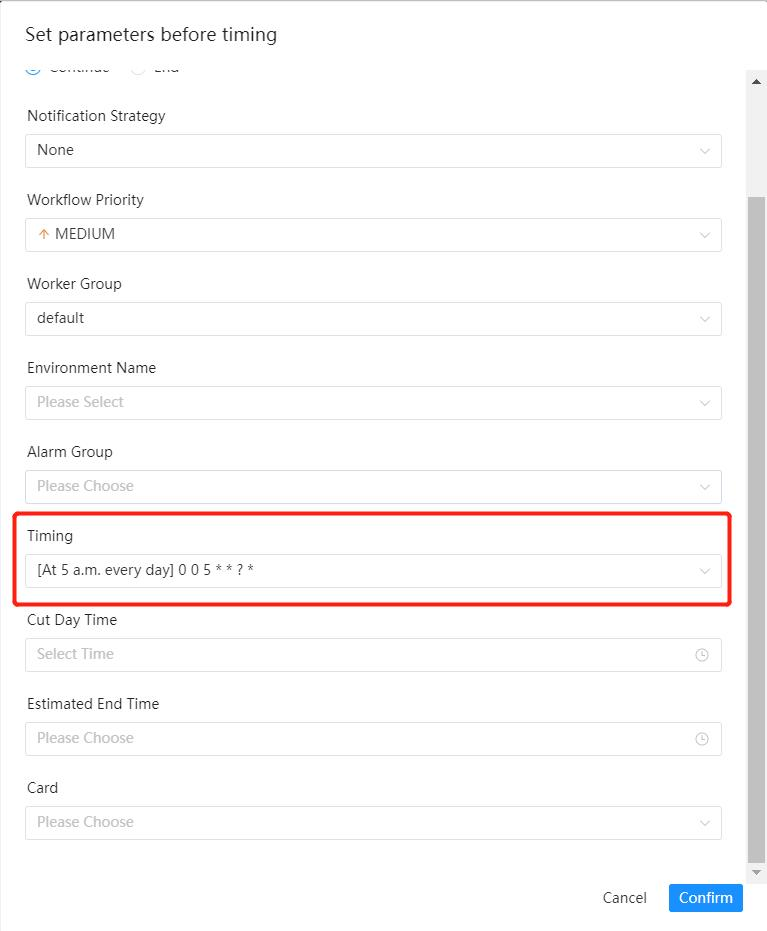

# Workflow Definition

## Overview

Work Definition screen shows list of existing workflows and utility to create or import workflows.

## Create workflow definition

Click `Project Management -> Workflow -> Workflow Definition`, enter the `Workflow Definition` page, and click the `Create Workflow` button to enter the **workflow DAG edit** page, as shown in the following figure:

### Create Tasks to Workflow

Drag from the toolbar  to the canvas, to add a shell task to the canvas, as shown in the figure below:

**Add parameter settings for shell task:**

1. Fill in the `Node Name`, `Description` and `Script` fields.
2. Check `Normal` for `Run Flag`. If `Prohibit Execution` is checked, the task will not execute when the workflow runs.
3. Select `Task Priority`: when the number of worker threads is insufficient, high priority tasks will execute first in the execution queue, and tasks with the same priority will execute in the order of first in, first out.
4. Timeout alarm (optional): check the timeout alarm, timeout failure, and fill in the "timeout period". When the task execution time exceeds **timeout period**, an alert email will send and the task timeout fails.
5. Resources (optional). Resources are files created or uploaded in the `Resource Center -> File Management` page. For example, the file name is `test.sh`, and the command to use the resource in the script is `sh test.sh`. Please note that you need to use the full path to the resource files.
6. Customize parameters (optional).
7. Click the `Confirm Add` button to save the task settings.

### Set dependencies between tasks

Click the plus sign on the right of the task node to connect the task; as shown in the figure below, task Node_B and task Node_C execute in parallel, When task Node_A finished execution, tasks Node_B and Node_C will execute simultaneously.

### Dependencies with stream task

If the DAG contains stream tasks, the relationship between stream tasks is displayed as a dotted line, and the execution of stream tasks will be skipped when the workflow instance is executed.

**Delete dependencies:** Using your mouse to select the connection line, and click the "Delete" icon in the upper right corner , delete dependencies between tasks.

### Save workflow definition

Click the `Save` button, and the "Set DAG chart name" window pops up, as shown in the figure below. Enter the workflow definition name, workflow definition description, and set global parameters (optional, refer to [global parameters](../parameter/global.md)), click the `Add` button to finish workflow definition creation.

### Configure workflow (process) execution type

Click the `Save` button and configure `process execution type` in the pop-up window. There are four process execution types:

- `Parallel`: If there are multiple instances of the same workflow definition, execute the instances in parallel.
- `Serial Wait`: If there are multiple instances of the same workflow definition, execute the instances in serial.
- `Serial Discard`: If there are multiple instances of the same workflow definition, discard the later ones and kill the current running ones.
- `Serial Priority`: If there are multiple instances of the same workflow definition, execute the instances according to the priority in serial.

## Workflow Definition Operation Function

Click `Project Management -> Workflow -> Workflow Definition` to enter the workflow definition page, as shown below:

### Actions Supported by a Single Workflow

- **Edit:** Only "Offline" workflow definitions can be edited. Workflow DAG editing is the same as [Create Workflow Definition](#create-workflow-definition)
- **Online:** When the workflow status is "Offline", used to make workflow online. Only the workflow in the "Online" state can run, but cannot edit.
- **Offline:** When the workflow status is "Online", used to make workflow offline. Only the workflow in the "Offline" state can be edited, but cannot run.
- **Run:** Only workflow in the online state can run. See [Run Workflow](#run-the-workflow) for the operation steps.
- **Timing:** Timing can only set to online workflows, and the system automatically schedules to run the workflow on time. The status after creating a timing setting is "offline", and the timing must set online on the timing management page to make effect. See [Workflow Timing](#workflow-schedule) for timing operation steps.
- **Timing Management:** The timing management page can edit, online or offline and delete timing.
- **Delete:** Delete the workflow definition. In the same project, only the workflow definition created by yourself can be deleted, and the workflow definition of other users cannot be deleted. If you need to delete it, please contact the user who created it or the administrator.
- **Download:** Download workflow definition to local.
- **Copy:** Under the current project, copy a new workflow based on the current workflow, and the name of the new workflow will be suffixed with `_copy_<date>` on the basis of the original workflow name.
- **Export:** Export workflow definition json file.
- **Version Info:** View the workflow version information, and switch the workflow version in the version information list.
- **Tree Diagram:** Display the task node type and task status in a tree structure, as shown in the figure below:

### Workflow batch operations

After selecting multiple workflows, you can perform batch operations at the bottom of the workflow definition list, as follows:

- **Batch Delete:** Batch delete multiple workflow definitions.
- **Batch Export:** Batch export multiple workflow definitions to a json file.
- **Batch Copy:** Batch copy multiple workflow definitions, you can choose under which project to generate the copied workflow.

## Run the Workflow

- Click `Project Management -> Workflow -> Workflow Definition` to enter the workflow definition page, as shown in the figure below, click the "Go Online" button to make workflow online.

- Click the `Run` button to pop up the startup parameter setting window, as shown in the figure below, set the startup parameters, click the `Run` button in the pop-up box, the workflow starts running, and the workflow instance page generates a workflow instance.

Description of workflow operating parameters:

* Failure strategy: When a task node fails to execute, other parallel task nodes need to execute this strategy. "Continue" means: after a certain task fails, other task nodes execute normally; "End" means: terminate all tasks execution, and terminate the entire process.
* Notification strategy: When the process is over, send the process execution result notification email according to the process status, options including no send, send if success, send of failure, send whatever result.
* Process priority: The priority of process operation, divide into five levels: highest (HIGHEST), high (HIGH), medium (MEDIUM), low (LOW), and lowest (LOWEST). When the number of master threads is insufficient, high priority processes will execute first in the execution queue, and processes with the same priority will execute in the order of first in, first out.
* Worker group: The process can only be executed in the specified worker machine group. The default is `Default`, which can execute on any worker.
* Notification group: select notification strategy||timeout alarm||when fault tolerance occurs, process result information or email will send to all members in the notification group.
* Recipient: select notification policy||timeout alarm||when fault tolerance occurs, process result information or alarm email will be sent to the recipient list.
* Cc: select notification policy||timeout alarm||when fault tolerance occurs, the process result information or warning email will be copied to the CC list.
* Startup parameter: Set or overwrite global parameter values when starting a new process instance.
* Complement: refers to running the workflow definition within the specified date range and generating the corresponding workflow instance according to the complement policy. The complement policy includes two modes: **serial complement** and **parallel complement**. The date can be selected on the page or entered manually.
  * Serial complement: within the specified time range, complement is executed from the start date to the end date, and multiple process instances are generated in turn; Click Run workflow and select the serial complement mode: for example, from July 9 to July 10, execute in sequence, and generate two process instances in sequence on the process instance page.

    

  * Parallel Replenishment: within the specified time range, replenishment is performed simultaneously for multiple days, and multiple process instances are generated at the same time. Enter date manually: manually enter a date in the comma separated date format of 'yyyy MM DD hh:mm:ss'.Click Run workflow and select the parallel complement mode: for example, execute the workflow definition from July 9 to July 10 at the same time, and generate two process instances on the process instance page at the same time.

    

  * Concurrency: refers to the maximum number of instances executed in parallel in the parallel complement mode.For example, if tasks from July 6 to July 10 are executed at the same time, and the concurrency is 2, then the process instance is:

    

    

  * Dependency mode: whether to trigger the replenishment of workflow instances that downstream dependent nodes depend on the current workflow (the timing status of workflow instances that require the current replenishment is online, which will only trigger the replenishment of downstream directly dependent on the current workflow).

    

  * Date selection:

    1. Select the date through the page:

    

    2. Manual input:

    

  * Relationship between complement and timing configuration:

    1. Unconfigured timing: When there is no timing configuration, the daily replenishment will be performed by default according to the selected time range. For example, the workflow scheduling date is July 7 to July 10. If timing is not configured, the process instance is:

    

    2. Configured timing: If there is a timing configuration, it will be supplemented according to the selected time range in combination with the timing configuration. For example, the workflow scheduling date is July 7 to July 10, and the timing is configured (running every 5 a.m.). The process example is:

    

    

## Run the task alone

- Right-click the task and click the `Start` button (only online tasks can be clicked to run).

- The startup parameter setting dialog box is displayed, and the parameter description is the same as [run the workflow](#run-the-workflow).

## Workflow Schedule

- Create schedule: Click `Project Management -> Workflow-> Workflow Definition`, enter the workflow definition page, make the workflow online, click the "timing" button  , the timing parameter setting dialog box pops up, as shown in the figure below:

  

- Select a start and end time. Within the start and end time range, the workflow is run regularly; outside the start and end time range, no timed workflow instance will be generated.

- Add a timing that execute 5 minutes once, as shown in the following figure:

  

- Failure strategy, notification strategy, process priority, worker group, notification group, recipient, and CC are the same as workflow running parameters.

- Click the "Create" button to create the timing. Now the timing status is "**Offline**" and the timing needs to be **Online** to make effect.

- Schedule online: Click the `Timing Management` button , enter the timing management page, click the `online` button, the timing status will change to `online`, as shown in the below figure, the workflow makes effect regularly.

  

## Import Workflow

Click `Project Management -> Workflow -> Workflow Definition` to enter the workflow definition page, click the `Import Workflow` button to import the local workflow file, the workflow definition list displays the imported workflow and the status is offline.
