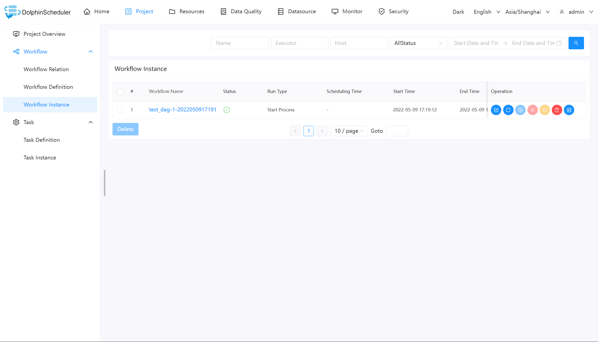
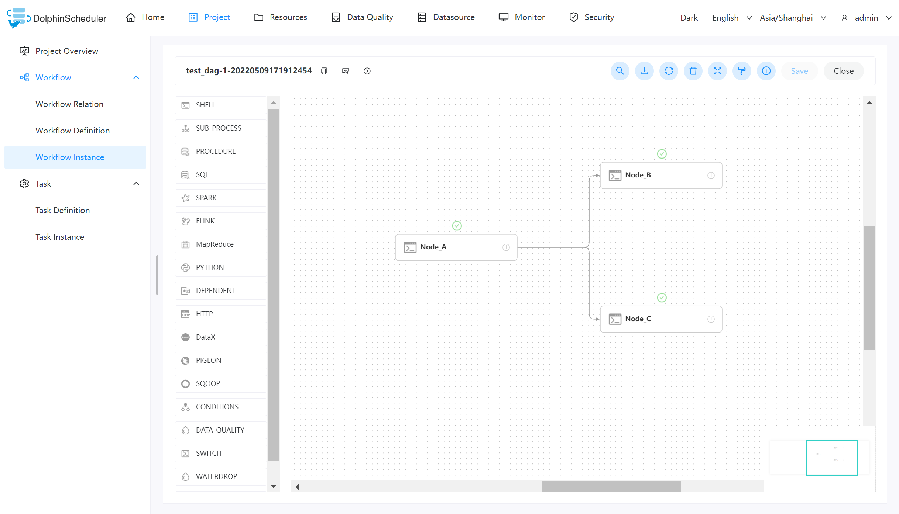
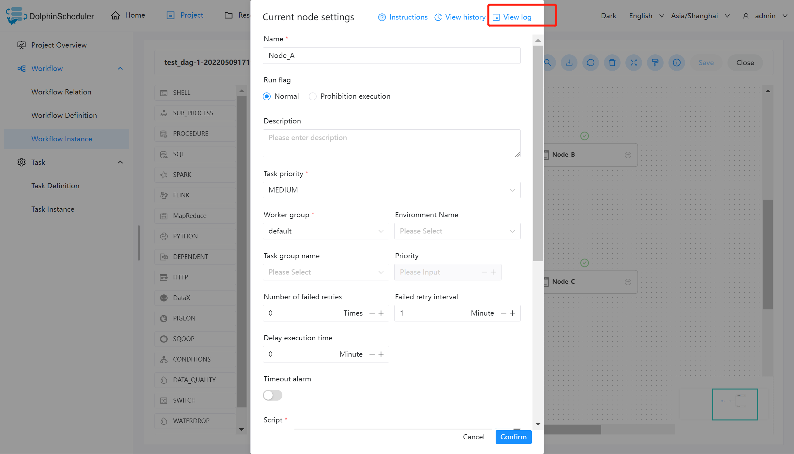
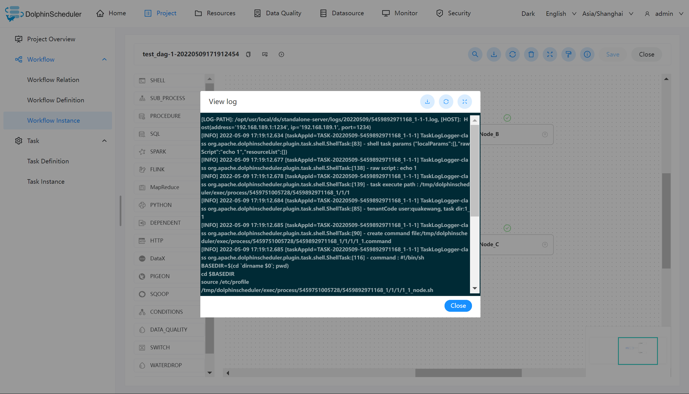
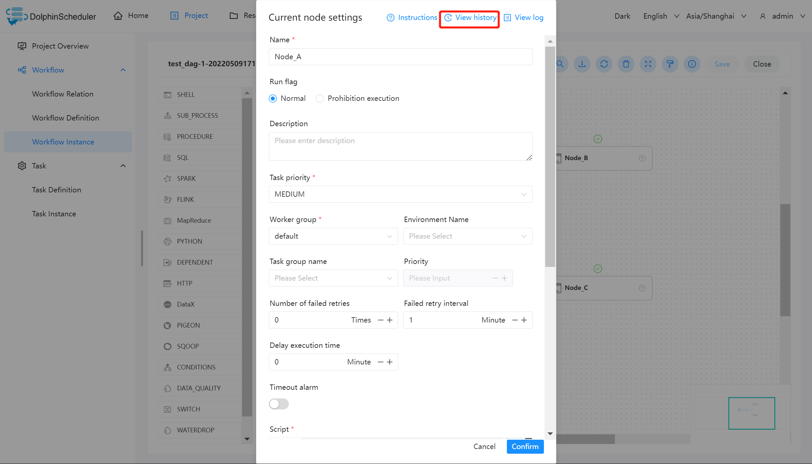
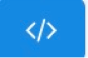
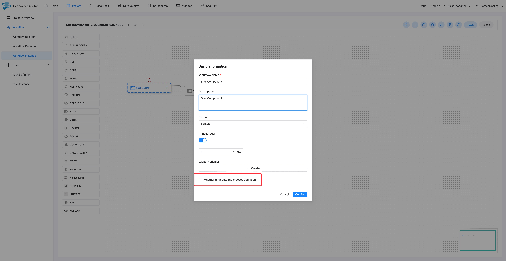
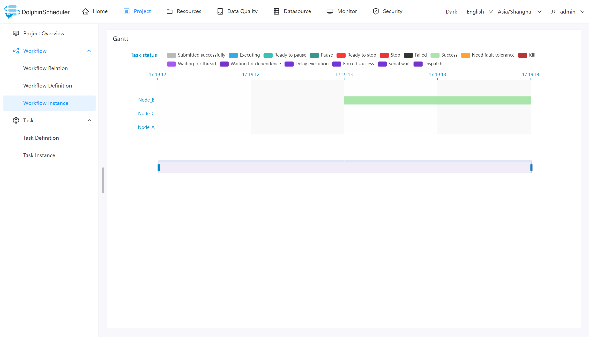

# Workflow Instance

## View Workflow Instance

Click `Project Management -> Workflow -> Workflow Instance`, enter the Workflow Instance page, as shown in the following figure:

Click the workflow name to enter the DAG view page, and check the task execution status, as shown in the following figure:

## View Task Log

Enter the workflow instance page, click the workflow name, enter the DAG view page, double-click the task node, as shown in the following figure:

Click "View Log", a log window pops up, as shown in the figure below, you can also view the task log on the task instance page, refer to [Task View Log](./task-instance.md)

## View Task History

Click `Project Management -> Workflow -> Workflow Instance` to enter the workflow instance page, click the workflow name to enter the workflow DAG page;

Double-click the task node, click `View History` to jump to the task instance page, and display the list of task instances run by the workflow instance.

## View Running Parameters

Click `Project Management -> Workflow -> Workflow Instance` to enter the workflow instance page, click the workflow name to enter the workflow DAG page;

Click the icon in the upper left corner  to view the startup parameters of the workflow instance; click the icon  to view the global parameters and local parameters of the workflow instance, as shown in the following figure:

## Workflow Instance Operation Function

Click `Project Management -> Workflow -> Workflow Instance`, enter the workflow instance page, as shown in the following figure:

- **Edit:** Only processes with success/failed/stop status can be edited. Click the "Edit" button or the workflow instance name to enter the DAG edit page. After the edit, click the "Save" button to confirm, as shown in the figure below. In the pop-up box, check "Whether to update the workflow definition", after saving, the information modified by the instance will be updated to the workflow definition; if not checked, the workflow definition would not be updated.

     

       
     

- **Rerun：** Re-execute the terminated process

- **Recovery Failed:** For failed processes, you can perform failure recovery operations, starting from the failed node

- **Stop:** **Stop** the running process, the background code will first `kill` the worker process, and then execute `kill -9` operation

- **Pause:** **Pause** the running process, the system status will change to **waiting for execution**, it will wait for the task to finish, and pause the next sequence task.

- **Resume pause:** Resume the paused process, start running directly from the **paused node**

- **Delete:** Delete the workflow instance and the task instance under the workflow instance

- **Gantt Chart:** The vertical axis of the Gantt chart is the topological sorting of task instances of the workflow instance, and the horizontal axis is the running time of the task instances, as shown in the figure:

