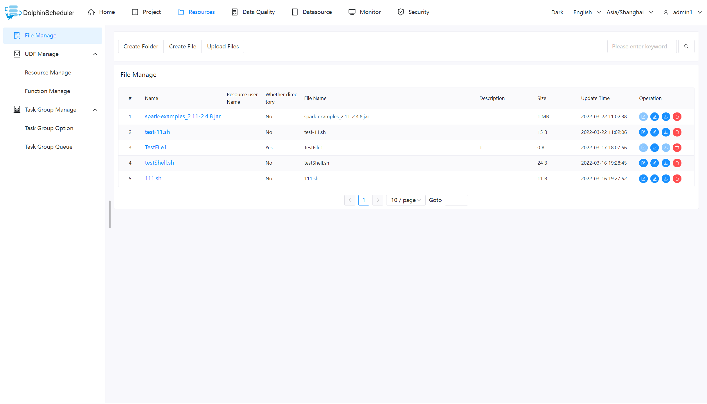
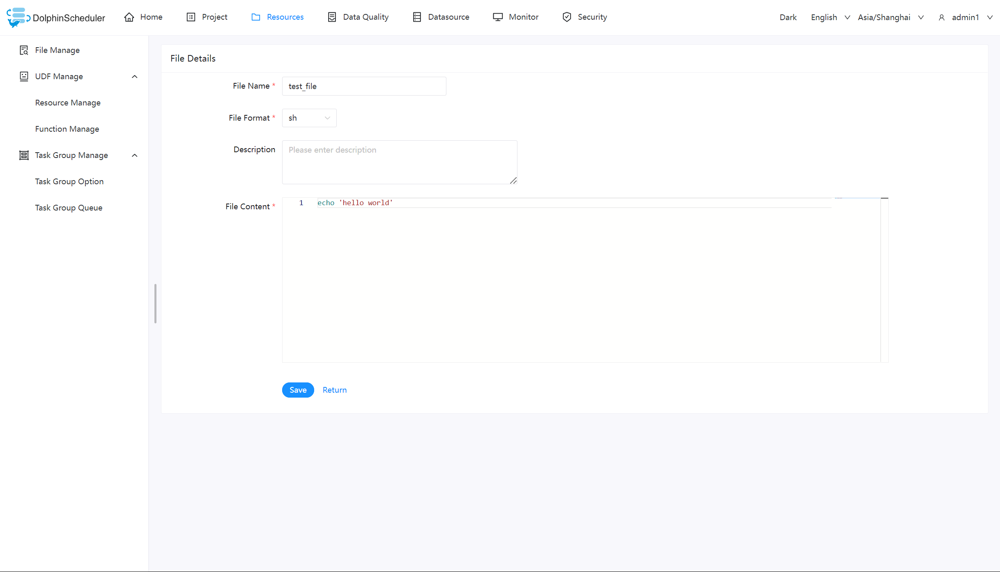
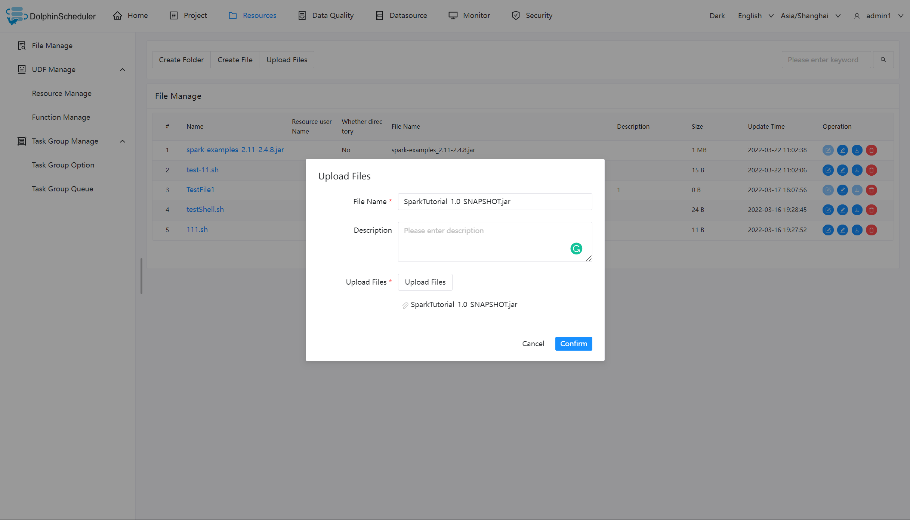
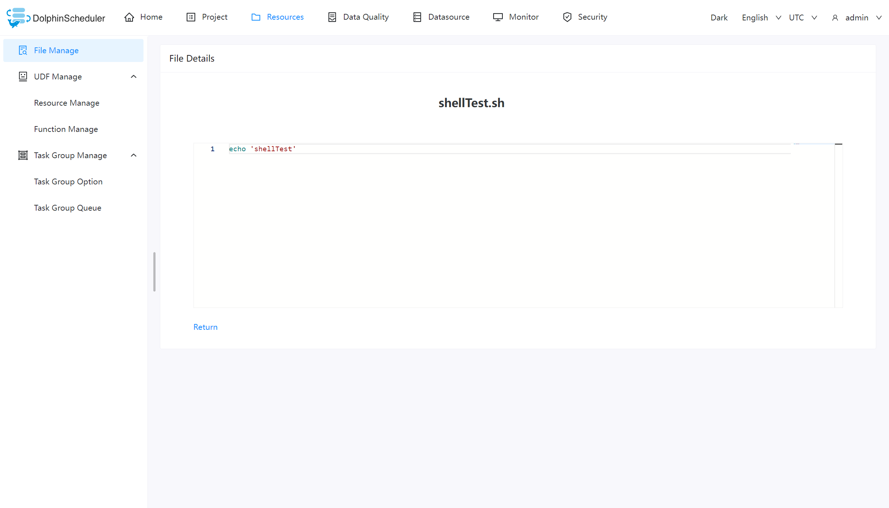
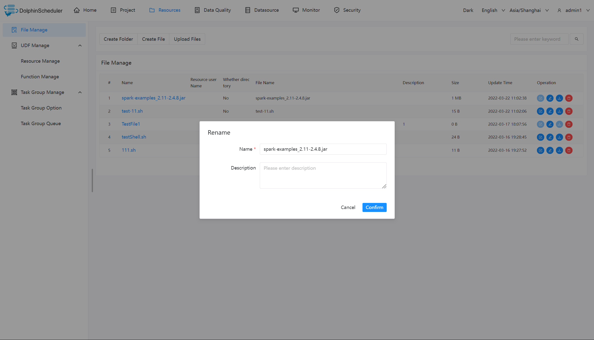
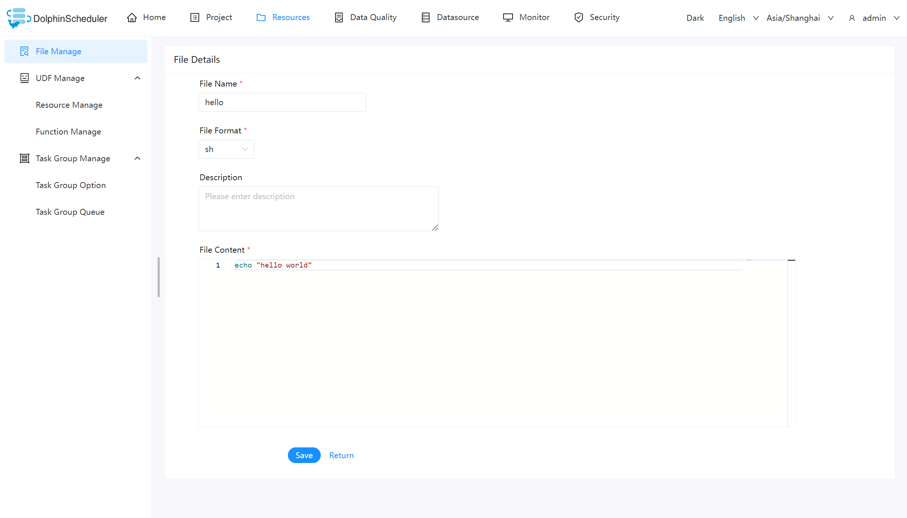
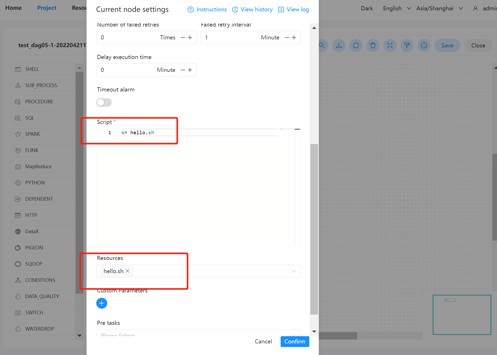
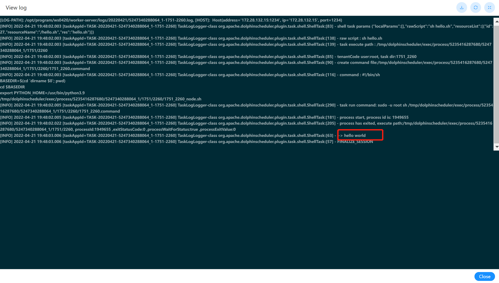

# File Management

When the third-party jar needs to be used in the scheduling process or the user needs to customize the script, the related operations can be completed on this page. The file types that can be created include: `txt`, `log`, `sh`, `conf`, `py`, `java` etc. And you can edit, rename, download and delete files.

> **_Note:_**
>
> * When you manage files as `admin`, remember to set up `tenant` for `admin` first.

## Basic Operations

### Create File

The file format supports the following types: txt, log, sh, conf, cfg, py, java, sql, xml, hql, properties.

### Upload File

Click the "Upload File" button to upload, drag the file to the upload area, the file name will be automatically completed with the uploaded file name.

### View File

For viewable file types, click the file name to view the file details.

### Download File

Click the "Download" button in the file list to download the file or click the "Download" button in the upper right corner of the file details to download the file.

### Rename File

### Delete File

File list -> Click the "Delete" button to delete the specified file.

> Note: File name or source name of your local file can not contain specific characters like `.` or `/` when you trying to
> upload, create or rename file in resource center.

## Example

This sample mainly uses a simple shell script to demonstrate how to use Content Center files in a workflow definition. The same is true for tasks such as MR and Spark that require jar packages.

### Create a shell file

Create a shell file, print `hello world`.

### Create the workflow execution shell

In the workflow definition module of project Manage, create a new workflow using a shell task.

- Script: 'sh hello.sh'
- Resource: Select 'hello.sh'

> Notice: When using a resource file in the script, the file name needs to be the same as the full path of the selected resource:
> For example: if the resource path is `/resource/hello.sh`, you need to use the full path of `/resource/hello.sh` to use it in the script.

### View the results

You can view the log results of the node running in the workflow instance. As shown below:

