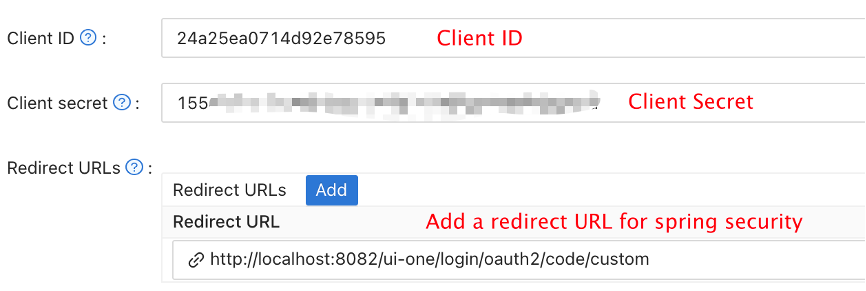

# Authentication Type

* So far we support three authentication types, Apache DolphinScheduler password, LDAP and Casdoor SSO.

## Change Authentication Type

> dolphinscheduler-api/src/main/resources/application.yaml

```yaml
security:
  authentication:
    # Authentication types (supported types: PASSWORD,LDAP,CASDOOR_SSO)
    type: PASSWORD
    # IF you set type `LDAP`, below config will be effective
    ldap:
      # ldap server config
      urls: ldap://ldap.forumsys.com:389/
      base-dn: dc=example,dc=com
      username: cn=read-only-admin,dc=example,dc=com
      password: password
      user:
        # admin userId when you use LDAP login
        admin: read-only-admin
        identity-attribute: uid
        email-attribute: mail
        # action when ldap user is not exist (supported types: CREATE,DENY)
        not-exist-action: CREATE
      ssl:
        enable: false
        # jks file absolute path && password
        trust-store: "/ldapkeystore.jks"
        trust-store-password: "password"
```

For detailed explanation of specific fields, please see: [Api-server related configuration](../../architecture/configuration.md)

## LDAP Test

We offer you a unit-test class while you can test the integration of DolphinScheduler with LDAP without running the service.

> dolphinscheduler-api/src/test/java/org/apache/dolphinscheduler/api/security/impl/ldap/LdapServiceTest.java

You can follow guide below：
- Change`TestPropertySource`configuration to your LDAP information.
- Change userId && userPwd to your information in the `ldapLogin` method.
- Change the expected email to the return value you expect in the `ldapLogin` method.
- Run`ldapLogin`method and determine whether the LDAP login result is expected.

If you want to enable ssl, please change configuration in `TestPropertySource` like below:

```
security.authentication.ldap.ssl.enable=false
// absolute path
security.authentication.ldap.ssl.trust-store=/ldapkeystore.jks
security.authentication.ldap.ssl.trust-store-password=yourpassword
```

Then run`ldapLoginSSL`method and determine whether the LDAP login result is expected.

## Casdoor SSO

[Casdoor](https://casdoor.org/) is a UI-first Identity Access Management (IAM) / Single-Sign-On (SSO) platform based on OAuth 2.0, OIDC, SAML and CAS. You can add SSO capability to Dolphinscheduler through Casdoor by following these steps:

### Step1. Deploy Casdoor

Firstly, the Casdoor should be deployed.

You can refer to the Casdoor official documentation for the [Server Installation](https://casdoor.org/docs/basic/server-installation).

After a successful deployment, you need to ensure:

* The Casdoor server is successfully running on http://localhost:8000.
* Open your favorite browser and visit http://localhost:7001, you will see the login page of Casdoor.
* Input admin and 123 to test login functionality is working fine.

Then you can quickly implement a Casdoor based login page in your own app with the following steps.

### Step2. Configure Casdoor Application

1. Create or use an existing Casdoor application.
2. Add Your redirect url (You can see more details about how to get redirect url in the next section)
   
3. Add provider you want and supplement other settings.

Not surprisingly, you can get two values on the application settings page: `Client ID` and `Client secret` like the picture above. We will use them in next step.

Open your favorite browser and visit: **http://`CASDOOR_HOSTNAME`/.well-known/openid-configuration**, you will see the OIDC configure of Casdoor.

### Step3. Configure Dolphinscheduler

> dolphinscheduler-api/src/main/resources/application.yaml

```yaml
security:
  authentication:
    # Authentication types (supported types: PASSWORD,LDAP,CASDOOR_SSO)
    type: CASDOOR_SSO
casdoor:
  # Your Casdoor server url
  endpoint:
  client-id:
  client-secret:
  # The certificate may be multi-line, you can use `|-` for ease
  certificate: 
  # Your organization name added in Casdoor
  organization-name:
  # Your application name added in Casdoor
  application-name:
  # Doplhinscheduler login url
  redirect-url: http://localhost:5173/login 
```

