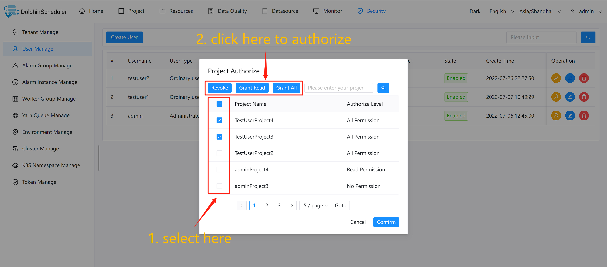
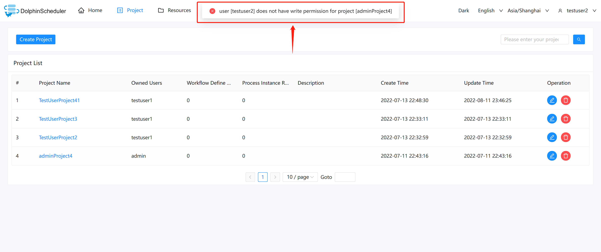
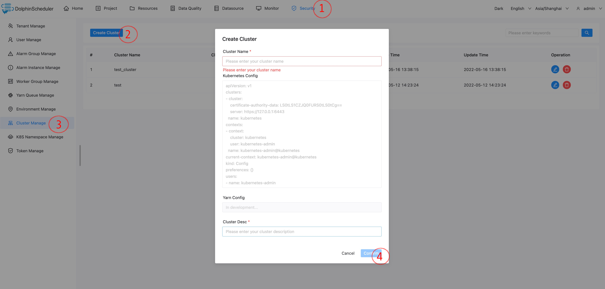

# Security (Authorization System)

Only the administrator account in the security center has permission to operate, which includes queue management, tenant management, user management, alarm group management, worker group management, token management and other functions. In the user management module, you can authorize resources, data sources, projects, etc.

Administrator login, default username/password: admin/dolphinscheduler123

## Create Queue

- The queue is used when executing programs such as spark and mapreduce, and the "queue" parameter needs to be used.
- The administrator enters the `Security Center->Queue Management` page and clicks the "Create Queue" button to create a new queue.


## Add Tenant

- The tenant corresponds to the Linux user, which is used by the worker to submit the job. If linux does not have this user, it will cause the task to fail. You can automatically create a linux user when the user does not exist by modifying the parameters in the `worker.properties` configuration file. The parameter will require that the worker can run the command `worker.tenant.auto.create = true; worker.tenant.auto.create = truesudo`
- Tenant Code: **The tenant code is the user on Linux, unique and cannot be repeated**
- The administrator enters the `Security Center->Tenant Management` page, and clicks the `Create Tenant` button to create a tenant.


## Create Normal User

Users are divided into **administrator users** and **ordinary users**

- Administrators have permissions such as authorization and user management, but do not have permissions to create projects and actions defined by workflows.
- Ordinary users can create projects and create, edit, and execute workflow definitions.
- **Note**: If the user switches tenants, all resources under the tenant to which the user belongs will be copied to the new tenant that is switched.

Go to the `Security Center -> User Management` page and click the `Create User` button to create a user, administrator only.


### Edit user information

The administrator enters the `Security Center->User Management` page and clicks the `Edit` button to edit user information.

After logging in as an ordinary user, click the user information in the drop-down box of the user name to enter the user information page, and click the `Edit` button to edit the user information.

### Modify user password

The administrator enters the `Security Center -> User Management` page and clicks the `Edit` button. When editing user information, enter the new password to modify the user password.

After logging in as an ordinary user, click the user information in the user name drop-down box to enter the password modification page, enter the password and confirm the password and click the `Edit` button, then the password modification is successful.

## Create Alarm Group

The alarm group is a parameter set at startup. After the process ends, the status of the process and other information will be sent to the alarm group by email.

The administrator enters the `Security Center -> Alarm Group Management` page and clicks the `Create Alarm Group` button to create an alarm group.


## Token Management

Since the back-end interface has a login check, token management provides a way to perform various operations on the system by calling the interface.

The administrator enters the `Security Center -> Token Management page`, clicks the `Create Token` button, selects the expiration time and user, clicks the `Generate Token` button, and clicks the `Submit` button, then create the selected user's token successfully.


After a normal user logs in, click the user information in the username drop-down box, enter the token management page, select the expiration time, click the `Generate Token` button, and click the `Submit` button, then the user creates a token successfully.

Example of calling:

```java
/**
 * test token
 */
public  void doPOSTParam()throws Exception{
    // create HttpClient
    CloseableHttpClient httpclient = HttpClients.createDefault();
    // create http post request
    HttpPost httpPost = new HttpPost("http://127.0.0.1:12345/escheduler/projects/create");
    httpPost.setHeader("token", "123");
    // set parameters
    List<NameValuePair> parameters = new ArrayList<NameValuePair>();
    parameters.add(new BasicNameValuePair("projectName", "qzw"));
    parameters.add(new BasicNameValuePair("desc", "qzw"));
    UrlEncodedFormEntity formEntity = new UrlEncodedFormEntity(parameters);
    httpPost.setEntity(formEntity);
    CloseableHttpResponse response = null;
    try {
        // execute
        response = httpclient.execute(httpPost);
        // response status code 200
        if (response.getStatusLine().getStatusCode() == 200) {
            String content = EntityUtils.toString(response.getEntity(), "UTF-8");
            System.out.println(content);
        }
    } finally {
        if (response != null) {
            response.close();
        }
        httpclient.close();
    }
}
```

## Granted Permissions

* Granted permissions include project permissions, resource permissions, data source permissions, and UDF function permissions.
* Administrators can authorize projects, resources, data sources, and UDF functions that ordinary users do not create. Because the authorization methods of projects, resources, data sources and UDF functions are all the same, the project authorization is used as an example to introduce.
* Note: For projects created by the user, the user has all permissions. Therefore, permission changes to projects created by users themselves are not valid.
- The administrator enters the `Security Center -> User Management` page, and clicks the "Authorize" button of the user to be authorized, as shown in the following figure:


- Select one or more projects and click the button above to authorize the project. The upper buttons from left to right correspond to `revoke all permissions`, `grant read permissions`, and `grant all permissions` (which including both read and write permissions).



- If a user has only the read permission but not the write permission for a project, and the user is trying to do something like delete or update the project, an error message is displayed indicating that the user has no write permission and cannot complete the operation.



- Resources, data sources, and UDF function authorization are the same as project authorization.

## Worker Grouping

Each worker node belongs to some worker groups, and the default group is `default`.

When DolphinScheduler executes a task, it will assign the task to the configured worker group and the worker nodes in the group will execute the task.

### Add or Update Worker Groups

- Open the `worker-server/conf/application.yaml` on the worker node where you want to configure the groups and modify the `groups` parameter in `worker` section.
- The values of the `groups` parameter are the names of the groups where the worker node belong. The default value is `default`.
- If the worker node belongs to multiple groups, list them with hyphens, e.g.

```conf
worker:
......
  groups:
    - default
    - group-1
    - group-2
......
```

- You can add new worker groups for the workers during runtime regardless of the configurations in `application.yaml` as below:
  `Security Center` -> `Worker Group Manage` -> `Create Worker Group` -> fill in `Group Name` and `Worker Addresses` -> click `confirm`.

## Environmental Management

- Configure the worker running environment online, a worker can specify multiple environments, each environment is equivalent to the `dolphinscheduler_env.sh` file.
- The default environment is the `dolphinscheduler_env.sh` file.
- When the task is executed, the task can be assigned to the specified worker group, and the corresponding environment can be selected according to the worker group, and finally the worker node in the group executes the environment and then executes the task.

### Add or update environment

The environment configuration is equivalent to the configuration in the `dolphinscheduler_env.sh` file.


### Usage environment

Create a task node in the workflow definition, select the worker group and the environment corresponding to the worker group. When executing the task, the Worker will execute the environment first before executing the task.


> NOTE: Please make sure you have associated the `Environments` with your `worker groups` if you can not select the `Environment Name` in workflow definition page or when triggering workflows.

## Cluster Management

> Add or update cluster
> - Each process can be related to zero or several clusters to support multiple environment, now just support k8s.
>
> Usage cluster
> - After creation and authorization, k8s namespaces and processes will associate clusters. Each cluster will have separate workflows and task instances running independently.



## Namespace Management

> Add or update k8s cluster

- First enter the configuration of the k8s cluster connection into the table `t_ds_k8s` in the database for batch job and will removed later, the creation of the namespace now selects the cluster by drop-down options.

> Add or update namespace

- After creation and authorization, you can select it from the namespace drop down list when edit k8s task, If the k8s cluster name is `ds_null_k8s` means test mode which will not operate the cluster actually.


