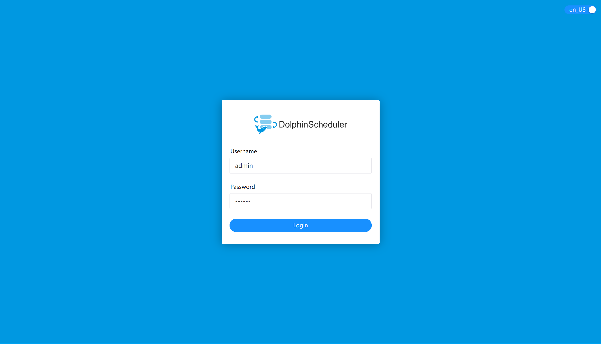

# Docker Quick Start

There are three ways to start DolphinScheduler with Docker

- [Standalone-server](#using-standalone-server-docker-image) is the way you find if you just want to start and try DolphinScheduler as a beginner.
- [docker-compose](#using-docker-compose-to-start-server) is for some who want to deploy DolphinScheduler in small or event middle scale workflows in their daily work.
- [Using exists postgresql and zookeeper server](#using-exists-postgresql-zookeeper) is for users who want to reuse the database or zookeeper server already exists.

## Prepare

Need to install [Docker](https://docs.docker.com/engine/install/) 1.13.1+ and [Docker Compose](https://docs.docker.com/compose/) 1.28.0+
before starting DolphinScheduler with Docker

## Start Server

### Using standalone-server Docker Image

Start DolphinScheduler with standalone-server Docker images is the easiest way to experience and explode it. In this way,
you can learn DolphinScheduler's concepts and usage, with minimal cost.

```shell
$ DOLPHINSCHEDULER_VERSION=<version>
$ docker run --name dolphinscheduler-standalone-server -p 12345:12345 -p 25333:25333 -d apache/dolphinscheduler-standalone-server:"${DOLPHINSCHEDULER_VERSION}"
```

> Note: Do not use apache/dolphinscheduler-standalone-server Docker image in production, it should only for you to taste
> DolphinScheduler at the first time. Not only because it runs all services in one single process, but also it uses H2 as
> its database which will lose metadata after it stops (could be changed to another database to avoid it). In addition,
> apache/dolphinscheduler-standalone-server only contains DolphinScheduler core services, some tasks such as Spark and Flink,
> require external components or environment to run it.

### Using docker-compose to Start Server

The difference between start services by docker-compose and standalone-server are servers running in one single process
or not. Services start with docker-compose running in separate containers, as well as different processes. Metadata could
be stored on disks after you change docker-compose configuration, and it is robust and stable for someone who wants to run
DolphinScheduler in a long term. You have to install [docker-compose](https://docs.docker.com/compose/install/) before you
start servers.

After complete the installation, get the `docker-compose.yaml` file from [download page](https://dolphinscheduler.apache.org/en-us/download/<version>)
form its source package, and make sure you get the right version. After download the package, you can run the commands as below.

```shell
$ DOLPHINSCHEDULER_VERSION=<version>
$ tar -zxf apache-dolphinscheduler-"${DOLPHINSCHEDULER_VERSION}"-src.tar.gz
# Going to docker-compose's location
# For Mac or Linux users
$ cd apache-dolphinscheduler-"${DOLPHINSCHEDULER_VERSION}"-src/deploy/docker
# For Windows users, you should run command `cd apache-dolphinscheduler-"${DOLPHINSCHEDULER_VERSION}"-src\deploy\docker`

# Initialize the database, use profile schema
$ docker-compose --profile schema up -d

# start all dolphinscheduler server, use profile all
$ docker-compose --profile all up -d
```

> NOTES: After installed docker-compose, it is recommended to modify some configurations for better experience. We highly
> recommended modify docker daemon memory up to 4 GB, see [How to assign more memory to docker container](https://stackoverflow.com/a/44533437/7152658)
> for more detail.
>
> It will not only start DolphinScheduler servers but also some others necessary services like PostgreSQL(with `root`
> as user, `root` as password and `dolphinscheduler` as database) and ZooKeeper when starting with docker-compose.

### Using Exists PostgreSQL ZooKeeper

[Using docker-compose to start server](#using-docker-compose-to-start-server) will create new a database and the ZooKeeper
container when it up. You could start DolphinScheduler server separately if you want to reuse your exists services.

```shell
$ DOLPHINSCHEDULER_VERSION=<version>
# Initialize the database, make sure database <DATABASE> already exists
$ docker run -d --name dolphinscheduler-tools \
    -e DATABASE="postgresql" \
    -e SPRING_DATASOURCE_URL="jdbc:postgresql://localhost:5432/<DATABASE>" \
    -e SPRING_DATASOURCE_USERNAME="<USER>" \
    -e SPRING_DATASOURCE_PASSWORD="<PASSWORD>" \
    -e SPRING_JACKSON_TIME_ZONE="UTC" \
    --net host \
    apache/dolphinscheduler-tools:"${DOLPHINSCHEDULER_VERSION}" tools/bin/upgrade-schema.sh
# Starting DolphinScheduler service
$ docker run -d --name dolphinscheduler-master \
    -e DATABASE="postgresql" \
    -e SPRING_DATASOURCE_URL="jdbc:postgresql://localhost:5432/<DATABASE>" \
    -e SPRING_DATASOURCE_USERNAME="<USER>" \
    -e SPRING_DATASOURCE_PASSWORD="<PASSWORD>" \
    -e SPRING_JACKSON_TIME_ZONE="UTC" \
    -e REGISTRY_ZOOKEEPER_CONNECT_STRING="localhost:2181" \
    --net host \
    -d apache/dolphinscheduler-master:"${DOLPHINSCHEDULER_VERSION}"
$ docker run -d --name dolphinscheduler-worker \
    -e DATABASE="postgresql" \
    -e SPRING_DATASOURCE_URL="jdbc:postgresql://localhost:5432/<DATABASE>" \
    -e SPRING_DATASOURCE_USERNAME="<USER>" \
    -e SPRING_DATASOURCE_PASSWORD="<PASSWORD>" \
    -e SPRING_JACKSON_TIME_ZONE="UTC" \
    -e REGISTRY_ZOOKEEPER_CONNECT_STRING="localhost:2181" \
    --net host \
    -d apache/dolphinscheduler-worker:"${DOLPHINSCHEDULER_VERSION}"
$ docker run -d --name dolphinscheduler-api \
    -e DATABASE="postgresql" \
    -e SPRING_DATASOURCE_URL="jdbc:postgresql://localhost:5432/<DATABASE>" \
    -e SPRING_DATASOURCE_USERNAME="<USER>" \
    -e SPRING_DATASOURCE_PASSWORD="<PASSWORD>" \
    -e SPRING_JACKSON_TIME_ZONE="UTC" \
    -e REGISTRY_ZOOKEEPER_CONNECT_STRING="localhost:2181" \
    --net host \
    -d apache/dolphinscheduler-api:"${DOLPHINSCHEDULER_VERSION}"
$ docker run -d --name dolphinscheduler-alert-server \
    -e DATABASE="postgresql" \
    -e SPRING_DATASOURCE_URL="jdbc:postgresql://localhost:5432/<DATABASE>" \
    -e SPRING_DATASOURCE_USERNAME="<USER>" \
    -e SPRING_DATASOURCE_PASSWORD="<PASSWORD>" \
    -e SPRING_JACKSON_TIME_ZONE="UTC" \
    -e REGISTRY_ZOOKEEPER_CONNECT_STRING="localhost:2181" \
    --net host \
    -d apache/dolphinscheduler-alert-server:"${DOLPHINSCHEDULER_VERSION}"
```

> Note: You should install and start [PostgreSQL](https://www.postgresql.org/download/)(8.2.15+) and [ZooKeeper](https://zookeeper.apache.org/releases.html)(3.8.0)
> by yourself if you want to use this way to start Dolphinscheduler, but you do not have those services

## Login DolphinScheduler

You could access DolphinScheduler web UI by click [http://localhost:12345/dolphinscheduler/ui](http://localhost:12345/dolphinscheduler/ui)
and use `admin` and `dolphinscheduler123` as default username and password in the login page.



> Note: If you start the services by the way [using exists PostgreSQL ZooKeeper](#using-exists-postgresql-zookeeper), and
> starting with multiple machine, you should change URL domain from `localhost` to IP or hostname the api server running.

## Change Environment Variable

You can modify some environment variables to change configurations when you are starting servers through Docker. We have
an example in [using exists PostgreSQL ZooKeeper](#using-exists-postgresql-zookeeper) to change database and ZooKeeper configurations,
and you could find all environment variables in [all environment variables](https://github.com/apache/dolphinscheduler/blob/<version>/script/env/dolphinscheduler_env.sh) <!-- markdown-link-check-disable-line -->
and change them if you want.
