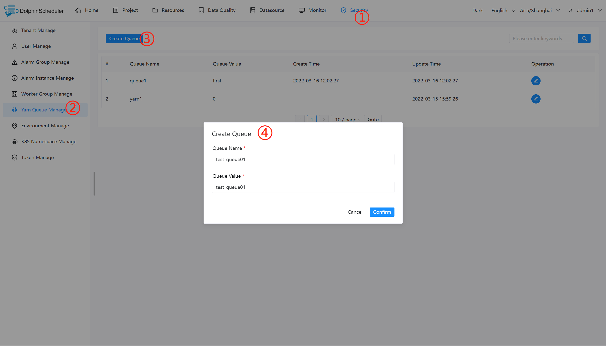
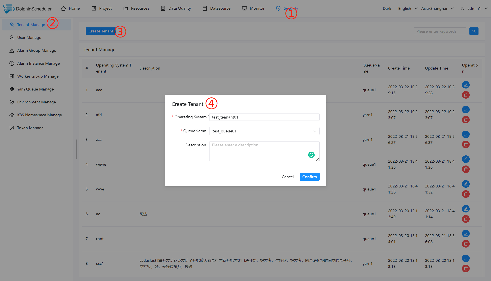
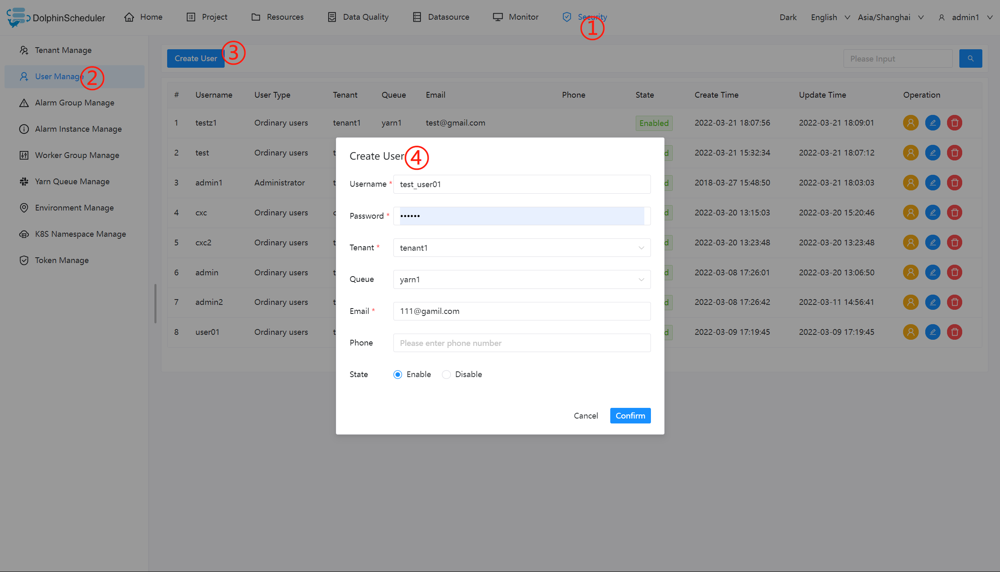
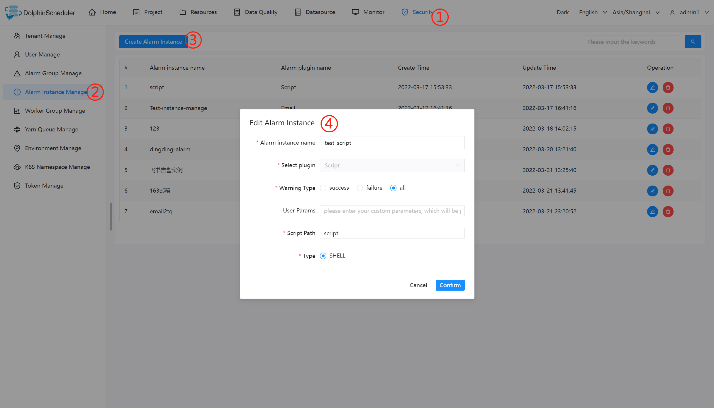
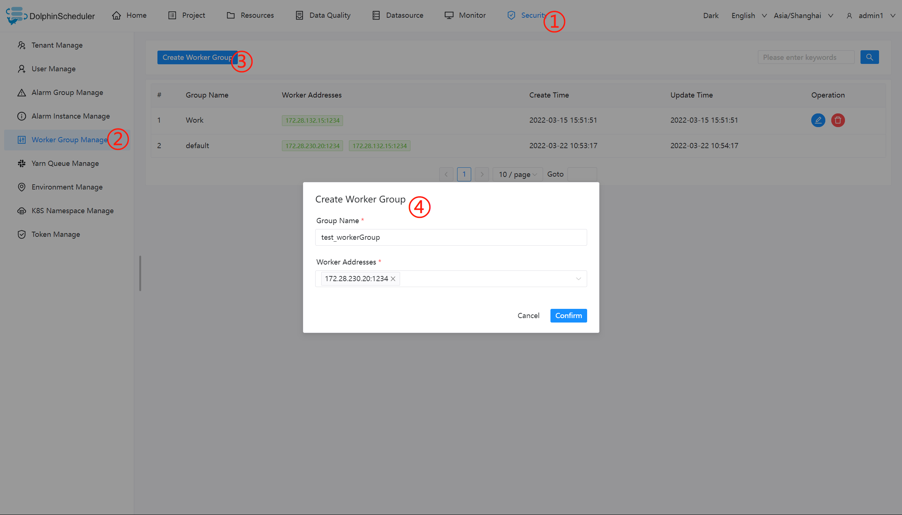
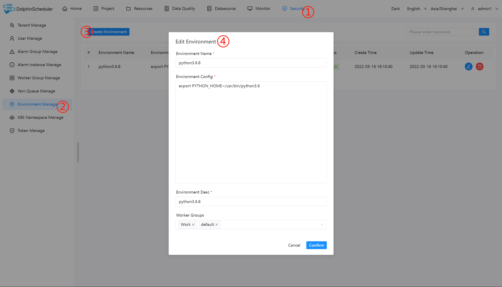
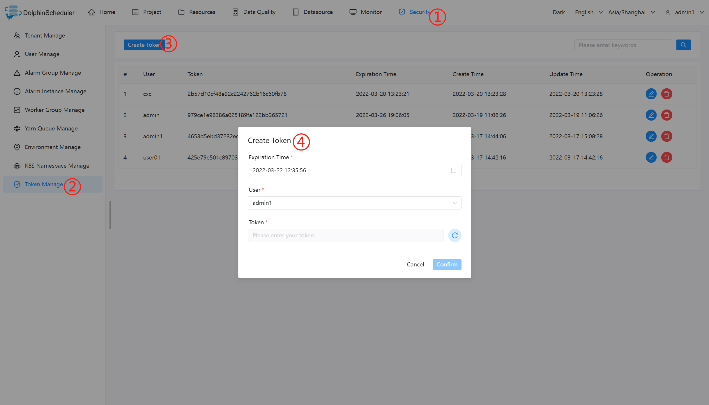
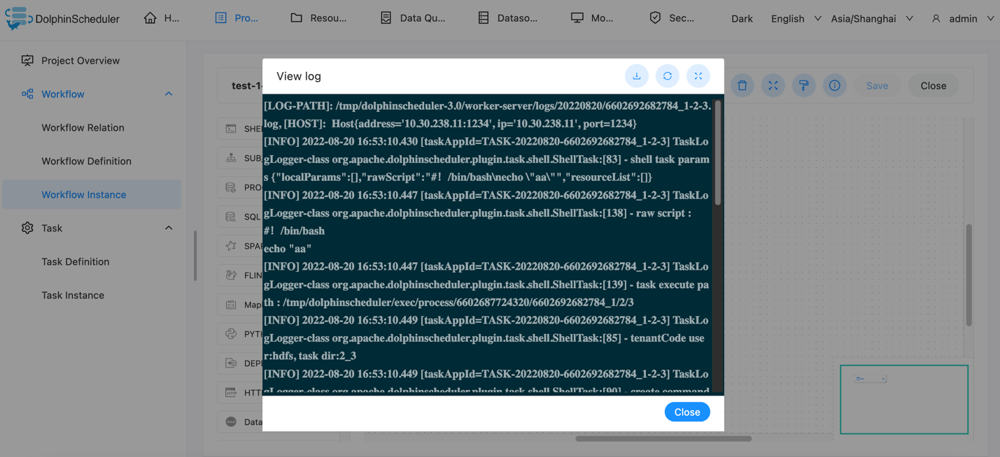

# Quick Start

This is a Quick Start guide to help you get a basic idea of working with Apache DolphinScheduler. Once you've gone through the tutorial video, we encourage you to find out more about Apache DolphinScheduler functions and examples in .

<figure class="video_container"> 
  <iframe src="https://www.youtube.com/embed/nrF20hpCkug" frameborder="0" allowfullscreen="true"></iframe>
</figure>

## Administrator User Login

* Address: http://localhost:12345/dolphinscheduler
* Username and password: admin/dolphinscheduler123

## Create a queue

## Create a tenant

## Create Ordinary Users

## Create an alarm instance

## Create an alarm group

## Create a worker group

## Create environment

## Create a token

## Login with regular users

Click on the user name in the upper right corner to "exit" and re-use the normal user login.

* `Project Management -> Create Project -> Project Name`

* `Click Workflow Definition -> Create Workflow Definition-> Online Workflow Definition`

* `Running Workflow Definition -> Click Workflow Instance -> Click Workflow Instance Name -> Double-click Task Node -> View Task Execution Log`

