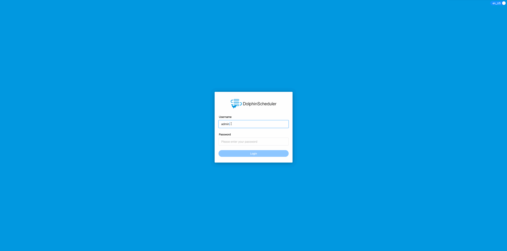
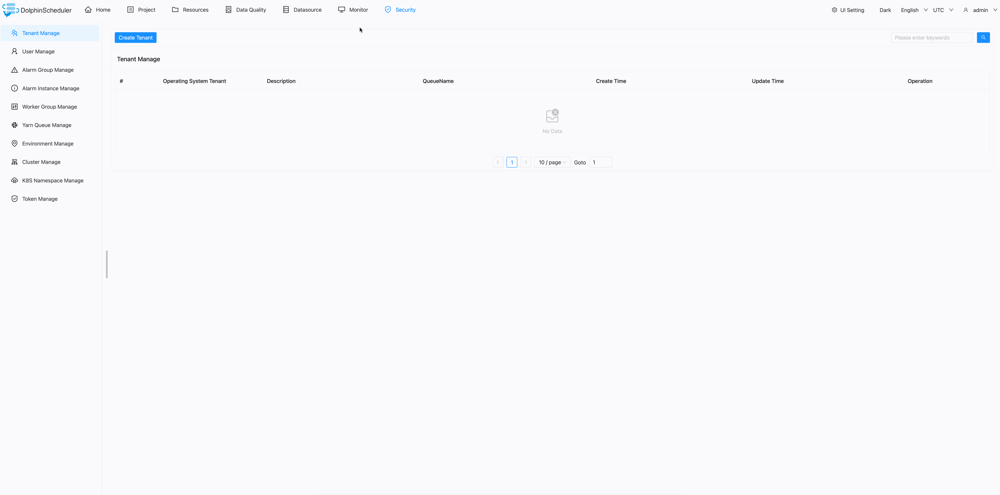
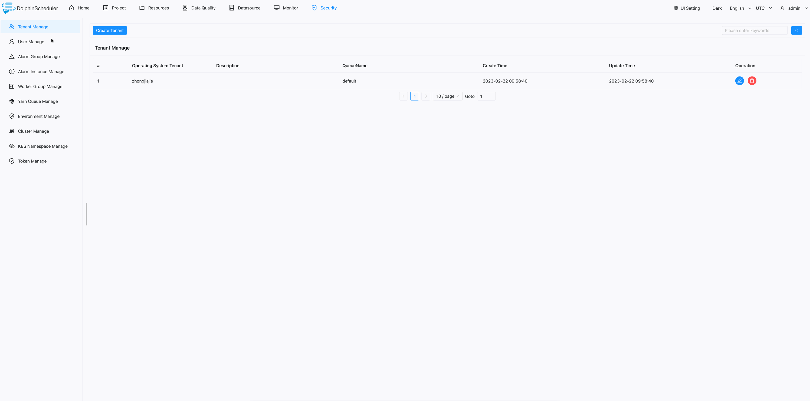
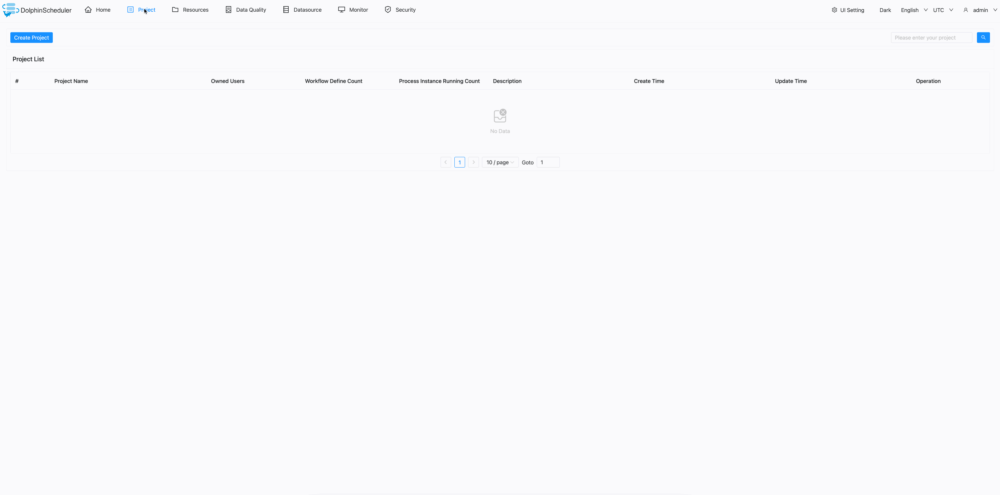
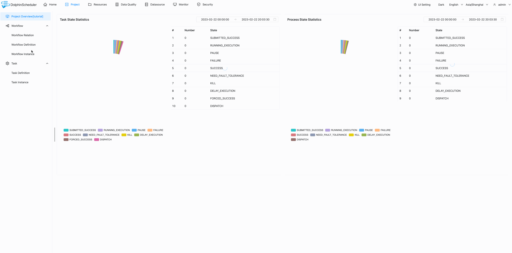
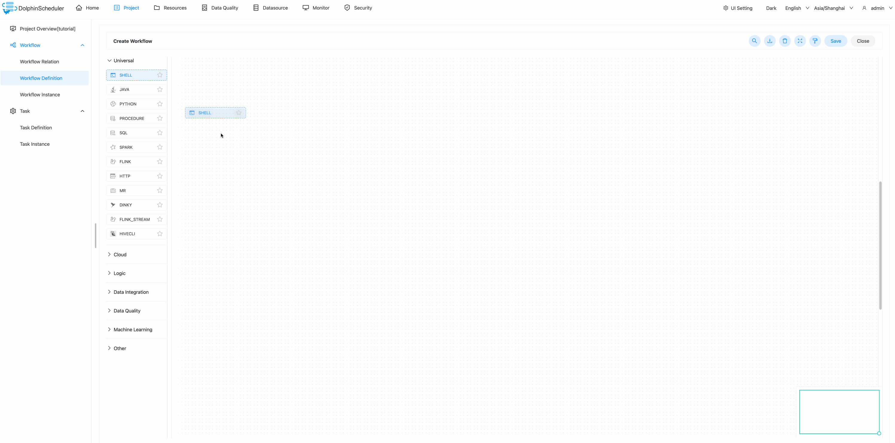
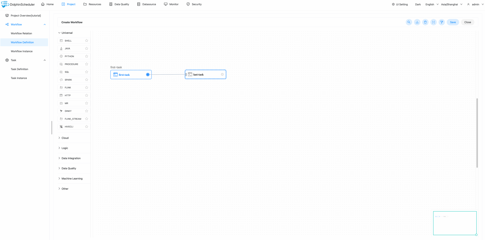
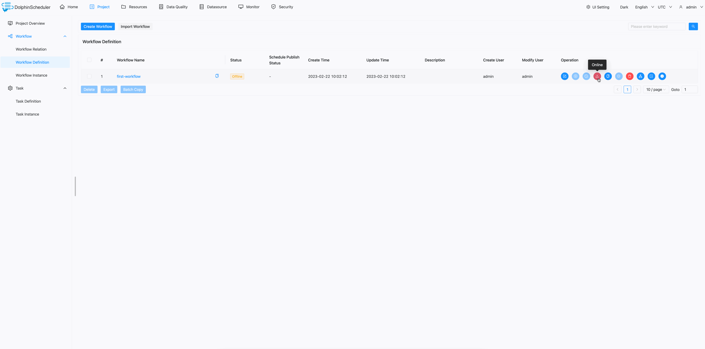
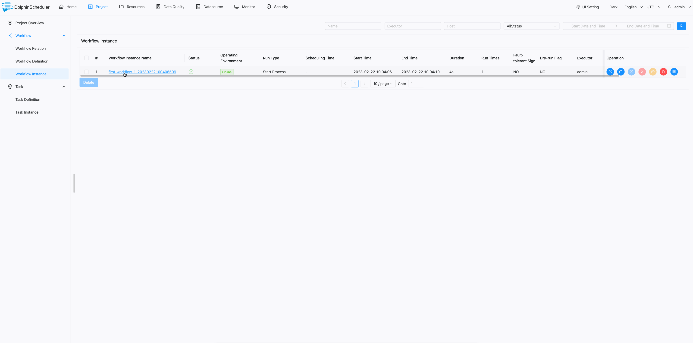

# Quick Start

In this section, we will use DolphinScheduler to create and run a simple workflow step by step. During this journey,
you will learn the basic concepts of DolphinScheduler and know the most basic configuration to run the workflow. We
provide both video and text in this tutorial, you can choose the way you prefer

## Video Tutorial

<figure class="video_container"> 
  <iframe src="https://www.youtube.com/embed/nrF20hpCkug" frameborder="0" allowfullscreen="true"></iframe>
</figure>

## Text Tutorial

### Setup Dolphinscheduler

You have to install and start dolphinscheduler first before go ahead. For beginners, we recommend setting up
DolphinScheduler with the official Docker image or with the standalone server.

* [standalone server](https://dolphinscheduler.apache.org/en-us/docs/3.1.3/guide/installation/standalone)
* [docker](https://dolphinscheduler.apache.org/en-us/docs/3.1.3/guide/start/docker)

### Build Your First Workflow

You can log in DolphinScheduler through http://localhost:12345/dolphinscheduler/ui and the default username/password
is `admin/dolphinscheduler123`.

#### Create Tenant

Tenant is an important concept while using DolphinScheduler, so
let's briefly introduce the concept of tenant first.

DolphinScheduler maps the `admin` account you use to log into DolphinScheduler to `user`.
To better control system resources, DolphinScheduler introduces the concept of
tenants, which are used to execute tasks.

The brief is as follows:

* User: login web UI, do all operations in the web UI, including workflow management and tenant creation.
* Tenant: the actual executor of the task, A Linux user for DolphinScheduler worker.

We can create a tenant in DolphinScheduler `Security -> Tenant Manage` page.

> NOTE: The user will bind to a default tenant when it is created, if you use the default tenant, the task will be executed by worker's bootstrap user.

#### Assign Tenant to User

As we have shown above in `Create Tenant` section, the`user` can not run tasks until we assign it with a `tenant`.

We can assign a tenant to a specific user in DolphinScheduler `Security -> User Manage` page.

After we create a tenant and assign it to a user, we can start creating a
simple workflow in DolphinScheduler.

#### Create Project

But in DolphinScheduler, all workflows must belong to a project, so we need
to create a project first.

We can create a project in DolphinScheduler `Project` page by clicking
`Create Project` button.

#### Create Workflow

Now we can create a workflow for the project `tutorial`. Click the project we just created,
go to `Workflow Definition` page, click `Create Workflow` button, and we will redirect
to the workflow detail page.

#### Create Tasks

We can use the mouse to drag the task you want to create from the toolbar in the workflow canvas.
In this case, we create a `Shell` task. Entering the necessary information for the task,
we just fill the attribute `Node Name` with `Script` to the task for this simple workflow.
After that, we can click the `Save` button to save the task into the workflow. We create another task
using the same way.

#### Set Task Dependency

So we have two different tasks with different names and commands to run in the workflow. The
only thing missing from the current workflow is task dependency. We can add dependency using
the mouse to drag the arrow from the upstream task to the downstream and then release the mouse.
And you can see the link with the arrow between the two tasks is created, from the upstream
task to the downstream one. Finally, we can click the `Save` button from the top right corner
to save the workflow, do not forget to enter the name of the workflow.

#### Run Workflow

After all done, we can run the workflow by clicking the `Online` and then the `Run` button from
the workflows list. If you want to see the workflow instance, just go to `Workflow Instance`
page, you can see the workflow instance is running and the status is `Executing`.

#### View Log

If you want to view the task log, please click the workflow instance from the workflow instance
list, then find the task you want to view the log, right-click the mouse and select `View Log`
from the context dialog, and you can see the detailed log of the task.

You can see the task printing `Hello DolphinScheduler` and `Ending...` which is the same as we
defined when creating the tasks.

You just finished the first tutorial of DolphinScheduler, you can now run some simple workflows
in DolphinScheduler, congratulations!
