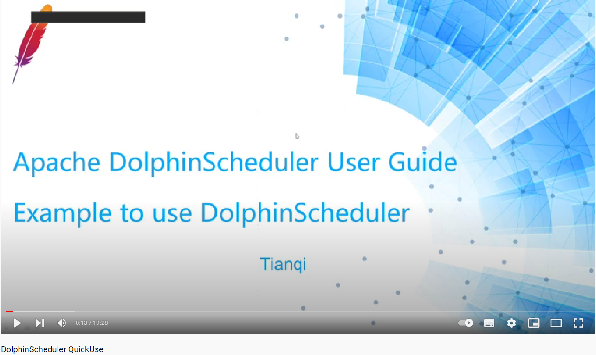
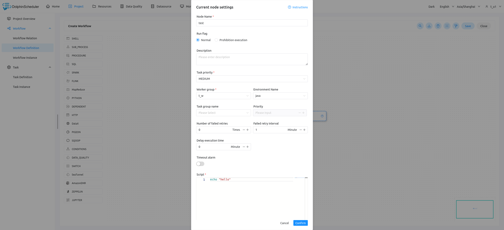
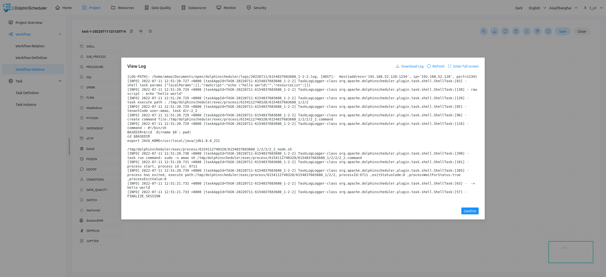

# Quick Start

* Watch Apache DolphinScheduler Quick Start Tutorile here:
  

* Administrator user login

  > Address：http://localhost:12345/dolphinscheduler/ui  Username and password: `admin/dolphinscheduler123`

* Create a queue

* Create a tenant

* Create Ordinary Users

* Create an alarm instance

* Create an alarm group

  
* Create a worker group

 * Create environment

    
* Create a token
  

     
* Login with regular users
  > Click on the user name in the upper right corner to "exit" and re-use the normal user login.

* `Project Management - > Create Project - > Click on Project Name`

* `Click Workflow Definition - > Create Workflow Definition - > Online Process Definition`

   
 

* `Running Process Definition - > Click Workflow Instance - > Click Process Instance Name - > Double-click Task Node - > View Task Execution Log`

 

   

