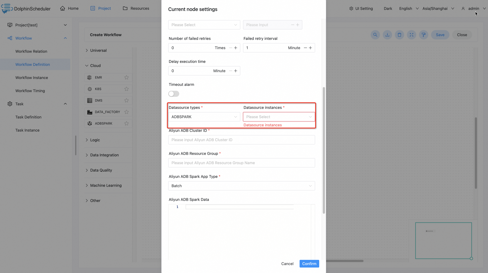

# Aliyun ADB Spark

## Introduction

`Aliyun ADB Spark` task plugin submits spark application to [`Aliyun ADB Spark`](https://www.alibabacloud.com/help/en/analyticdb-for-mysql/user-guide/spark-app-development/?spm=a2c63.l28256.0.0.7cc67ed0j6gd6b) service.

## Create Datasource

- Click `Datasource -> Create Datasource -> ADBSPARK` to create a datasource.

- Fill in `Datasource Name`, `Aliyun Access Key Id`, `Aliyun Access Key Secret`, `Aliyun Region Id` and click `Confirm`.

]

## Create Tasks

- Click `Porject -> Workflow Definition -> Create Workflow` and drag the `ADBSPARK` task to the canvas.

- Fill in the task parameters and click `Confirm` to create the task node.

## Task Parameters

- Please refer to [DolphinScheduler Task Parameters Appendix](appendix.md) `Default Task Parameters` section for default parameters.

| **Parameters**            | **Description**                                                                                                                                                                                                                                   |
|---------------------------|---------------------------------------------------------------------------------------------------------------------------------------------------------------------------------------------------------------------------------------------------|
| Datasource types          | The type of datasource the task uses, should be `ADBSPARK`.                                                                                                                                                                                       |
| Datasource instances      | The instance of `ADBSPARK` datasource.                                                                                                                                                                                                            |
| Aliyun ADB Cluster ID     | The ID of the AnalyticDB for MySQL Data Lakehouse Edition (V3.0) cluster.                                                                                                                                                                         |
| Aliyun ADB Resource Group | The name of the job resource group in AnalyticDB for MySQL Data Lakehouse Edition (V3.0) cluster.                                                                                                                                                 |
| Aliyun ADB App Type       | The type of the application. Valid values: Batch(default), SQL.                                                                                                                                                                                   |
| Aliyun ADB Spark Data     | The data of the application template. For information about the application template configuration, see [Spark application configuration guide](https://www.alibabacloud.com/help/en/analyticdb-for-mysql/spark-application-configuration-guide). |

## Examples

### Submit Spark Application

#### Batch Type Application

| **Parameters**            | **Example Values / Operations**                                                                                                                                                                                                                   |
|---------------------------|---------------------------------------------------------------------------------------------------------------------------------------------------------------------------------------------------------------------------------------------------|
| Aliyun ADB Cluster ID     | amv-example                                                                                                                                                                                                                                       |
| Aliyun ADB Resource Group | spark                                                                                                                                                                                                                                             |
| Aliyun ADB App Type       | Batch                                                                                                                                                                                                                                             |
| Aliyun ADB Spark Data     |{   &nbsp; &nbsp; &nbsp; &nbsp; "comments":&nbsp; [   &nbsp; &nbsp; &nbsp; &nbsp; &nbsp; &nbsp; &nbsp; &nbsp; "--&nbsp; Here&nbsp; is&nbsp; just&nbsp; an&nbsp; example&nbsp; of&nbsp; SparkPi.&nbsp; Modify&nbsp; the&nbsp; content&nbsp; and&nbsp; run&nbsp; your&nbsp; spark&nbsp; program."   &nbsp; &nbsp; &nbsp; &nbsp; ],   &nbsp; &nbsp; &nbsp; &nbsp; "args":&nbsp; [   &nbsp; &nbsp; &nbsp; &nbsp; &nbsp; &nbsp; &nbsp; &nbsp; "1000"   &nbsp; &nbsp; &nbsp; &nbsp; ],   &nbsp; &nbsp; &nbsp; &nbsp; "file":&nbsp; "local:///tmp/spark-examples.jar",   &nbsp; &nbsp; &nbsp; &nbsp; "name":&nbsp; "SparkPi",   &nbsp; &nbsp; &nbsp; &nbsp; "className":&nbsp; "org.apache.spark.examples.SparkPi",   &nbsp; &nbsp; &nbsp; &nbsp; "conf":&nbsp; {   &nbsp; &nbsp; &nbsp; &nbsp; &nbsp; &nbsp; &nbsp; &nbsp; "spark.driver.resourceSpec":&nbsp; "medium",   &nbsp; &nbsp; &nbsp; &nbsp; &nbsp; &nbsp; &nbsp; &nbsp; "spark.executor.instances":&nbsp; 2,   &nbsp; &nbsp; &nbsp; &nbsp; &nbsp; &nbsp; &nbsp; &nbsp; "spark.executor.resourceSpec":&nbsp; "medium"   &nbsp; &nbsp; &nbsp; &nbsp; }   }|

#### SQL Type Application

| **Parameters**            | **Example Values / Operations**             |
|---------------------------|---------------------------------------------|
| Aliyun ADB Cluster ID     | amv-example                                 |
| Aliyun ADB Resource Group | spark                                       |
| Aliyun ADB App Type       | Batch                                       |
| Aliyun ADB Spark Data     | show databases;   select * from example; |