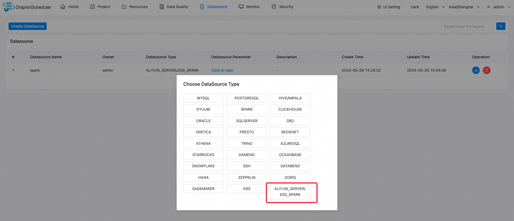
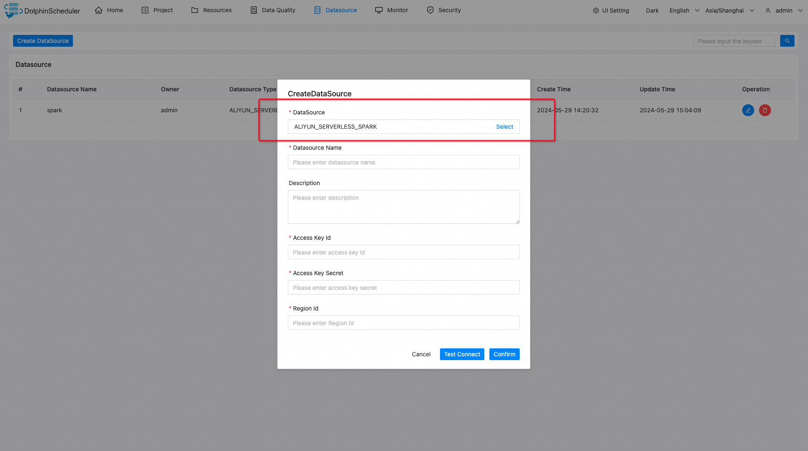
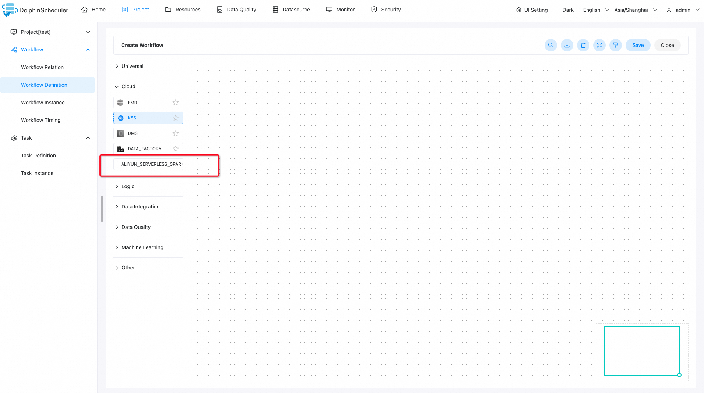
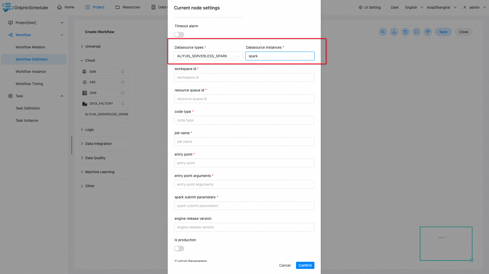

# Aliyun EMR Serverless Spark

## Introduction

`Aliyun EMR Serverless Spark` task plugin submits spark job to
[`Aliyun EMR Serverless Spark`](https://help.aliyun.com/zh/emr/emr-serverless-spark/product-overview/what-is-emr-serverless-spark) service.

## Create Connections

- Click `Datasource -> Create Datasource -> ALIYUN_SERVERLESS_SPARK` to create a connection.

- Fill in `Datasource Name`, `Access Key Id`, `Access Key Secret`, `Region Id` and click `Confirm`.

## Create Tasks

- Click `Porject -> Workflow Definition -> Create Workflow` and drag the `ALIYUN_SERVERLESS_SPARK` task to the canvas.

- Fill in the task parameters and click `Confirm` to create the task node.

## Task Parameters

- Please refer to [DolphinScheduler Task Parameters Appendix](appendix.md) `Default Task Parameters` section for default parameters.

|     **Parameters**      |                                           **Description**                                           |
|-------------------------|-----------------------------------------------------------------------------------------------------|
| Datasource types        | The type of datasource the task uses, should be `ALIYUN_SERVERLESS_SPARK`.                          |
| Datasource instances    | The instance of `ALIYUN_SERVERLESS_SPARK` datasource.                                               |
| workspace id            | `Aliyun Serverless Spark` workspace id.                                                             |
| resource queue id       | `Aliyun Serverless Spark` resource queue the task uses to submit spark job.                         |
| code type               | `Aliyun Serverless Spark` code type, could be `JAR`, `PYTHON` or `SQL`.                             |
| job name                | `Aliyun Serverless Spark` job name.                                                                 |
| entry point             | The location of the job code such as jar package, python file, or sql file. OSS location supported. |
| entry point arguments   | Arguments of the job main program.                                                                  |
| spark submit parameters | Spark-submit related parameters.                                                                    |
| engine release version  | Spark engine release version.                                                                       |
| is production           | Whether the spark job runs in production or development environment.                                |

## Examples

### Submit Jar tasks

|     **Parameters**      |                                                                                   **Example Values / Operations**                                                                                    |
|-------------------------|------------------------------------------------------------------------------------------------------------------------------------------------------------------------------------------------------|
| region id               | cn-hangzhou                                                                                                                                                                                          |
| access key id           | <your-access-key-id>                                                                                                                                                                                 |
| access key secret       | <your-access-key-secret>                                                                                                                                                                             |
| resource queue id       | root_queue                                                                                                                                                                                           |
| code type               | JAR                                                                                                                                                                                                  |
| job name                | ds-emr-spark-jar                                                                                                                                                                                     |
| entry point             | oss://datadev-oss-hdfs-test/spark-resource/examples/jars/spark-examples_2.12-3.3.1.jar                                                                                                               |
| entry point arguments   | 100                                                                                                                                                                                                  |
| spark submit parameters | --class org.apache.spark.examples.SparkPi --conf spark.executor.cores=4 --conf spark.executor.memory=20g --conf spark.driver.cores=4 --conf spark.driver.memory=8g --conf spark.executor.instances=1 |
| engine release version  | esr-2.1-native (Spark 3.3.1, Scala 2.12, Native Runtime)                                                                                                                                             |
| is production           | Please open the switch                                                                                                                                                                               |

### Submit SQL tasks

|     **Parameters**      |                                                                                               **Example Values / Operations**                                                                                               |
|-------------------------|-----------------------------------------------------------------------------------------------------------------------------------------------------------------------------------------------------------------------------|
| region id               | cn-hangzhou                                                                                                                                                                                                                 |
| access key id           | <your-access-key-id>                                                                                                                                                                                                        |
| access key secret       | <your-access-key-secret>                                                                                                                                                                                                    |
| resource queue id       | root_queue                                                                                                                                                                                                                  |
| code type               | SQL                                                                                                                                                                                                                         |
| job name                | ds-emr-spark-sql-1                                                                                                                                                                                                          |
| entry point             | Any non-empty string                                                                                                                                                                                                        |
| entry point arguments   | -e#show tables;show tables;                                                                                                                                                                                                 |
| spark submit parameters | --class org.apache.spark.sql.hive.thriftserver.SparkSQLCLIDriver --conf spark.executor.cores=4 --conf spark.executor.memory=20g --conf spark.driver.cores=4 --conf spark.driver.memory=8g --conf spark.executor.instances=1 |
| engine release version  | esr-2.1-native (Spark 3.3.1, Scala 2.12, Native Runtime)                                                                                                                                                                    |
| is production           | Please open the switch                                                                                                                                                                                                      |

### Submit SQL tasks located in OSS

|     **Parameters**      |                                                                                               **Example Values / Operations**                                                                                                |
|-------------------------|------------------------------------------------------------------------------------------------------------------------------------------------------------------------------------------------------------------------------|
| region id               | cn-hangzhou                                                                                                                                                                                                                  |
| access key id           | <your-access-key-id>                                                                                                                                                                                                         |
| access key secret       | <your-access-key-secret>                                                                                                                                                                                                     |
| resource queue id       | root_queue                                                                                                                                                                                                                   |
| code type               | SQL                                                                                                                                                                                                                          |
| job name                | ds-emr-spark-sql-2                                                                                                                                                                                                           |
| entry point             | Any non-empty string                                                                                                                                                                                                         |
| entry point arguments   | -f#oss://datadev-oss-hdfs-test/spark-resource/examples/sql/show_db.sql                                                                                                                                                       |
| spark submit parameters | --class org.apache.spark.sql.hive.thriftserver.SparkSQLCLIDriver --conf spark.executor.cores=4 --conf spark.executor.memory=20g --conf spark.driver.cores=4 --conf spark.driver.memory=8g --conf spark.executor.instances=1" |
| engine release version  | esr-2.1-native (Spark 3.3.1, Scala 2.12, Native Runtime)                                                                                                                                                                     |
| is production           | Please open the switch                                                                                                                                                                                                       |

### Submit PySpark Tasks

|     **Parameters**      |                                                              **Example Values / Operations**                                                               |
|-------------------------|------------------------------------------------------------------------------------------------------------------------------------------------------------|
| region id               | cn-hangzhou                                                                                                                                                |
| access key id           | <your-access-key-id>                                                                                                                                       |
| access key secret       | <your-access-key-secret>                                                                                                                                   |
| resource queue id       | root_queue                                                                                                                                                 |
| code type               | PYTHON                                                                                                                                                     |
| job name                | ds-emr-spark-python                                                                                                                                        |
| entry point             | oss://datadev-oss-hdfs-test/spark-resource/examples/src/main/python/pi.py                                                                                  |
| entry point arguments   | 100                                                                                                                                                        |
| spark submit parameters | --conf spark.executor.cores=4 --conf spark.executor.memory=20g --conf spark.driver.cores=4 --conf spark.driver.memory=8g --conf spark.executor.instances=1 |
| engine release version  | esr-2.1-native (Spark 3.3.1, Scala 2.12, Native Runtime)                                                                                                   |
| is production           | Please open the switch                                                                                                                                     |

