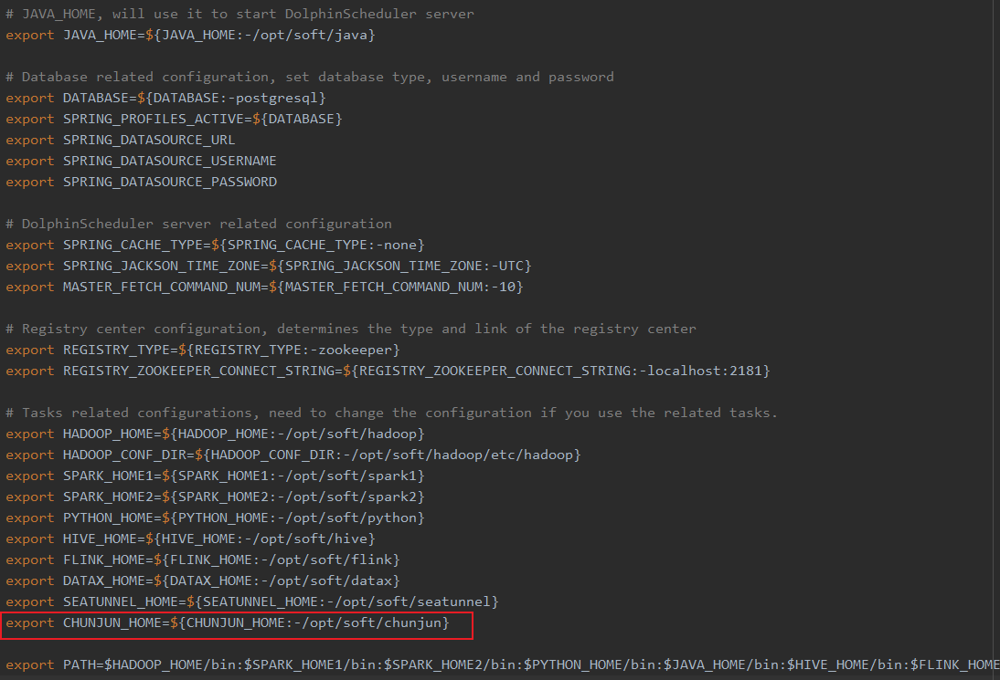
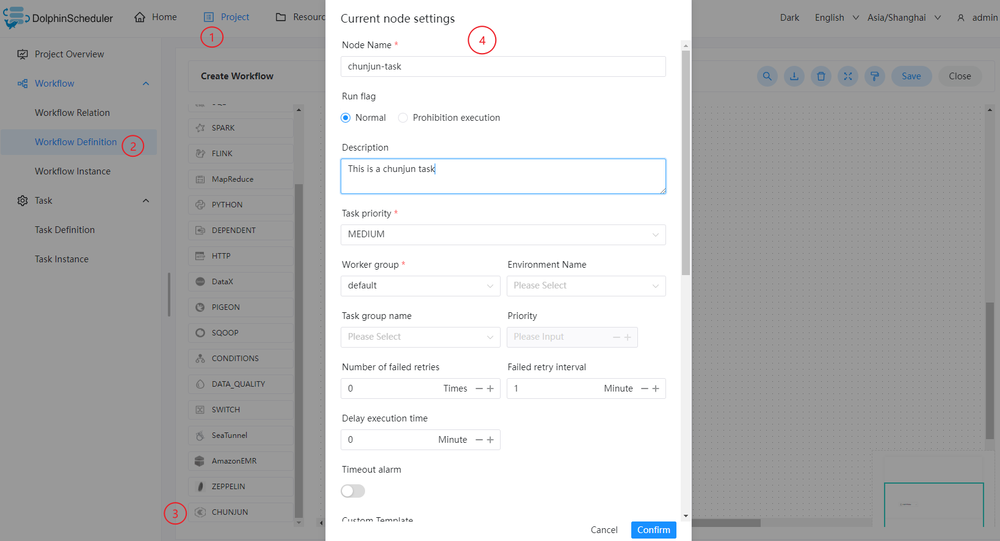
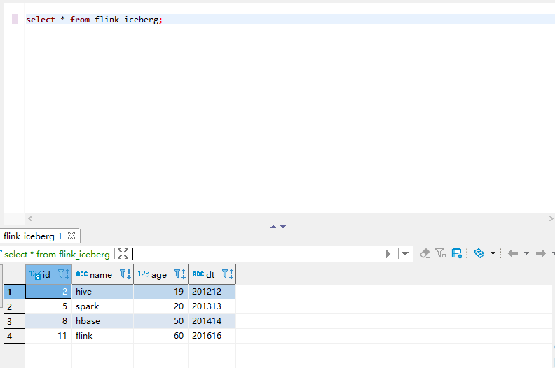

# ChunJun

## Overview

ChunJun task type for executing ChunJun programs. For ChunJun nodes, the worker will execute `${CHUNJUN_HOME}/bin/start-chunjun` to analyze the input json file.

## Create Task

- Click `Project Management -> Project Name -> Workflow Definition`, and click the `Create Workflow` button to enter the DAG editing page.
- Drag the  from the toolbar to the drawing board.

## Task Parameters

[//]: # (TODO: use the commented anchor below once our website template supports this syntax)
[//]: # (- Please refer to [DolphinScheduler Task Parameters Appendix]&#40;appendix.md#default-task-parameters&#41; `Default Task Parameters` section for default parameters.)

- Please refer to [DolphinScheduler Task Parameters Appendix](appendix.md) `Default Task Parameters` section for default parameters

|   **Parameter**   |                                                      **Description**                                                      |
|-------------------|---------------------------------------------------------------------------------------------------------------------------|
| Custom template   | Custom the content of the ChunJun node's json profile.                                                                    |
| json              | json configuration file for ChunJun synchronization.                                                                      |
| Custom parameters | It is a user-defined parameter, and will replace the content with `${variable}` in the script.                            |
| Deploy mode       | Execute chunjun task mode, eg local standalone.                                                                           |
| Option Parameters | Support such as `-confProp "{\"flink.checkpoint.interval\":60000}"`                                                       |
| Predecessor task  | Selecting a predecessor task for the current task will set the selected predecessor task as upstream of the current task. |

## Task Example

This example demonstrates importing data from Hive into MySQL.

### Configuring the ChunJun environment in DolphinScheduler

If you are using the ChunJun task type in a production environment, it is necessary to configure the required environment first. The configuration file is as follows: `/dolphinscheduler/conf/env/dolphinscheduler_env.sh`.



After the environment has been configured, DolphinScheduler needs to be restarted.

### Configuring ChunJun Task Node

As the data to be read from Hive, a custom json is required, refer to: [Hive Json Template](https://github.com/DTStack/chunjun/blob/master/chunjun-examples/json/hive/binlog_hive.json).

After writing the required json file, you can configure the node content by following the steps in the diagram below.



### View run results



### Note

Before execute ${CHUNJUN_HOME}/bin/start-chunjun, need to change the shell ${CHUNJUN_HOME}/bin/start-chunjun, remove '&' in order to run in front.

such as:

```shell
nohup $JAVA_RUN -cp $JAR_DIR $CLASS_NAME $@ &
```

update to following:

```shell
nohup $JAVA_RUN -cp $JAR_DIR $CLASS_NAME $@
```

