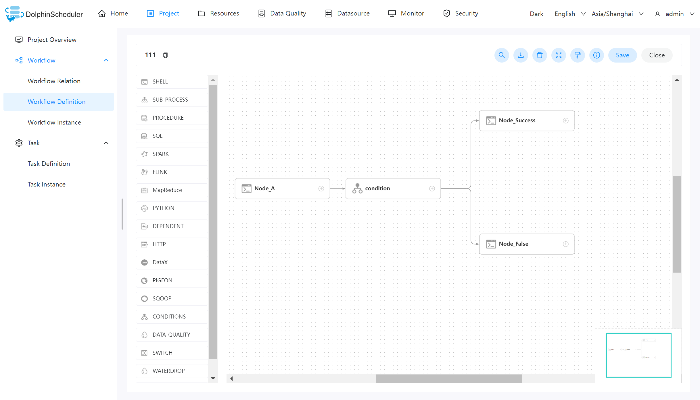
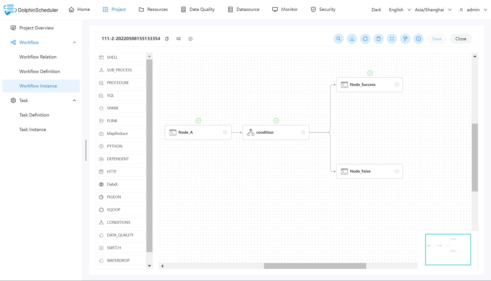
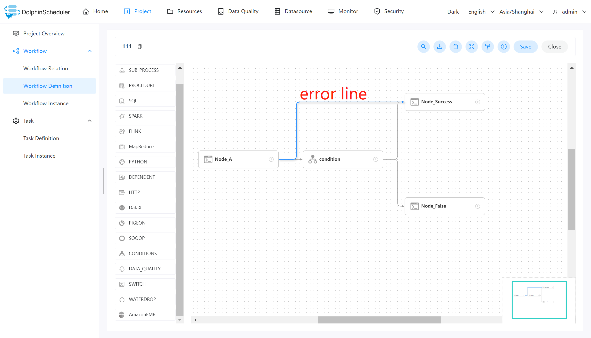
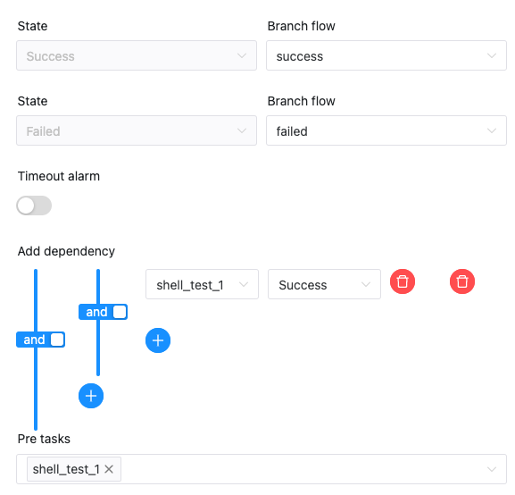

# Conditions

Condition is a conditional node, that determines which downstream task should run based on the condition of the upstream task. Currently, the Conditions support multiple upstream tasks, but only two downstream tasks. When the number of upstream tasks exceeds one, achieve complex upstream dependencies by through `and` and `or` operators.

## Create Task

- Click `Project Management -> Project Name -> Workflow Definition`, and click the `Create Workflow` button to enter the DAG editing page.
- Drag from the toolbar  task node to canvas.

## Task Parameters

[//]: # (TODO: use the commented anchor below once our website template supports this syntax)
[//]: # (- Please refer to [DolphinScheduler Task Parameters Appendix]&#40;appendix.md#default-task-parameters&#41; `Default Task Parameters` section for default parameters.)

- Please refer to [DolphinScheduler Task Parameters Appendix](appendix.md) `Default Task Parameters` section for default parameters.

|        **Parameter**         |                                                                                                                                                                                                             **Description**                                                                                                                                                                                                              |
|------------------------------|------------------------------------------------------------------------------------------------------------------------------------------------------------------------------------------------------------------------------------------------------------------------------------------------------------------------------------------------------------------------------------------------------------------------------------------|
| Downstream tasks selection   | Depending on the status of the predecessor task, you can jump to the corresponding branch, currently two branches are supported: success, failure <ul><li>Success: When the upstream task runs successfully, run the success branch.</li><li>Failure: When the upstream task runs failed, run the failure branch.</li></ul></li></ul>                                                                                                    |
| Upstream condition selection | Can select one or more upstream tasks for conditions.<ul><li>Add an upstream dependency: the first parameter is to choose a specified task name, and the second parameter is to choose the upstream task status to trigger conditions.</li><li>Select upstream task relationship: use `and` and `or` operators to handle the complex relationship of upstream when there are multiple upstream tasks for conditions.</li></ul></li></ul> |

## Related Task

[switch](switch.md): Conditions task mainly executes the corresponding branch based on the execution status (success, failure) of the upstream nodes. The [Switch](switch.md) task node mainly executes the corresponding branch based on the value of the [global parameter](../parameter/global.md) and the result of user written expression.

## Example

This sample demonstrates the operation of the Condition task by using the [Shell](shell.md) task.

### Create workflow

Go to the workflow definition page, and then create the following task nodes:

- Node_A: Shell task, prints out "hello world", its main function is the upstream branch of Condition, and triggers the corresponding branch node according to whether its execution is successful or not.
- Condition: The Conditions task executes the corresponding branch according to the execution status of the upstream task.
- Node_Success: Shell task, print out "success", Node_A executes the successful branch.
- Node_False: Shell task, print out "false", Node_A executes the failed branch.

### View the execution result

After you finish creating the workflow, you can run the workflow online. You can view the execution status of each task on the workflow instance page. As shown below:

In the above figure, the task status marked with a green check mark is the successfully executed task node.

## Note

- The Conditions task supports multiple upstream tasks, but only two downstream tasks.
- The Conditions task and the workflow that contain it do not support copy operations.
- The predecessor task of Conditions cannot connect to its branch nodes, which will cause logical confusion and does not conform to DAG scheduling. The situation shown below is **wrong**.

