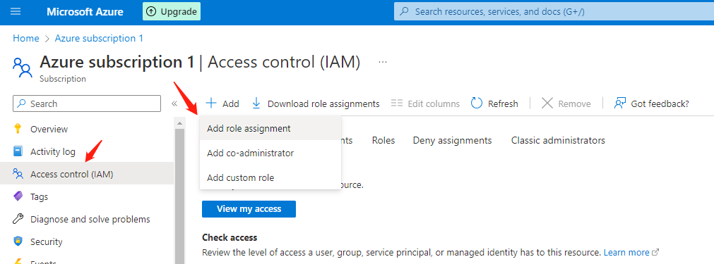
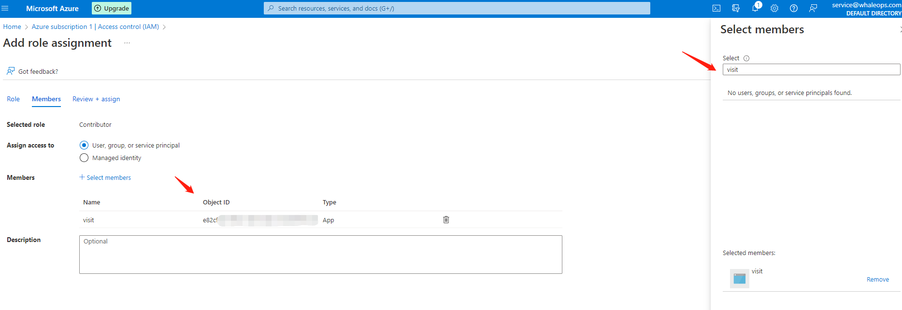
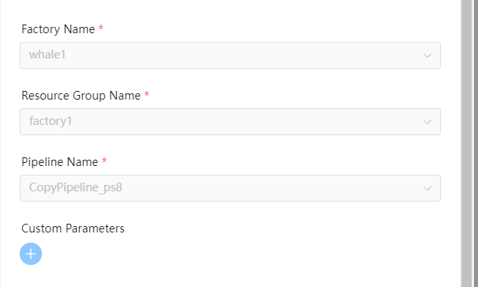

# Azure DataFactory Node

## Overview

In the world of big data, raw, unorganized data is often stored in relational, non-relational, and other storage systems.[Azure DataFactory](https://learn.microsoft.com/en-us/azure/data-factory/introduction) is a managed cloud service that's built for these complex hybrid extract-transform-load (ETL), extract-load-transform (ELT), and data integration projects.

DolphinScheduler DataFactory functions:

- Create Azure DataFactory task enable DolphinScheduler to schedule DataFactory pipelines, keep query pipeline execution status until finish the execution.

## Prerequisite

- **ResourceGroup**: Azure owns a resource group
- **DataFactory**: Azure owns a data factory under the resource group
- **Pipeline**: Azure owns pipelines under the assigned resource group and data factory
- **Application**: Azure owns an application has permission to visit data factory, enables using SDK to call data factory functions
- **ApplicationClientSecret**: To apply for client secret under Application `Certificates & secrets`
- **AZURE-CLI**: Install Azure auth application AZURE-CLI on machine, please refer to [Install the Azure CLI on Linux](https://learn.microsoft.com/en-us/cli/azure/install-azure-cli-linux)

### Application Permission Setting

First, visit the `Subscription` page and choose `Access control (IAM)`, then click `Add role assignment` to the authorization page.

After that, select `Contributor` role which satisfy functions calls in data factory. Then click `Members` page, and click `Select members`.
Search application name or application `Object ID` to assign `Contributor` role to application.


## Configurations

Config Azure configurations, modify `azure` related configurations in `common.properties`
- **resource.azure.client.id**: Azure Application Application (client) ID
- **resource.azure.client.secret**: Azure Application client secret under `Certificates & secrets`
- **resource.azure.subId**: Data factory subscription ID
- **resource.azure.tenant.id**: Azure Active Directory tenant ID

```yaml
# The Azure client ID (Azure Application (client) ID)
resource.azure.client.id=minioadmin
# The Azure client secret in the Azure application
resource.azure.client.secret=minioadmin
# The Azure data factory subscription ID
resource.azure.subId=minioadmin
# The Azure tenant ID in the Azure Active Directory
resource.azure.tenant.id=minioadmin

```

## Create Task

- Click `Project -> Management-Project -> Name-Workflow Definition`, and click the "Create Workflow" button to enter the
  DAG editing page.
- Drag from the toolbar  task node to canvas.

## Task Example

[//]: # (TODO: use the commented anchor below once our website template supports this syntax)
[//]: # (- Please refer to [DolphinScheduler Task Parameters Appendix]&#40;appendix.md#default-task-parameters&#41; `Default Task Parameters` section for default parameters.)

- Please refer to [DolphinScheduler Task Parameters Appendix](appendix.md) `Default Task Parameters` section for default parameters.

Here are some specific parameters for the DataFactory plugin:

- **factoryName**: data factory name
- **resourceGroupName**: resource group name of the data factory
- **pipelineName**: pipeline name under the resource group and data factory

The following shows the task plugin example:



