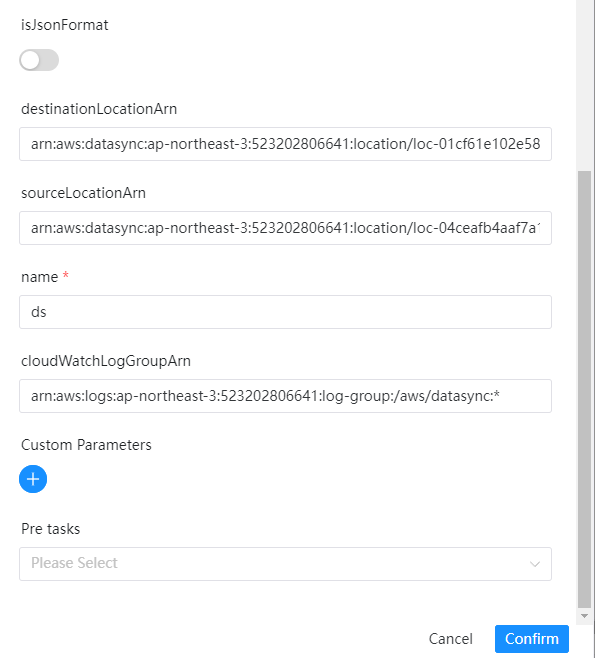

# DataSync Node

## Overview

[AWS DataSync](https://console.aws.amazon.com/datasync/) is an online data transfer service that simplifies, automates, and accelerates moving data between on-premises storage systems and AWS Storage services, as well as between AWS Storage services.

DataSync can copy data to and from:

- Network File System (NFS) file servers
- Server Message Block (SMB) file servers
- Hadoop Distributed File System (HDFS)
- Object storage systems
- Amazon Simple Storage Service (Amazon S3) buckets
- Amazon EFS file systems
- Amazon FSx for Windows File Server file systems
- Amazon FSx for Lustre file systems
- Amazon FSx for OpenZFS file systems
- Amazon FSx for NetApp ONTAP file systems
- AWS Snowcone devices

The follow shows the DolphinScheduler DataSync task plugin features:

- Create an AWS DataSync task and execute, continuously get the execution status until the task completes.

## Create Task

- Click `Project -> Management-Project -> Name-Workflow Definition`, and click the "Create Workflow" button to enter the
  DAG editing page.
- Drag from the toolbar  task node to canvas.

## Task Example

[//]: # (TODO: use the commented anchor below once our website template supports this syntax)
[//]: # (- Please refer to [DolphinScheduler Task Parameters Appendix]&#40;appendix.md#default-task-parameters&#41; `Default Task Parameters` section for default parameters.)

- Please refer to [DolphinScheduler Task Parameters Appendix](appendix.md) `Default Task Parameters` section for default parameters.

Here are some specific parameters for the DataSync plugin:

- **name**: Task name
- **destinationLocationArn**: The Amazon Resource Name (ARN) of an AWS storage resource's location. Visit [AWS API](https://docs.aws.amazon.com/datasync/latest/userguide/API_CreateTask.html#DataSync-CreateTask-request-DestinationLocationArn)
- **sourceLocationArn**: The Amazon Resource Name (ARN) of the source location for the task. Visit [AWS API](https://docs.aws.amazon.com/datasync/latest/userguide/API_CreateTask.html#DataSync-CreateTask-request-SourceLocationArn)
- **cloudWatchLogGroupArn**: The Amazon Resource Name (ARN) of the Amazon CloudWatch log group that is used to monitor and log events in the task. Visit [AWS API](https://docs.aws.amazon.com/datasync/latest/userguide/API_CreateTask.html#DataSync-CreateTask-request-CloudWatchLogGroupArn)

  or

- **json**: JSON parameters to construct datasync task, and supports parameters like options, etc. Visit: [AWS CreateTask API] 的 Request Syntax (https://docs.aws.amazon.com/datasync/latest/userguide/API_CreateTask.html)

- The following shows the task plugin example:



## Environment to prepare

The task requires AWS configurations, modify the value in file `common.properties`

```yaml
# Defines AWS access key and is required
resource.aws.access.key.id=<YOUR AWS ACCESS KEY>
# Defines AWS secret access key and is required
resource.aws.secret.access.key=<YOUR AWS SECRET KEY>
# Defines  AWS Region to use and is required
resource.aws.region=<AWS REGION>
```

