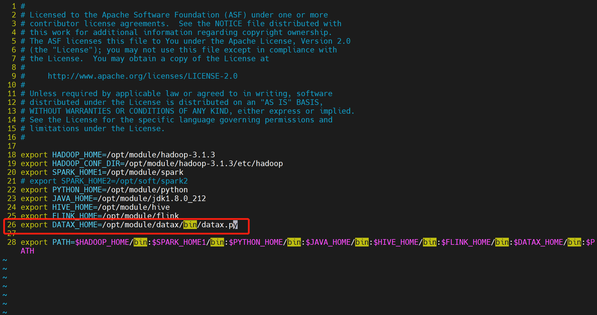
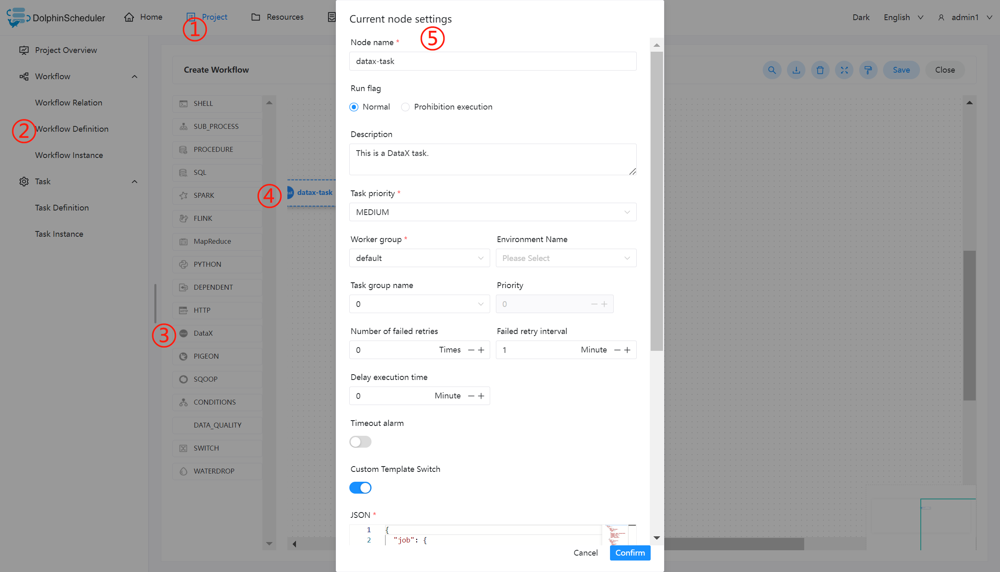
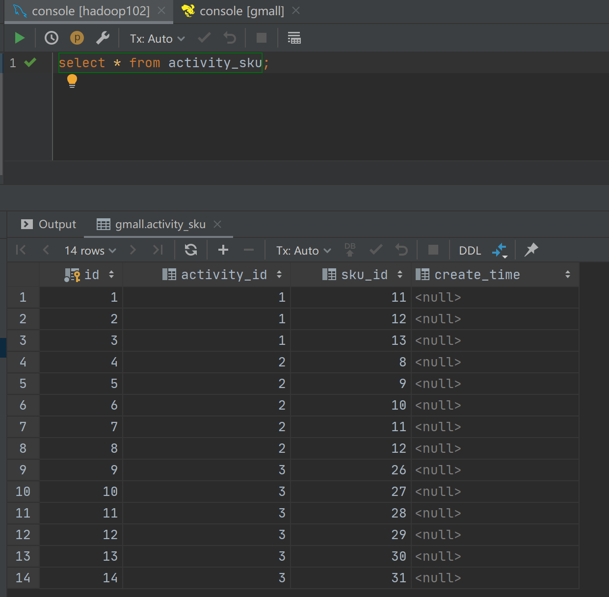

# DataX

## Overview

DataX task type for executing DataX programs. For DataX nodes, the worker will execute `${DATAX_LAUNCHER}` to analyze the input json file.

Please set environment name `PYTHON_LAUNCHER` before you run datax task, some of datax release version only support `python2.7`

## Create Task

- Click `Project Management -> Project Name -> Workflow Definition`, and click the `Create Workflow` button to enter the DAG editing page.
- Drag the  from the toolbar to the drawing board.

## Task Parameters

[//]: # (TODO: use the commented anchor below once our website template supports this syntax)
[//]: # (- Please refer to [DolphinScheduler Task Parameters Appendix]&#40;appendix.md#default-task-parameters&#41; `Default Task Parameters` section for default parameters.)

- Please refer to [DolphinScheduler Task Parameters Appendix](appendix.md) `Default Task Parameters` section for default parameters.

|         **Parameter**          |                                                                                                                                                    **Description**                                                                                                                                                     |
|--------------------------------|------------------------------------------------------------------------------------------------------------------------------------------------------------------------------------------------------------------------------------------------------------------------------------------------------------------------|
| Custom template                | Custom the content of the DataX node's json profile when the default data source provided does not meet the required requirements.                                                                                                                                                                                     |
| json                           | json configuration file for DataX synchronization.                                                                                                                                                                                                                                                                     |
| Resource                       | When using custom json, if the cluster has kerberos authentication enabled, and datax needs to use the relevant keytab, xml file, etc. when reading or writing plug-ins such as hdfs and hbase, you can use this option. and the files uploaded or created in Resource Center - File Management.                       |
| Custom parameters              | SQL task type, and stored procedure is a custom parameter order to set values for the method. The custom parameter type and data type are the same as the stored procedure task type. The difference is that the SQL task type custom parameter will replace the \${variable} in the SQL statement.                    |
| Data source                    | Select the data source from which the data will be extracted.                                                                                                                                                                                                                                                          |
| sql statement                  | the sql statement used to extract data from the target database, the sql query column name is automatically parsed when the node is executed, and mapped to the target table synchronization column name. When the source table and target table column names are inconsistent, they can be converted by column alias. |
| Target library                 | Select the target library for data synchronization.                                                                                                                                                                                                                                                                    |
| Pre-sql                        | Pre-sql is executed before the sql statement (executed by the target library).                                                                                                                                                                                                                                         |
| Post-sql                       | Post-sql is executed after the sql statement (executed by the target library).                                                                                                                                                                                                                                         |
| Stream limit (number of bytes) | Limits the number of bytes in the query.                                                                                                                                                                                                                                                                               |
| Limit flow (number of records) | Limit the number of records for a query.                                                                                                                                                                                                                                                                               |
| Running memory                 | the minimum and maximum memory required can be configured to suit the actual production environment.                                                                                                                                                                                                                   |

## Task Example

This example demonstrates importing data from Hive into MySQL.

### Configuring the DataX environment in DolphinScheduler

If you are using the DataX task type in a production environment, it is necessary to configure the required environment first. The configuration file is as follows: `/dolphinscheduler/conf/env/dolphinscheduler_env.sh`.

After the environment has been configured, DolphinScheduler needs to be restarted.

### Configuring DataX Task Node

As the default data source does not contain data to be read from Hive, a custom json is required, refer to: [HDFS Writer](https://github.com/alibaba/DataX/blob/master/hdfswriter/doc/hdfswriter.md). Note: Partition directories exist on the HDFS path, when importing data in real world situations, partitioning is recommended to be passed as a parameter, using custom parameters.

After writing the required json file, you can configure the node content by following the steps in the diagram below.

### View run results

### Note

If the default data source provided does not meet your needs, you can configure the writer and reader of DataX according to the actual usage environment in the custom template option, available at https://github.com/alibaba/DataX.
