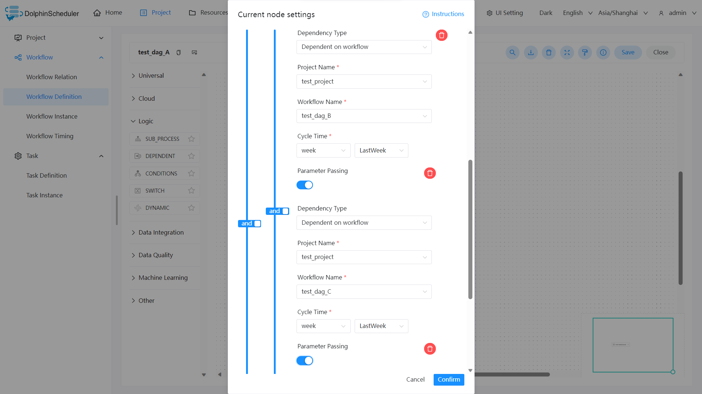

# Dependent

## Overview

Dependent nodes are **dependency check nodes**. For example, process A depends on the successful execution of process B from yesterday, and the dependent node will check whether process B run successful yesterday.

## Create Task

- Click `Project Management -> Project Name -> Workflow Definition`, and click the `Create Workflow` button to enter the DAG editing page.
- Drag from the toolbar  task node to canvas.

## Task Parameter

[//]: # (TODO: use the commented anchor below once our website template supports this syntax)
[//]: # (- Please refer to [DolphinScheduler Task Parameters Appendix]&#40;appendix.md#default-task-parameters&#41; `Default Task Parameters` section for default parameters.)

- Please refer to [DolphinScheduler Task Parameters Appendix](appendix.md) `Default Task Parameters` section for default parameters.

|  **Parameter**   |               **Description**               |
|------------------|---------------------------------------------|
| Predecessor Task | The upstream task of the current task node. |

## Task Examples

The Dependent node provides a logical judgment function, which can detect the execution of the dependent node according to the logic.

For example, process A is a weekly task, processes B and C are daily tasks, and task A requires tasks B and C to be successfully executed every day of the last week.

And another example is that process A is a weekly report task, processes B and C are daily tasks, and task A requires tasks B or C to be successfully executed every day of the last week:

If the weekly report A also needs to be executed successfully last Tuesday:

