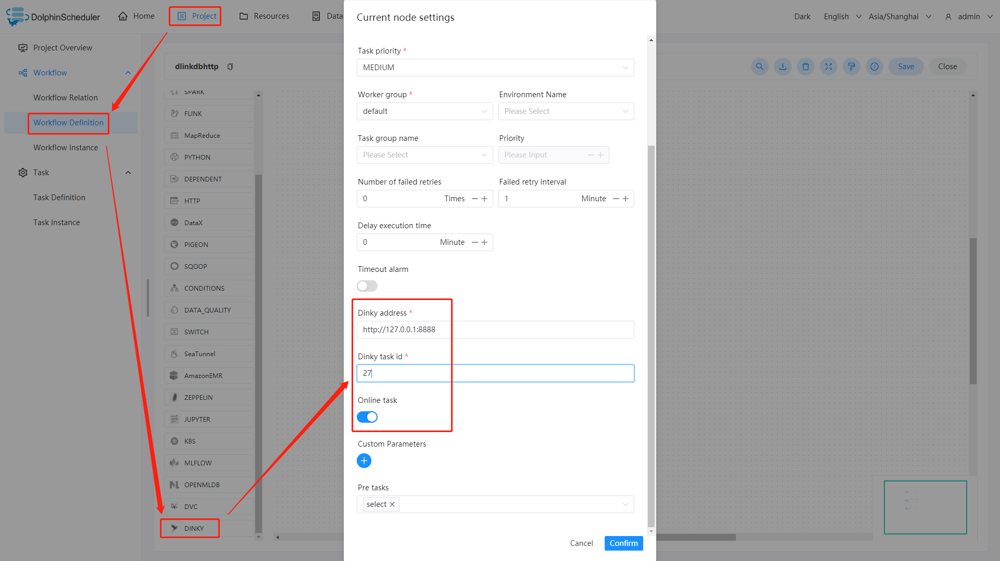
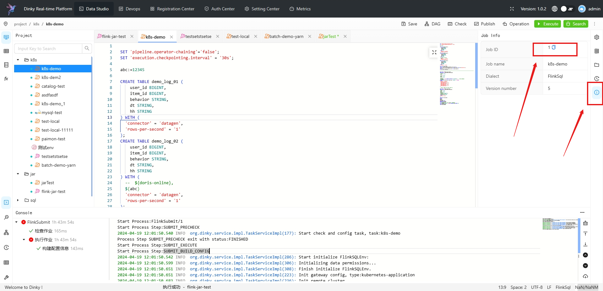

# Dinky

## Overview

Use `Dinky Task` to create a dinky-type task and support one-stop development, debugging, operation and maintenance of FlinkSql, Flink jar and SQL. When the worker executes `Dinky Task`,
it will call `Dinky API` to trigger dinky task. Click [here](http://www.dlink.top/) for details about `Dinky`.

## Create Task

- Click Project Management-Project Name-Workflow Definition, and click the "Create Workflow" button to enter the DAG editing page.
- Drag  from the toolbar to the canvas.

## Task Parameter

[//]: # (TODO: use the commented anchor below once our website template supports this syntax)
[//]: # (- Please refer to [DolphinScheduler Task Parameters Appendix]&#40;appendix.md#default-task-parameters&#41; `Default Task Parameters` section for default parameters.)

- Please refer to [DolphinScheduler Task Parameters Appendix](appendix.md) `Default Task Parameters` section for default parameters.

| **Parameter** |                                                                                       **Description**                                                                                        |
|---------------|----------------------------------------------------------------------------------------------------------------------------------------------------------------------------------------------|
| Dinky Address | The url for a dinky server.                                                                                                                                                                  |
| Dinky Task ID | The unique task id for a dinky task.                                                                                                                                                         |
| Online Task   | Specify whether the current dinky job is online. If yes, the submitted job can only be submitted successfully when it is published and there is no corresponding Flink job instance running. |

## Task Example

### Dinky Task Example

This example illustrates how to create a dinky task node.

