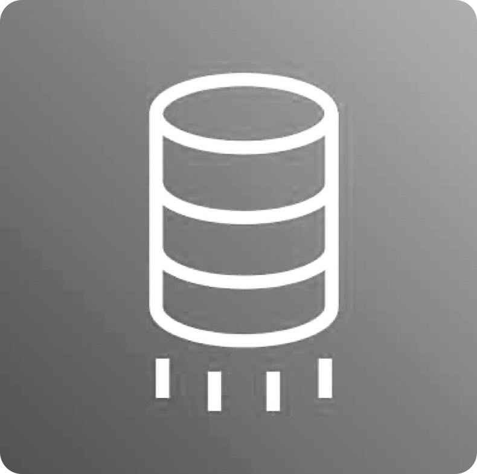
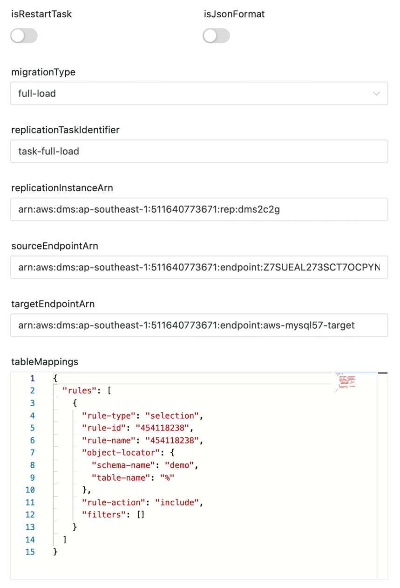
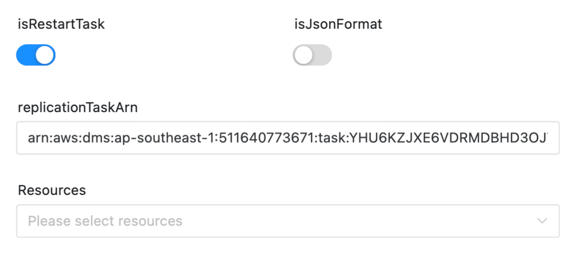
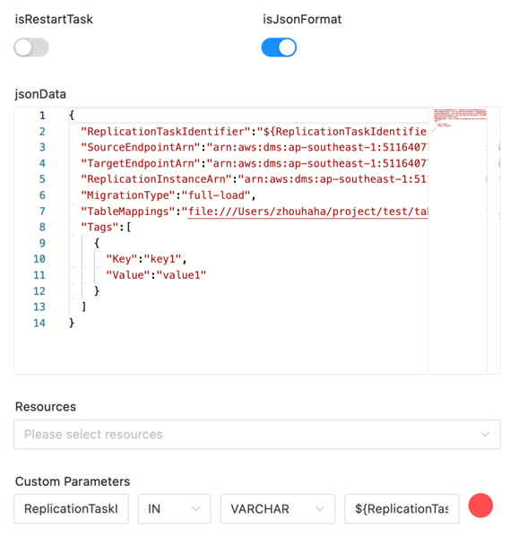
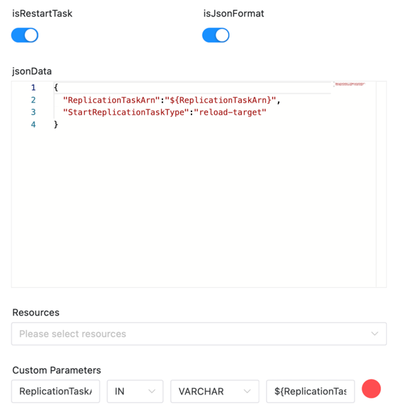

# DMS Node

## Overview

[AWS Database Migration Service (AWS DMS)](https://aws.amazon.com/cn/dms) helps you migrate databases to AWS quickly and securely.
The source database remains fully operational during the migration, minimizing downtime to applications that rely on the database.
The AWS Database Migration Service can migrate your data to and from the most widely used commercial and open-source databases.

DMS task plugin can help users to create and start DMS tasks in DolphinScheduler more conveniently.

Contains two features:
- Create DMS task and start DMS task
- Restart DMS task

We can create DMS task and start DMS task in two ways:
- Use interface
- Use JSON data

DolphinScheduler will track the status of the DMS task and set the status to successfully completed when the DMS task is completed. Except for the CDC task without end time.

So, if the `migrationType` is `cdc` or `full-load-and-cdc`, `cdcStopPosition` not be set, DolphinScheduler will set the status to successfully after the DMS task starts successfully.

## Create Task

- Click `Project Management -> Project Name -> Workflow Definition`, and click the `Create Workflow` button to enter the DAG editing page.
- Drag  from the toolbar to the canvas.

## Task Example

The task plugin picture is as follows

**Create and start DMS task by interface**



**Restart DMS task by interface**



**Create and start DMS task by JSON data**



**Restart DMS task by JSON data**



### First, introduce some general parameters of DolphinScheduler

[//]: # (TODO: use the commented anchor below once our website template supports this syntax)
[//]: # (- Please refer to [DolphinScheduler Task Parameters Appendix]&#40;appendix.md#default-task-parameters&#41; `Default Task Parameters` section for default parameters.)

- Please refer to [DolphinScheduler Task Parameters Appendix](appendix.md) `Default Task Parameters` section for default parameters.

### Here are some specific parameters for the DMS plugin

- **isRestartTask**：Whether to restart the task. If it is true, the task will be restarted. If it is false, the task will be created and started.
- **isJsonFormat**：Whether to use JSON data to create and start the task. If it is true, the task will be created and started by JSON data. If it is false, the task will be created and started by interface.
- **jsonData**：Json data for creating and starting the task. Only when `isJsonFormat` is true, this parameter is valid.

Parameters of creating and starting the task by interface

- **migrationType**：The type of migration. The value can be full-load, cdc, full-load-and-cdc.
- **replicationTaskIdentifier**：The name of the task.
- **replicationInstanceArn**：The ARN of the replication instance.
- **sourceEndpointArn**：The ARN of the source endpoint.
- **targetEndpointArn**：The ARN of the target endpoint.
- **tableMappings**：The mapping of the table.

Parameters of restarting the task by interface

- **replicationTaskArn**：The ARN of the task.

## Environment to prepare

Some AWS configuration is required, modify a field in file `aws.yaml`

```yaml
dms:
  # The AWS credentials provider type. support: AWSStaticCredentialsProvider, InstanceProfileCredentialsProvider
  # AWSStaticCredentialsProvider: use the access key and secret key to authenticate
  # InstanceProfileCredentialsProvider: use the IAM role to authenticate
  credentials.provider.type: AWSStaticCredentialsProvider
  access.key.id: <access.key.id>
  access.key.secret: <access.key.secret>
  region: <region>
  endpoint: <endpoint>
```

