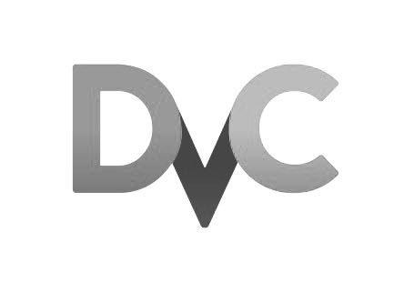
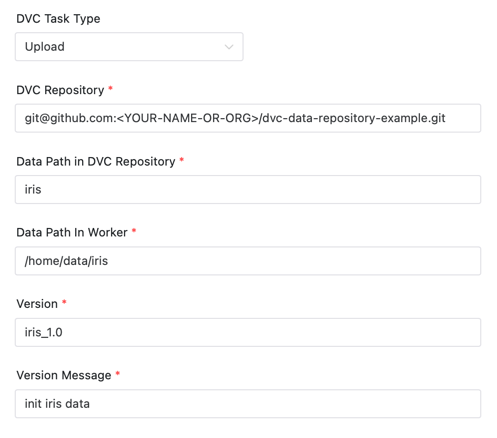
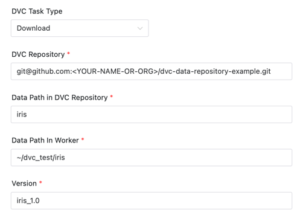
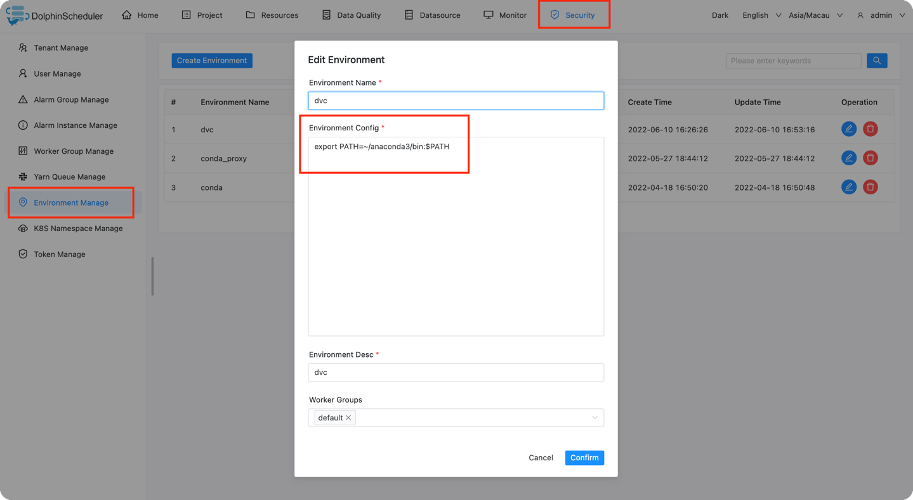
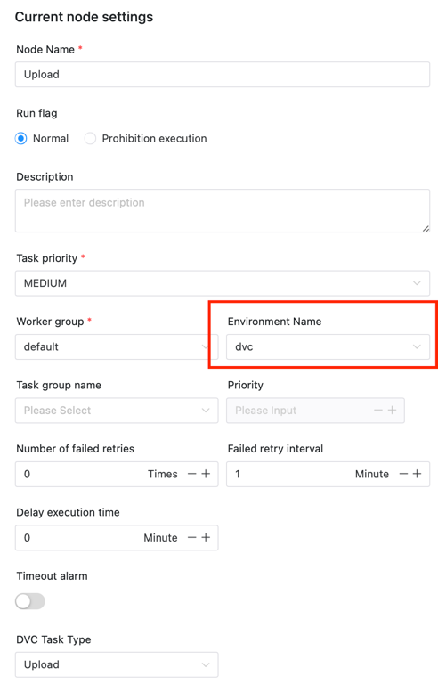

# DVC Node

## Overview

[DVC (Data Version Control)](https://dvc.org) is an excellent open-source  version control system for machine learning projects.

The DVC plugin is used to use the data version management function of DVC on DolphinScheduler, helping users to carry out data version management easily.

The plugin provides the following three functions:

- Init DVC: Initialize the Git repository as a DVC repository and bind the address where the data is stored to store the actual data.
- Upload: Add or update specific data to the repository and record the version tag.
- Download: Download a specific version of data from the repository.

## Create Task

- Click `Project -> Management-Project -> Name-Workflow Definition`, and click the "Create Workflow" button to enter the
  DAG editing page.
- Drag from the toolbar  task node to canvas.

## Task Parameters

[//]: # (TODO: use the commented anchor below once our website template supports this syntax)
[//]: # (- Please refer to [DolphinScheduler Task Parameters Appendix]&#40;appendix.md#default-task-parameters&#41; `Default Task Parameters` section for default parameters.)

- Please refer to [DolphinScheduler Task Parameters Appendix](appendix.md) `Default Task Parameters` section for default parameters.

|        **Parameter**        |                                                                                               **Description**                                                                                               |
|-----------------------------|-------------------------------------------------------------------------------------------------------------------------------------------------------------------------------------------------------------|
| DVC Task Type               | Upload, Download or Init DVC。                                                                                                                                                                               |
| DVC Repository              | The DVC repository address associated with the task execution.                                                                                                                                              |
| Remote Store Url            | The actual data is stored at the address. You can learn about the supported storage types from the [DVC supported storage types](https://dvc.org/doc/command-reference/remote/add#supported-storage-types). |
| Data Path in DVC Repository | The path which the task uploads /downloads data to in the repository.                                                                                                                                       |
| Data Path In Worker         | Data path to be uploaded. / Path for saving data after the file is downloaded to the local                                                                                                                  |
| Version                     | After the data is uploaded, the version tag for the data will be saved in `git tag`. / The version of the data to download.                                                                                 |
| Version Message             | Version Message.                                                                                                                                                                                            |

### Init DVC

Initialize the Git repository as a DVC repository and add a new data remote to save data.

After the project is initialized, it is still a Git repository, but with DVC features added.

The data is not actually stored in a Git repository, but somewhere else, and DVC keeps track of the version and address of the data and handles this relationship.


The example above shows that:
Initialize repository `git@github.com:<YOUR-NAME-OR-ORG>/dvc-data-repository-example.git` as a DVC project and bind the remote storage address to `~/dvc`

### Upload

Used to upload and update data and record version numbers.



The example above shows that:

Upload data `/home/data/iris` to the root directory of repository `git@github.com:<YOUR-NAME-OR-ORG>/dvc-data-repository-example.git`. The file or folder of data is named `iris`.

Then run `git tag "iris_1.0" -m "init iris data"`. Record the version tag `iris_1.0` and the version message `inir iris data`.

### Download

Used to download data for a specific version.



The example above shows that:

Download the data for iris data at version `iris_1.0` in repository `git@github.com:<YOUR-NAME-OR-ORG>/dvc-data-repository-example.git` to the `~/dvc_test/iris`

## Environment to prepare

### Install DVC

Make sure you have installed DVC, if not, you can run `pip install dvc` command to install it.

Get the 'dvc' path and configure the environment variables.

The conda environment is used as an example:

Install python PIP on Conda and configure conda's environment variables so that the component can correctly find the 'DVC' command

```shell
which dvc
# >> ~/anaconda3/bin/dvc
```

You need to enter the admin account to configure a conda environment variable（Please
install [anaconda](https://docs.continuum.io/anaconda/install/)
or [miniconda](https://docs.conda.io/en/latest/miniconda.html#installing) in advance).



Note During the configuration task, select the conda environment created above. Otherwise, the program cannot find the
Conda environment.


