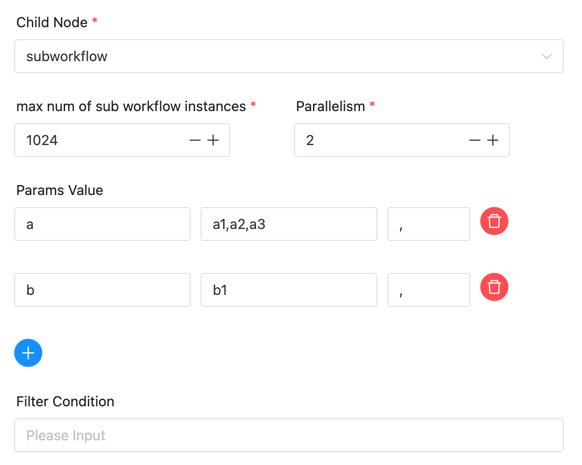
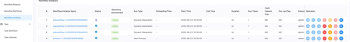

# Dynamic Task

## Overview

Dynamic task can input multiple parameter lists, calculate all parameter combinations through Cartesian product, and then execute each parameter combination as a sub-workflow node.

For example, we have a workflow with two input parameters, a, b.

We can use the dynamic node to define this workflow definition as a node, and then enter the parameter list

- Parameter a: a1, a2
- Parameter b: b1, b2

Then the dynamic node will calculate four parameter combinations, which are
- a1, b1
- a1, b2
- a2, b1
- a2, b2

Then execute these four parameter combinations as the startup parameters of the sub-workflow node, and a total of four sub-workflow nodes are generated.

## Create Task

- Click `Project -> Management-Project -> Name-Workflow Definition`, and click the "Create Workflow" button to enter the
  DAG editing page.
- Drag from the toolbar  task node to canvas.

The task definition is shown in the following figure:



## Task Parameters

[//]: # (TODO: use the commented anchor below once our website template supports this syntax)
[//]: # (- Please refer to [DolphinScheduler Task Parameters Appendix]&#40;appendix.md#default-task-parameters&#41; `Default Task Parameters` section for default parameters.)

- Please refer to [DolphinScheduler Task Parameters Appendix](appendix.md) `Default Task Parameters` section for default parameters.

|        **Task Parameters**        |                                                                                                                         **Description**                                                                                                                          |
|-----------------------------------|------------------------------------------------------------------------------------------------------------------------------------------------------------------------------------------------------------------------------------------------------------------|
| Child Node                        | Select the workflow definition of the sub-workflow. You can jump to the workflow definition of the selected sub-workflow by entering the sub-node in the upper right corner.                                                                                     |
| max num of sub workflow instances | The maximum number of sub-workflow instances dynamically generated. After exceeding this upper limit, the dynamically generated sub-workflow instances will no longer be executed.                                                                               |
| Parallelism                       | The parallelism of the sub-workflow instances dynamically generated, that is, the number of sub-workflow instances executed at the same time.                                                                                                                    |
| Param Value                       | The parameter of the sub-workflow instance dynamically generated, supports multiple parameters, and the parameters are separated by delimiters.                                                                                                                  |
| Filter Condition                  | The filter condition of the sub-workflow instance dynamically generated, supports multiple filter values, and the filter conditions are separated by commas, such as `2022,2023`, which will filter the parameter groups containing the values of 2022 and 2023. |

## Task Parameters Output

The output parameters of the dynamic node refer to the output parameters of the sub-workflow. The output parameters of all sub-workflows will be collected into a list as the output parameters of the dynamic node.

When the downstream task is referenced, it can be referenced by `${dynamic.out(TaskName)}`.

The value is a json, as shown below

```Json
[
    { "dynParams":{ "a":"a1", "b":"b1" }, "outputValue":{ "p":"a1-b1" }, "mappedTimes":1 },
    { "dynParams":{ "a":"a2", "b":"b1" }, "outputValue":{ "p":"a2-b1" }, "mappedTimes":2 },
    { "dynParams":{ "a":"a3", "b":"b1" }, "outputValue":{ "p":"a3-b1" }, "mappedTimes":3 }
]
```

- `dynParams` the input parameters of the sub-workflow
- `outputValue` is the output parameter of the sub-workflow. For example, the `p` here is a string that splices the output parameters `a` and `b` of the sub-workflow and outputs them in the form of variables `p`
- `mappedTimes` is the index of the execution of the sub-workflow, starting from 1

## Running Status

After the dynamic task is started, all parameter combinations will be calculated according to the input parameter list, and then a sub-workflow instance will be created for each parameter combination.

When the dynamic task is running, it will periodically check the statistical information of all current sub-workflow instances. If the parallelism is greater than the number of sub-workflow instances running, it will trigger the start of the appropriate number of sub-workflow instances (the sub-workflow instances are created first, and then the start is triggered later).

As shown below.



The dynamic task will run successfully only when all sub-workflow instances are running successfully.
