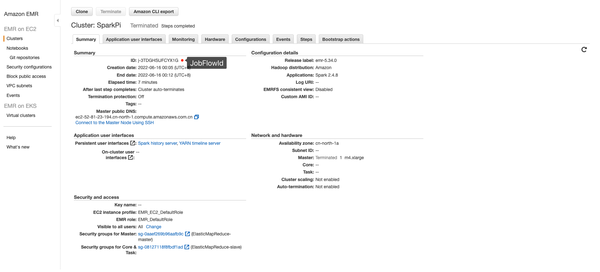

# Amazon EMR

## Overview

Amazon EMR task type, for operation EMR clusters on AWS and running computing tasks.
Using [aws-java-sdk](https://aws.amazon.com/cn/sdk-for-java/) in the background code, to transfer JSON parameters to task object and submit to AWS, Two program types are currently supported:

* `RUN_JOB_FLOW` Using [API_RunJobFlow](https://docs.aws.amazon.com/emr/latest/APIReference/API_RunJobFlow.html#API_RunJobFlow_Examples) submit [RunJobFlowRequest](https://docs.aws.amazon.com/AWSJavaSDK/latest/javadoc/com/amazonaws/services/elasticmapreduce/model/RunJobFlowRequest.html) object
* `ADD_JOB_FLOW_STEPS` Using [API_AddJobFlowSteps](https://docs.aws.amazon.com/emr/latest/APIReference/API_AddJobFlowSteps.html#API_AddJobFlowSteps_Examples) submit [AddJobFlowStepsRequest](https://docs.aws.amazon.com/AWSJavaSDK/latest/javadoc/com/amazonaws/services/elasticmapreduce/model/AddJobFlowStepsRequest.html) object

## Create Task

* Click `Project Management -> Project Name -> Workflow Definition`, click the `Create Workflow` button to enter the DAG editing page.
* Drag `AmazonEMR` task from the toolbar to the artboard to complete the creation.

## Task Parameters

[//]: # (TODO: use the commented anchor below once our website template supports this syntax)
[//]: # (- Please refer to [DolphinScheduler Task Parameters Appendix]&#40;appendix.md#default-task-parameters&#41; `Default Task Parameters` section for default parameters.)

- Please refer to [DolphinScheduler Task Parameters Appendix](appendix.md) `Default Task Parameters` section for default parameters.

|   **Parameter**   |                                                                                                                                                                       **Description**                                                                                                                                                                       |
|-------------------|-------------------------------------------------------------------------------------------------------------------------------------------------------------------------------------------------------------------------------------------------------------------------------------------------------------------------------------------------------------|
| Program Type      | Select the program type. If it is `RUN_JOB_FLOW`, you need to fill in `jobFlowDefineJson`, if it is `ADD_JOB_FLOW_STEPS`, you need to fill in `stepsDefineJson`.                                                                                                                                                                                            |
| jobFlowDefineJson | JSON corresponding to the [RunJobFlowRequest](https://docs.aws.amazon.com/AWSJavaSDK/latest/javadoc/com/amazonaws/services/elasticmapreduce/model/RunJobFlowRequest.html) object, for details refer to [API_RunJobFlow_Examples](https://docs.aws.amazon.com/emr/latest/APIReference/API_RunJobFlow.html#API_RunJobFlow_Examples).                          |
| stepsDefineJson   | JSON corresponding to the [AddJobFlowStepsRequest](https://docs.aws.amazon.com/AWSJavaSDK/latest/javadoc/com/amazonaws/services/elasticmapreduce/model/AddJobFlowStepsRequest.html) object, for details refer to [API_AddJobFlowSteps_Examples](https://docs.aws.amazon.com/emr/latest/APIReference/API_AddJobFlowSteps.html#API_AddJobFlowSteps_Examples). |

## Task Example

### Create an EMR cluster and run Steps

This example shows how to create an `EMR` task node of type `RUN_JOB_FLOW`. Taking the execution of `SparkPi` as an example, the task will create an `EMR` cluster and execute the `SparkPi` sample program.


jobFlowDefineJson example

```json
{
  "Name": "SparkPi",
  "ReleaseLabel": "emr-5.34.0",
  "Applications": [
    {
      "Name": "Spark"
    }
  ],
  "Instances": {
    "InstanceGroups": [
      {
        "Name": "Primary node",
        "InstanceRole": "MASTER",
        "InstanceType": "m4.xlarge",
        "InstanceCount": 1
      }
    ],
    "KeepJobFlowAliveWhenNoSteps": false,
    "TerminationProtected": false
  },
  "Steps": [
    {
      "Name": "calculate_pi",
      "ActionOnFailure": "CONTINUE",
      "HadoopJarStep": {
        "Jar": "command-runner.jar",
        "Args": [
          "/usr/lib/spark/bin/run-example",
          "SparkPi",
          "15"
        ]
      }
    }
  ],
  "JobFlowRole": "EMR_EC2_DefaultRole",
  "ServiceRole": "EMR_DefaultRole"
}
```

### Add a Step to a Running EMR Cluster

This example shows how to create an `EMR` task node of type `ADD_JOB_FLOW_STEPS`. Taking the execution of `SparkPi` as an example, the task will add a `SparkPi` sample program to the running `EMR` cluster.



stepsDefineJson example

```json
{
  "JobFlowId": "j-3V628TKAERHP8",
  "Steps": [
    {
      "Name": "calculate_pi",
      "ActionOnFailure": "CONTINUE",
      "HadoopJarStep": {
        "Jar": "command-runner.jar",
        "Args": [
          "/usr/lib/spark/bin/run-example",
          "SparkPi",
          "15"
        ]
      }
    }
  ]
}
```

## Notice

- Failover on EMR Task type has not been implemented. In this time, DolphinScheduler only supports failover on yarn task type . Other task type, such as EMR task, k8s task not ready yet.
- `stepsDefineJson` A task definition only supports the association of a single step, which can better ensure the reliability of the task state.

