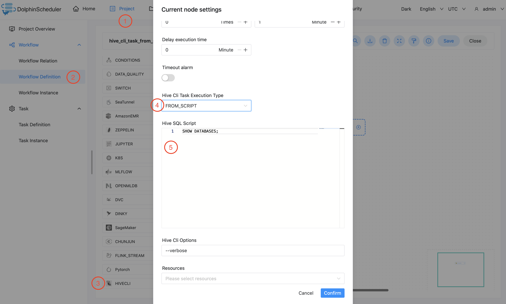
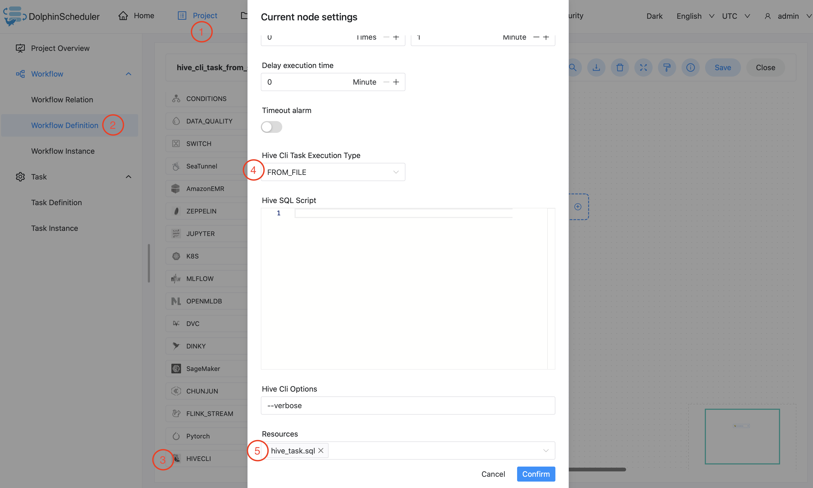

# Hive CLI

## Overview

Use `Hive Cli Task` to create a `Hive Cli` type task and execute hive SQL from scripts or files.
The workers run `hive -e` to execute hive sql from scripts or `hive -f` to execute from files in `Resource Center`.

## Hive CLI Task vs SQL Task With Hive Datasource

In DolphinScheduler, we have both `Hive CLI Task` and `SQL Task With Hive Datasource` for different scenarios.
You could choose between these two based on your needs.

- The `Hive CLI` task plugin connects directly to `HDFS` and the `Hive Metastore` for hive task executions,
  which requires your workers to have access to those services, such as related `Hive` libs, `Hive` and `HDFS` configuration files.
  However, `Hive CLI Task` provides better stability for scheduling in production.
- `SQL Task With Hive Datasource` does not require access to `Hive` libs, `Hive` and
  `HDFS` configuration files and supports `Kerberos` for authentication. However, you may encounter `HiveServer2` failures
  if your hive sql task scheduling puts significant pressure on it.

## Create Task

- Click `Project Management-Project Name-Workflow Definition`, and click the `Create Workflow` button to enter the DAG editing page.
- Drag  from the toolbar to the canvas.

## Task Parameters

[//]: # (TODO: use the commented anchor below once our website template supports this syntax)
[//]: # (- Please refer to [DolphinScheduler Task Parameters Appendix]&#40;appendix.md#default-task-parameters&#41; `Default Task Parameters` section for default parameters.)

- Please refer to [DolphinScheduler Task Parameters Appendix](appendix.md) `Default Task Parameters` section for default parameters.

|        **Parameter**         |                                           **Description**                                            |
|------------------------------|------------------------------------------------------------------------------------------------------|
| Hive Cli Task Execution Type | The type of hive cli task execution, choose either `FROM_SCRIPT` or `FROM_FILE`.                     |
| Hive SQL Script              | If you choose `FROM_SCRIPT` for `Hive Cli Task Execution Type`, you need to fill in your SQL script. |
| Hive Cli Options             | Extra options for hive cli, such as `--verbose`                                                      |
| Resources                    | If you choose `FROM_FILE` for `Hive Cli Task Execution Type`, you need to select your SQL file.      |

## Task Example

### Hive Cli Task Example

This example below illustrates how to create a `Hive CLI` task node and execute hive SQL from script:

This example below illustrates how to create a `Hive CLI` task node and execute hive SQL from file:

