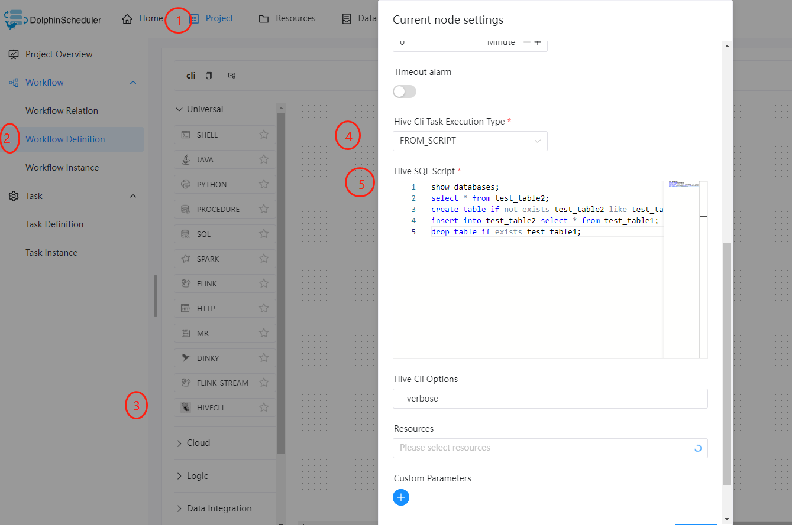

# Hive CLI

## Overview

Use `Hive Cli Task` to create a `Hive Cli` type task and execute hive SQL from scripts or files.
The workers run `hive -e` to execute hive sql from scripts or `hive -f` to execute from files in `Resource Center`.

## Hive CLI Task vs SQL Task With Hive Datasource

In DolphinScheduler, we have both `Hive CLI Task` and `SQL Task With Hive Datasource` for different scenarios.
You could choose between these two based on your needs.

- The `Hive CLI` task plugin connects directly to `HDFS` and the `Hive Metastore` for hive task executions,
  which requires your workers to have access to those services, such as related `Hive` libs, `Hive` and `HDFS` configuration files.
  However, `Hive CLI Task` provides better stability for scheduling in production.
- `SQL Task With Hive Datasource` does not require access to `Hive` libs, `Hive` and
  `HDFS` configuration files and supports `Kerberos` for authentication. However, you may encounter `HiveServer2` failures
  if your hive sql task scheduling puts significant pressure on it.

## Create Task

- Click `Project Management-Project Name-Workflow Definition`, and click the `Create Workflow` button to enter the DAG editing page.
- Drag  from the toolbar to the canvas.

## Task Parameters

|        **Parameter**         |                                                                                                                                        **Description**                                                                                                                                         |
|------------------------------|------------------------------------------------------------------------------------------------------------------------------------------------------------------------------------------------------------------------------------------------------------------------------------------------|
| Node Name                    | The name of the task. Node names within the same workflow must be unique.                                                                                                                                                                                                                      |
| Run Flag                     | Indicating whether to schedule the task. If you do not need to execute the task, you can turn on the `Prohibition execution` switch.                                                                                                                                                           |
| Description                  | Describing the function of this node.                                                                                                                                                                                                                                                          |
| Task Priority                | When the number of the worker threads is insufficient, the worker executes task according to the priority. When two tasks have the same priority, the worker will execute them in `first come first served` fashion.                                                                           |
| Worker Group                 | Machines which execute the tasks. If you choose `default`, scheduler will send the task to a random worker.                                                                                                                                                                                    |
| Task Group Name              | Resource group of tasks. It will not take effect if not configured.                                                                                                                                                                                                                            |
| Environment Name             | Environment to execute the task.                                                                                                                                                                                                                                                               |
| Number of Failed Retries     | The number of task retries for failures. You could select it by drop-down menu or fill it manually.                                                                                                                                                                                            |
| Failure Retry Interval       | Interval of task retries for failures. You could select it by drop-down menu or fill it manually.                                                                                                                                                                                              |
| CPU Quota                    | Assign the specified CPU time quota to the task executed. Takes a percentage value. Default -1 means unlimited. For example, the full CPU load of one core is 100%, and that of 16 cores is 1600%. You could configure it by [task.resource.limit.state](../../architecture/configuration.md). |
| Max Memory                   | Assign the specified max memory to the task executed. Exceeding this limit will trigger oom to be killed and will not automatically retry. Takes an MB value. Default -1 means unlimited. You could configure it by [task.resource.limit.state](../../architecture/configuration.md).          |
| Timeout Alarm                | Alarm for task timeout. When the task exceeds the "timeout threshold", an alarm email will send.                                                                                                                                                                                               |
| Hive Cli Task Execution Type | The type of hive cli task execution, choose either `FROM_SCRIPT` or `FROM_FILE`.                                                                                                                                                                                                               |
| Hive SQL Script              | If you choose `FROM_SCRIPT` for `Hive Cli Task Execution Type`, you need to fill in your SQL script.                                                                                                                                                                                           |
| Hive Cli Options             | Extra options for hive cli, such as `--verbose`                                                                                                                                                                                                                                                |
| Resources                    | If you choose `FROM_FILE` for `Hive Cli Task Execution Type`, you need to select your SQL file.                                                                                                                                                                                                |

## Task Example

### Hive Cli Task Example

This example below illustrates how to create a `Hive CLI` task node and execute hive SQL from script:

This example below illustrates how to create a `Hive CLI` task node and execute hive SQL from file:

