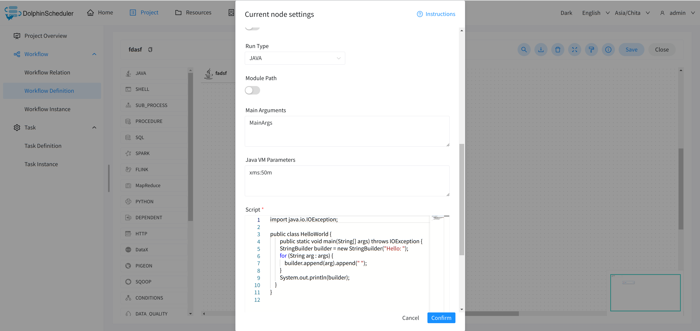

# Overview

This node is for executing java-type tasks and supports using files and jar packages as program entries.

# Create Tasks

- Click on `Project Management` -> `Project Name` -> `Workflow Definition`, click on the “Create workflow” button, go to the DAG edit page:

- Drag the toolbar's Java task node to the palette.

# Task Parameters

[//]: # (TODO: use the commented anchor below once our website template supports this syntax)
[//]: # (- Please refer to [DolphinScheduler Task Parameters Appendix]&#40;appendix.md#default-task-parameters&#41; `Default Task Parameters` section for default parameters.)

- Please refer to [DolphinScheduler Task Parameters Appendix](appendix.md) `Default Task Parameters` section for default parameters.

|   **Parameter**    |                                                                **Description**                                                                |
|--------------------|-----------------------------------------------------------------------------------------------------------------------------------------------|
| Module Path        | pick Java 9 + 's modularity feature, put all resources into-module-path, and require that the JDK version in your worker supports modularity. |
| Main Parameter     | Java program main method entry parameter.                                                                                                     |
| Java VM Parameters | JVM startup parameters.                                                                                                                       |
| Script             | You need to write Java code if you use the Java run type. The public class must exist in the code without writing a package statement.        |
| Resources          | External JAR packages or other resource files that are added to the classpath or module path and can be easily retrieved in your JAVA script. |

## Example

Java type tasks have two modes of execution, here is a demonstration of executing tasks in Java mode.

The main configuration parameters are as follows:
- Run Type
- Module Path
- Main Parameters
- Java VM Parameters
- Script

## Note

When you run the task in JAVA execution mode, the public class must exist in the code, and you could omit writing a package statement.
