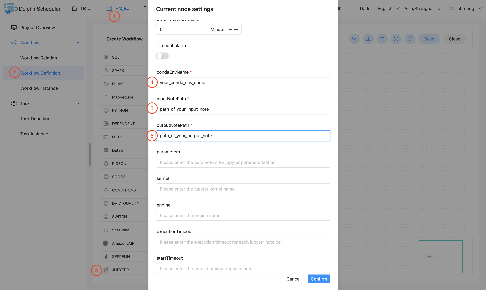

# Jupyter

## Overview

Use `Jupyter Task` to create a jupyter-type task and execute jupyter notes. When the worker executes `Jupyter Task`,
it will use `papermill` to evaluate jupyter notes. Click [here](https://papermill.readthedocs.io/en/latest/) for details about `papermill`.

## Conda Configuration
 
- Config `conda.path` in `common.properties` to the path of your `conda.sh`, which should be the same `conda` you use to manage the python environment of your `papermill` and `jupyter`.
Click [here](https://docs.conda.io/en/latest/) for more information about `conda`.
- `conda.path` is set to `/opt/anaconda3/etc/profile.d/conda.sh` by default. If you have no idea where your `conda` is, simply run `conda info | grep -i 'base environment'`.

> NOTICE: `Jupyter Task Plugin` uses `source` command to activate conda environment. 
> If your tenant does not have permission to use `source`, `Jupyter Task Plugin` will not function. 


## Python Dependency Management

### Use Pre-Installed Conda Environment

1. Create a conda environment manually or using `shell task` on your target worker.
2. In your `jupyter task`, set `condaEnvName` as the name of the conda environment you just created. 

### Use Packed Conda Environment

1. Use [Conda-Pack](https://conda.github.io/conda-pack/) to pack your conda environment into `tarball`.
2. Upload packed conda environment to `resource center`.
3. Select your packed conda environment as `resource` in your `jupyter task`, e.g. `jupyter_env.tar.gz`.

> **_Note:_** Make sure you follow the [Conda-Pack](https://conda.github.io/conda-pack/) official instructions. 
> If you unpack your packed conda environment, the directory structure should be the same as below:

```
.
├── bin
├── conda-meta
├── etc
├── include
├── lib
├── share
└── ssl
```   

> NOTICE: Please follow the `conda pack` instructions above strictly, and DO NOT modify `bin/activate`.
> `Jupyter Task Plugin` uses `source` command to activate your packed conda environment.
> If you are concerned about using `source`, choose other options to manage your python dependency.   

## Create Task

- Click Project Management-Project Name-Workflow Definition, and click the "Create Workflow" button to enter the DAG editing page.
- Drag  from the toolbar to the canvas.

## Task Parameter

- Node name: The node name in a workflow definition is unique.
- Run flag: Identifies whether this node can be scheduled normally, if it does not need to be executed, you can turn on the prohibition switch.
- Descriptive information: Describe the function of the node.
- Task priority: When the number of worker threads is insufficient, execute in the order of priority from high to low, and tasks with the same priority will execute in a first-in first-out order.
- Worker grouping: Assign tasks to the machines of the worker group to execute. If `Default` is selected, randomly select a worker machine for execution.
- Number of failed retry attempts: The failure task resubmitting times. It supports drop-down and hand-filling.
- Failed retry interval: The time interval for resubmitting the task after a failed task. It supports drop-down and hand-filling.
- Cpu quota: Assign the specified CPU time quota to the task executed. Takes a percentage value. Default -1 means unlimited. For example, the full CPU load of one core is 100%,and that of 16 cores is 1600%. This function is controlled by [task.resource.limit.state](../../architecture/configuration.md)
- Max memory：Assign the specified max memory to the task executed. Exceeding this limit will trigger oom to be killed and will not automatically retry. Takes an MB value. Default -1 means unlimited. This function is controlled by [task.resource.limit.state](../../architecture/configuration.md)
- Timeout alarm: Check the timeout alarm and timeout failure. When the task exceeds the "timeout period", an alarm email will send and the task execution will fail.
- Conda Env Name: Name of conda environment or packed conda environment tarball.
- Input Note Path: Path of input jupyter note template.
- Out Note Path: Path of output note.
- Jupyter Parameters: Parameters in json format used for jupyter note parameterization.
- Kernel: Jupyter notebook kernel.
- Engine: Engine to evaluate jupyter notes.
- Jupyter Execution Timeout: Timeout set for each jupyter notebook cell.
- Jupyter Start Timeout: Timeout set for jupyter notebook kernel.
- Others: Other command options for papermill.

## Task Example

### Jupyter Task Example

This example illustrates how to create a jupyter task node.


