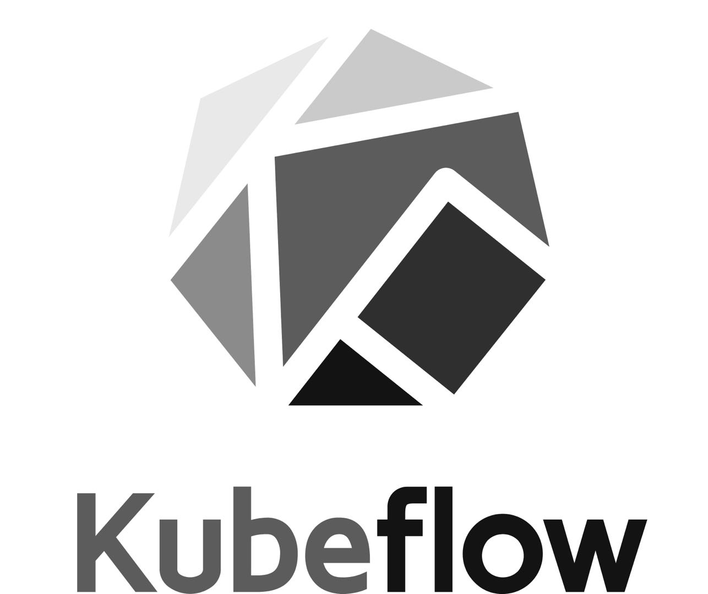
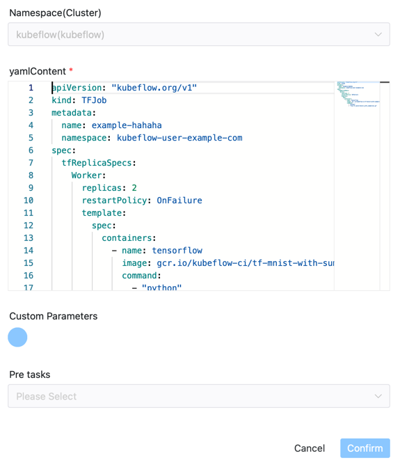

# Kubeflow Node

## Overview

[Kubeflow](https://www.kubeflow.org) task type is used to create tasks on Kubeflow.

The backend mainly uses the `kubectl` command to create kubeflow tasks, and continues to monitor the resource status on Kubeflow until the task is completed.

Now it mainly supports creating kubeflow tasks using yaml files. If you need to publish `kubeflow pipeline` tasks, you can use the [python task type](./python.md).

## Create Task

- Click `Project Management -> Project Name -> Workflow Definition`, and click the `Create Workflow` button to enter the DAG editing page.
- Drag  from the toolbar to the canvas.

## Task Example

The task plugin picture is as follows



### First, introduce some general parameters of DolphinScheduler

- Please refer to [DolphinScheduler Task Parameters Appendix](appendix.md) `Default Task Parameters` section for default parameters.

### Here are some specific parameters for the Kubeflow plugin

- **Namespace**：The namespace parameter of the cluster
- **yamlContent**：CRD YAML file content, for example:

```yaml
apiVersion: "kubeflow.org/v1"
kind: TFJob
metadata:
  name: tfjob-simple
  namespace: kubeflow-user-example-com
spec:
  tfReplicaSpecs:
    Worker:
      replicas: 2
      restartPolicy: OnFailure
      template:
        metadata:
          annotations:
            sidecar.istio.io/inject: "false"
        spec:
          containers:
            - name: tensorflow
              image: gcr.io/kubeflow-ci/tf-mnist-with-summaries:1.0
              command:
                - "python"
                - "/var/tf_mnist/mnist_with_summaries.py"
```

## Environment Configuration

**Configure Kubernetes environment**

Reference [Cluster Management and Namespace Management](../security/security.md).

Only the required fields need to be filled in, and the others do not need to be filled in. The resource management depends on the YAML file definition in the specific Job.

**kubectl**

Install [kubectl](https://kubernetes.io/docs/tasks/tools/install-kubectl-linux/), and make sure `kubectl` can submit tasks to kubeflow normally.

