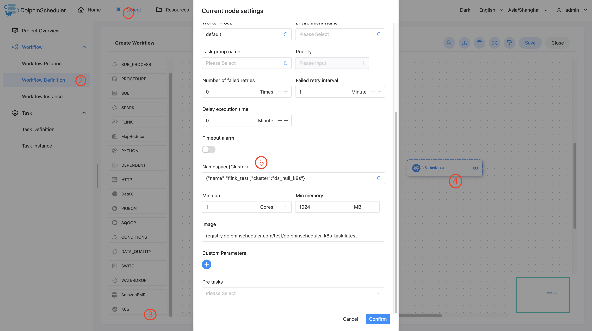

# K8S Node

## Overview

K8S task type used to execute a batch task. In this task, the worker submits the task by using a k8s client.

## Create Task

- Click `Project Management -> Project Name -> Workflow Definition`, and click the `Create Workflow` button to enter the DAG editing page.
- Drag from the toolbar  to the canvas.

## Task Parameters

[//]: # (TODO: use the commented anchor below once our website template supports this syntax)
[//]: # (- Please refer to [DolphinScheduler Task Parameters Appendix]&#40;appendix.md#default-task-parameters&#41; `Default Task Parameters` section for default parameters.)

- Please refer to [DolphinScheduler Task Parameters Appendix](appendix.md) `Default Task Parameters` section for default parameters.

|   **Parameter**   |                                                                                                                                        **Description**                                                                                                                                         |
|-------------------|------------------------------------------------------------------------------------------------------------------------------------------------------------------------------------------------------------------------------------------------------------------------------------------------|
| Namespace         | The namespace for running k8s task.                                                                                                                                                                                                                                                            |
| Min CPU           | Minimum CPU requirement for running k8s task.                                                                                                                                                                                                                                                  |
| Min Memory        | Minimum memory requirement for running k8s task.                                                                                                                                                                                                                                               |
| Image             | The registry url for image.                                                                                                                                                                                                                                                                    |
| Image Pull Policy | The image pull policy for image.                                                                                                                                                                                                                                                               |
| Command           | The container execution command (yaml-style array), for example: ["printenv"]                                                                                                                                                                                                                  |
| Args              | The args of execution command (yaml-style array), for example: ["HOSTNAME", "KUBERNETES_PORT"]                                                                                                                                                                                                 |
| Custom label      | The customized labels for k8s Job.                                                                                                                                                                                                                                                             |
| Node selector     | The label selectors for running k8s pod. Different value in value set should be separated by comma, for example: `value1,value2`. You can refer to https://kubernetes.io/docs/reference/kubernetes-api/common-definitions/node-selector-requirement/ for configuration of different operators. |
| Custom parameter  | It is a local user-defined parameter for K8S task, these params will pass to container as environment variables.                                                                                                                                                                               |

## Task Example

### Configure the K8S Environment in DolphinScheduler

If you are using the K8S task type in a production environment, the K8S cluster environment is required.

### Configure K8S Nodes

Configure the required content according to the parameter descriptions above.

## Note

Task name contains only lowercase alphanumeric characters or '-'
