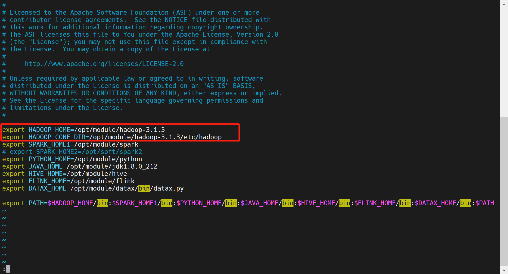
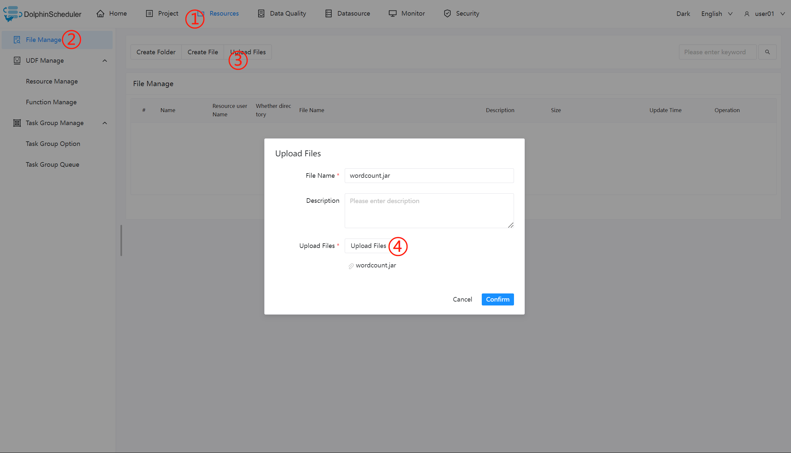
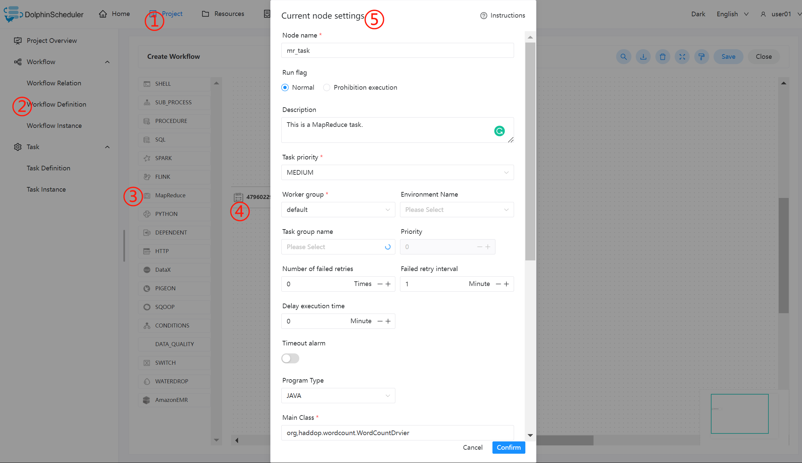

# MapReduce Node

## Overview

MapReduce(MR) task type used for executing MapReduce programs. For MapReduce nodes, the worker submits the task by using the Hadoop command `hadoop jar`. See [Hadoop Command Manual](https://hadoop.apache.org/docs/r3.2.4/hadoop-project-dist/hadoop-common/CommandsManual.html#jar) for more details.

## Create Task

- Click `Project Management -> Project Name -> Workflow Definition`, and click the `Create Workflow` button to enter the DAG editing page.
- Drag from the toolbar  to the canvas.

## Task Parameters

[//]: # (TODO: use the commented anchor below once our website template supports this syntax)
[//]: # (- Please refer to [DolphinScheduler Task Parameters Appendix]&#40;appendix.md#default-task-parameters&#41; `Default Task Parameters` section for default parameters.)

- Please refer to [DolphinScheduler Task Parameters Appendix](appendix.md) `Default Task Parameters` section for default parameters.

### General

|   **Parameter**   |                                                  **Description**                                                   |
|-------------------|--------------------------------------------------------------------------------------------------------------------|
| Custom parameters | It is a local user-defined parameter for MapReduce, and will replace the content with `${variable}` in the script. |

### JAVA or SCALA Program

|         **Parameter**          |                                                  **Description**                                                   |
|--------------------------------|--------------------------------------------------------------------------------------------------------------------|
| Program type                   | Select JAVA or SCALA program.                                                                                      |
| The class of the main function | The **full path** of Main Class, the entry point of the MapReduce program.                                         |
| Main jar package               | The jar package of the MapReduce program.                                                                          |
| Task name                      | MapReduce task name.                                                                                               |
| Yarn queue                     | Used to set the yarn queue, use `default` queue by default.                                                        |
| Command line parameters        | Set the input parameters of the MapReduce program and support the substitution of custom parameter variables.      |
| Other parameters               | Support `-D`, `-files`, `-libjars`, `-archives` format.                                                            |
| User-defined parameter         | It is a local user-defined parameter for MapReduce, and will replace the content with `${variable}` in the script. |

### Python Program

|     **Parameter**      |                                                                                                                                                                                                                 **Description**                                                                                                                                                                                                                  |
|------------------------|--------------------------------------------------------------------------------------------------------------------------------------------------------------------------------------------------------------------------------------------------------------------------------------------------------------------------------------------------------------------------------------------------------------------------------------------------|
| Program type           | Select Python language.                                                                                                                                                                                                                                                                                                                                                                                                                          |
| Main jar package       | The Python jar package for running MapReduce.                                                                                                                                                                                                                                                                                                                                                                                                    |
| Other parameters       | Support `-D`, `-mapper`, `-reducer,` `-input` `-output` format, and you can set the input of user-defined parameters, such as:<ul><li>`-mapper "mapper.py 1"` `-file mapper.py` `-reducer reducer.py` `-file reducer.py` `–input /journey/words.txt` `-output /journey/out/mr/${currentTimeMillis}`</li><li>The `mapper.py 1` after `-mapper` is two parameters, the first parameter is `mapper.py`, and the second parameter is `1`. </li></ul> |
| User-defined parameter | It is a local user-defined parameter for MapReduce, and will replace the content with `${variable}` in the script.                                                                                                                                                                                                                                                                                                                               |

## Task Example

### Execute the WordCount Program

This example is a common introductory type of MapReduce application, which used to count the number of identical words in the input text.

#### Configure the MapReduce Environment in DolphinScheduler

If you are using the MapReduce task type in a production environment, it is necessary to configure the required environment first. The following is the configuration file: `bin/env/dolphinscheduler_env.sh`.

#### Upload the Main Package

When using the MapReduce task node, you need to use the Resource Centre to upload the jar package for the execution. Refer to the [resource centre](../resource/configuration.md).

After finish the Resource Centre configuration, upload the required target files directly by dragging and dropping.

#### Configure MapReduce Nodes

Configure the required content according to the parameter descriptions above.

