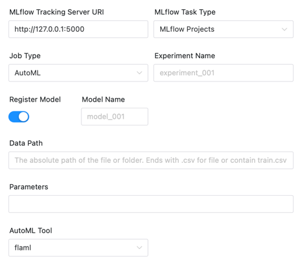
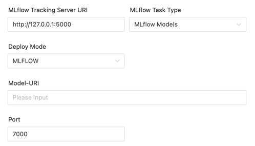

# MLflow Node

## Overview

[MLflow](https://mlflow.org) is an excellent open source platform to manage the ML lifecycle, including experimentation,
reproducibility, deployment, and a central model registry.

MLflow task plugin used to execute MLflow tasks，Currently contains MLflow Projects and MLflow Models. (Model Registry will soon be rewarded for support)

- MLflow Projects: Package data science code in a format to reproduce runs on any platform.
- MLflow Models: Deploy machine learning models in diverse serving environments.
- Model Registry: Store, annotate, discover, and manage models in a central repository.

The MLflow plugin currently supports and will support the following:

- [x] MLflow Projects
    - [x] BasicAlgorithm: contains LogisticRegression, svm, lightgbm, xgboost
    - [x] AutoML: AutoML tool，contains autosklean, flaml
    - [x] Custom projects: Support for running your own MLflow projects
- [ ] MLflow Models
    - [x] MLFLOW: Use `MLflow models serve` to deploy a model service
    - [x] Docker: Run the container after packaging the docker image
    - [x] Docker Compose: Use docker compose to run the container, it will replace the docker run above
    - [ ] Seldon core: Use Selcon core to deploy model to k8s cluster
    - [ ] k8s: Deploy containers directly to K8S
    - [ ] MLflow deployments: Built-in deployment modules, such as built-in deployment to SageMaker, etc
- [ ] Model Registry
    - [ ] Register Model: Allows artifacts (Including model and related parameters, indicators) to be registered directly into the model center


## Create Task

- Click `Project Management -> Project Name -> Workflow Definition`, and click the `Create Workflow` button to enter the DAG editing page.
- Drag from the toolbar  task node to canvas.

## Task Parameters and Example

| **Parameter** | **Description** |
| ------- | ---------- |
| Node Name | Set the name of the task. Node names within a workflow definition are unique. |
| Run flag | Indicates whether the node can be scheduled normally. If it is not necessary to execute, you can turn on the prohibiting execution switch. |
| Description | Describes the function of this node. |
| Task priority | When the number of worker threads is insufficient, they are executed in order from high to low according to the priority, and they are executed according to the first-in, first-out principle when the priority is the same. |
| Worker group | The task is assigned to the machines in the worker group for execution. If Default is selected, a worker machine will be randomly selected for execution. |
| Task group name | The group in Resources, if not configured, it will not be used. | 
| Environment Name | Configure the environment in which to run the script. |
| Number of failed retries | The number of times the task is resubmitted after failure. It supports drop-down and manual filling. | 
| Failure Retry Interval | The time interval for resubmitting the task if the task fails. It supports drop-down and manual filling. | 
| Timeout alarm | Check Timeout Alarm and Timeout Failure. When the task exceeds the "timeout duration", an alarm email will be sent and the task execution will fail. |
| Predecessor task | Selecting the predecessor task of the current task will set the selected predecessor task as the upstream of the current task. |
| MLflow Tracking Server URI | MLflow Tracking Server URI, default http://localhost:5000. |
| Experiment Name | Create the experiment where the task is running, if the experiment does not exist. If the name is empty, it is set to ` Default `, the same as MLflow. |

### MLflow Projects

#### BasicAlgorithm


**Task Parameters**
| **Parameter** | **Description** |
| ------- | ---------- |
| Register Model | Register the model or not. If register is selected, the following parameters are expanded. |
| Model Name | The registered model name is added to the original model version and registered as Production. |
| Data Path | The absolute path of the file or folder. Ends with .csv for file or contain train.csv and test.csv for folder（In the suggested way, users should build their own test sets for model evaluation. |
| Parameters | Parameter when initializing the algorithm/AutoML model, which can be empty. For example, parameters `"time_budget=30;estimator_list=['lgbm']"` for flaml 。The convention will be passed with '; ' shards each parameter, using the name before the equal sign as the parameter name, and using the name after the equal sign to get the corresponding parameter value through `python eval()`. <ul><li>[Logistic Regression](https://scikit-learn.org/stable/modules/generated/sklearn.linear_model.LogisticRegression.html#sklearn.linear_model.LogisticRegression)</li><li>[SVM](https://scikit-learn.org/stable/modules/generated/sklearn.svm.SVC.html?highlight=svc#sklearn.svm.SVC)</li><li>[lightgbm](https://lightgbm.readthedocs.io/en/latest/pythonapi/lightgbm.LGBMClassifier.html#lightgbm.LGBMClassifier)</li><li>[xgboost](https://xgboost.readthedocs.io/en/stable/python/python_api.html#xgboost.XGBClassifier)</li></ul> |
| Algorithm |The selected algorithm currently supports `LR`, `SVM`, `LightGBM` and `XGboost` based on [scikit-learn](https://scikit-learn.org/) form. |
| Parameter Search Space | Parameter search space when running the corresponding algorithm, which can be empty. For example, the parameter `max_depth=[5, 10];n_estimators=[100, 200]` for lightgbm 。The convention will be passed with '; 'shards each parameter, using the name before the equal sign as the parameter name, and using the name after the equal sign to get the corresponding parameter value through `python eval()`. |

#### AutoML



**Task Parameter**
| **Parameter** | **Description** |
| ------- | ---------- |
| Register Model | Register the model or not. If register is selected, the following parameters are expanded. |
| model name | The registered model name is added to the original model version and registered as Production. |
| Data Path | The absolute path of the file or folder. Ends with .csv for file or contain train.csv and test.csv for folder(In the suggested way, users should build their own test sets for model evaluation). |
| Parameters | Parameter when initializing the algorithm/AutoML model, which can be empty. For example, parameters `n_estimators=200;learning_rate=0.2` for flaml. The convention will be passed with '; 'shards each parameter, using the name before the equal sign as the parameter name, and using the name after the equal sign to get the corresponding parameter value through `python eval()`. The detailed parameter list is as follows: <ul><li>[flaml](https://microsoft.github.io/FLAML/docs/reference/automl#automl-objects)</li><li>[autosklearn](https://automl.github.io/auto-sklearn/master/api.html)</li></ul> |
| AutoML tool | The AutoML tool used, currently supports [autosklearn](https://github.com/automl/auto-sklearn) and [flaml](https://github.com/microsoft/FLAML). |

#### Custom projects


**Task Parameter**
| **Parameter** | **Description** |
| ------- | ---------- |
| parameters | `--param-list` in `mlflow run`. For example `-P learning_rate=0.2 -P colsample_bytree=0.8 -P subsample=0.9`. |
| Repository | Repository url of MLflow Project，Support git address and directory on worker. If it's in a subdirectory，We add `#` to support this (same as `mlflow run`) , for example `https://github.com/mlflow/mlflow#examples/xgboost/xgboost_native`. |
| Project Version | Version of the project，default master. |

You can now use this feature to run all MLFlow projects on Github (For example [MLflow examples](https://github.com/mlflow/mlflow/tree/master/examples) ). You can also create your own machine learning library to reuse your work, and then use DolphinScheduler to use your library with one click.


### MLflow Models

**General Parameters**

| **Parameter** | **Description** |
| ------- | ---------- |
| Model-URI | Model-URI of MLflow , support `models:/<model_name>/suffix` format and `runs:/` format. See https://mlflow.org/docs/latest/tracking.html#artifact-stores |
| Port | The port to listen on. |


#### MLflow



#### Docker


#### DOCKER COMPOSE


| **Parameter** | **Description** |
| ------- | ---------- |
| Max Cpu Limit | For example, `1.0` or `0.5`, the same as docker compose. |
| Max Memory Limit | For example `1G` or `500M`, the same as docker compose. |

## Environment to Prepare

### Conda Environment

You need to enter the admin account to configure a conda environment variable（Please
install [anaconda](https://docs.continuum.io/anaconda/install/)
or [miniconda](https://docs.conda.io/en/latest/miniconda.html#installing ) in advance).


Note During the configuration task, select the conda environment created above. Otherwise, the program cannot find the
Conda environment.


### Start the MLflow Service

Make sure you have installed MLflow, using 'pip install mlflow'.

Create a folder where you want to save your experiments and models and start MLflow service.

```sh
mkdir mlflow
cd mlflow
mlflow server -h 0.0.0.0 -p 5000 --serve-artifacts --backend-store-uri sqlite:///mlflow.db
```

After running, an MLflow service is started.

After this, you can visit the MLflow service (`http://localhost:5000`) page to view the experiments and models.

