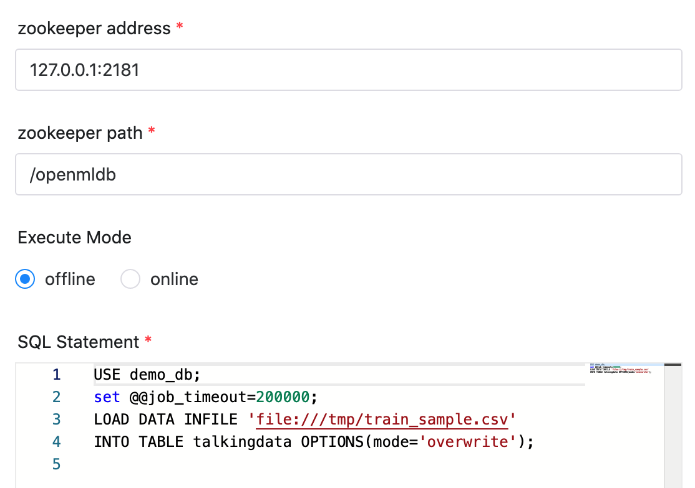

# OpenMLDB Node

## Overview

[OpenMLDB](https://openmldb.ai/) is an excellent open source machine learning database, providing a full-stack
FeatureOps solution for production.

OpenMLDB task plugin used to execute tasks on OpenMLDB cluster.

## Create Task

- Click `Project Management -> Project Name -> Workflow Definition`, and click the `Create Workflow` button to enter the DAG editing page.
- Drag from the toolbar  task node to canvas.

## Task Parameters

[//]: # (TODO: use the commented anchor below once our website template supports this syntax)
[//]: # (- Please refer to [DolphinScheduler Task Parameters Appendix]&#40;appendix.md#default-task-parameters&#41; `Default Task Parameters` section for default parameters.)

- Please refer to [DolphinScheduler Task Parameters Appendix](appendix.md) `Default Task Parameters` section for default parameters.

|   **Parameter**   |                                               **Description**                                                |
|-------------------|--------------------------------------------------------------------------------------------------------------|
| zookeeper         | OpenMLDB cluster zookeeper address, e.g. 127.0.0.1:2181.                                                     |
| zookeeper path    | OpenMLDB cluster zookeeper path, e.g. /openmldb.                                                             |
| Execute Mode      | Determine the init mode, offline or online. You can switch it in sql statement.                              |
| SQL statement     | SQL statement.                                                                                               |
| Custom parameters | It is the user-defined parameters of Python, which will replace the content with \${variable} in the script. |

## Task Examples

### Load data

We use `LOAD DATA` to load data into OpenMLDB cluster. We select `offline` here, so it will load to offline storage.

### Feature extraction

We use `SELECT INTO` to do feature extraction. We select `offline` here, so it will run sql on offline engine.

### Environment to Prepare

#### Start the OpenMLDB Cluster

You should create an OpenMLDB cluster first. If in production env, please check [deploy OpenMLDB](https://openmldb.ai/docs/en/v0.5/deploy/install_deploy.html).

You can follow [run OpenMLDB in docker](https://openmldb.ai/docs/zh/v0.5/quickstart/openmldb_quickstart.html#id11)
to a quick start.

#### Python Environment

The OpenMLDB task will use OpenMLDB Python SDK to connect OpenMLDB cluster. So you should have the Python env.

We will use `python3` by default. You can set `PYTHON_HOME` to use your custom python env.

Make sure you have installed OpenMLDB Python SDK in the host where the worker server running, using `pip install openmldb`.
