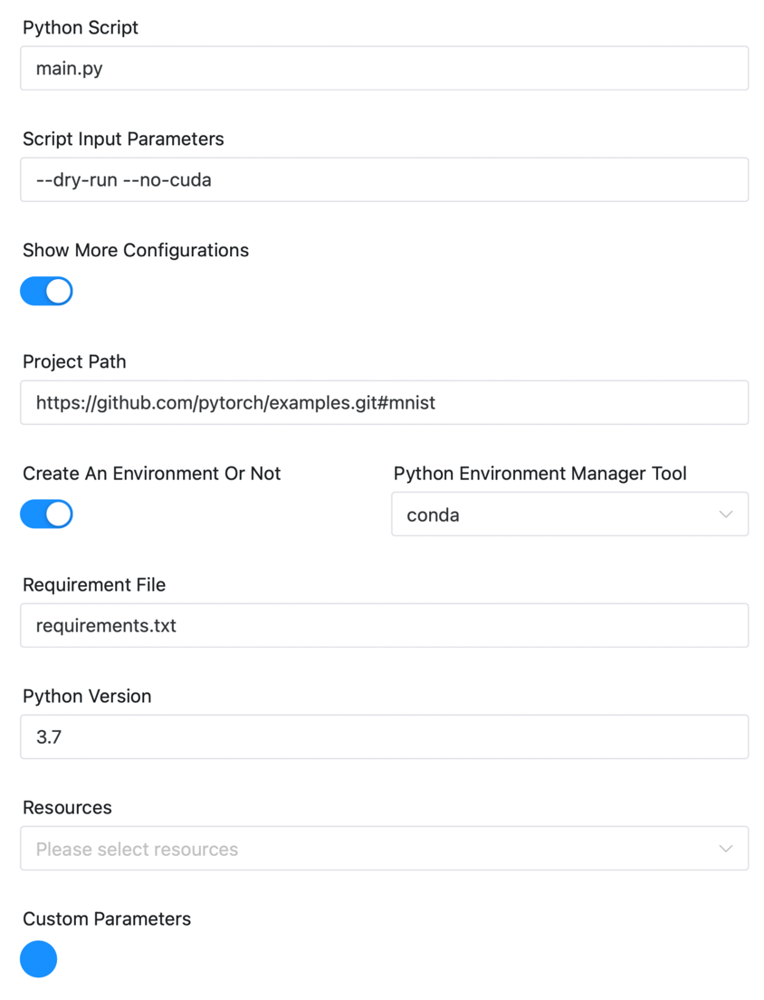

# Pytorch Node (experimental)

## Overview

[Pytorch](https://pytorch.org) is a mainstream Python machine learning library.

`Pytorch` task plugin enables users to run `Pytorch` projects in DolphinScheduler more conveniently. In addition, it supports handy Python environment management.

`Pytorch task plugin` is more than `Python task plugin`, which allows users to **conveniently use existing Python environments or create new ones (using `Virtualenv` or `Conda`)**. **It supports running Python projects (native or Git projects)** instead of just Python scripts.

## Create Task

- Click `Project Management -> Project Name -> Workflow Definition`, and click the `Create Workflow` button to enter the DAG editing page.
- Drag  from the toolbar to the canvas.

## Task Example

The task plugin picture is as follows


First, introduce some general parameters of DolphinScheduler:

- **Node name**: The node name in a workflow definition is unique.
- **Run flag**: Identifies whether this node schedules normally, if it does not need to execute, select
  the `prohibition execution`.
- **Descriptive information**: Describe the function of the node.
- **Task priority**: When the number of worker threads is insufficient, execute in the order of priority from high
  to low, and tasks with the same priority will execute in a first-in first-out order.
- **Worker grouping**: Assign tasks to the machines of the worker group to execute. If `Default` is selected,
  randomly select a worker machine for execution.
- **Environment Name**: Configure the environment name in which run the script.
- **Times of failed retry attempts**: The number of times the task failed to resubmit.
- **Failed retry interval**: The time interval (unit minute) for resubmitting the task after a failed task.
- **Delayed execution time**: The time (unit minute) that a task delays in execution.
- **Timeout alarm**: Check the timeout alarm and timeout failure. When the task runs exceed the "timeout", an alarm
  email will send and the task execution will fail.
- **Resource**: Refers to the list of resource files that need to be called in the script, and the files uploaded or created in Resource Center - File Management.
- **User-defined parameters**: It is a user-defined parameter of Shell, which will replace the content with `${variable}` in the script.
- **Predecessor task**: Selecting a predecessor task for the current task, will set the selected predecessor task as
  upstream of the current task.


Here are some specific parameters for the Pytorch plugin:

#### Run time parameters

- **Python Script** ：Entry to the Python script file that you want to run.
- **Script Input Parameters** ：Input parameters at run time.

The preceding two parameters are used to minimize the running of the configuration. Additional configuration parameters are provided as follows. When you choose to expand more configurations, you can configure more parameters

- **Project Path** ：Set environment variable `PYTHONPATH` to load the Python package/project code at this path when running Python scripts。Support for local paths or Git URL.
  - If it is a local path, it is used as environment variable `PYTHONPATH`.
  - If the GIT URL (`git @ | https:// | http://` prefix), can download the project, and the deposit after download path as new `Project Path`, if need to run a folder under the project, you can add `#subdirectory` after GIT URL.

#### Python environment parameters

- **Create An Environment Or Not** ：Whether to create a new Python environment to run the task.

*no*

- **Python Command Path** ：Such as `/usr/bin/python`，The default value is ${PYTHON_HOME} in environment.

*yes*

- **Python Environment Manager Tool** ：You can choose Virtualenv or Conda。
  - if choose `virtualenv`，that may use `virtualenv` to create a new environment. Use command `virtualenv -p ${PYTHON_HOME} venv`.
  - if choose `conda`, ，that may use `conda` to create a new environment，And you need to specify the Python version.
- **Requirement File** ：The defualt is requirements.txt。

If the `Project Path` parameter is configured, then the `Python Script` and `Script Input Parameters` parameters are allowed to enter relative paths.

#### Demo

Now if we want to run the mnist subproject under `https://github.com/pytorch/examples`.

We can run task like below:




In addition, if the code is stored in the `Resource`, you can use the `Resource` parameter to download the code, and write the related parameters into the path of the corresponding resource.

## Environment configuration

The environment configuration mainly depends on the choice of runtime Python environment. You need to configure the corresponding environment variables in the `Security` - `Environment Manage`.

### Specifying a Python path

It is applicable to the Python environment where the project has been run on the worker, so you can directly configure the `Python Command Path` as the corresponding Python environment in the component. If you do not know the environment address, you can use `which python` to obtain it.

### Create a new environment using Conda

It applies to a new environment to run the project. You need to create an environment in 'Security' - 'Environment Manage'. You can change the environment to the actual environment by referring to the following.

```shell
# Add the directory for the conda command
export PATH=$HOME/anaconda3/bin:$PATH
```

### Create a new environment using Virtualenv

It applies to a new environment to run the project. You need to create an environment in 'Security' - 'Environment Manage'. You can change the environment to the actual environment by referring to the following.

```shell
# Add the directory for the virtualenv command
export PATH=/home/xxx/anaconda3/bin:$PATH
export PYTHON_HOME=/usr/local/bin/python3.7
```

## Other

This task plugin can also run XGBoost, LightGBM, SkLearn, TensorFlow, Keras and other projects. This component is available as an upgrade to Python task plugin running machine learning tasks.

If necessary, subsequent recommendations can be uniformly named PythonML components to run machine learning projects.