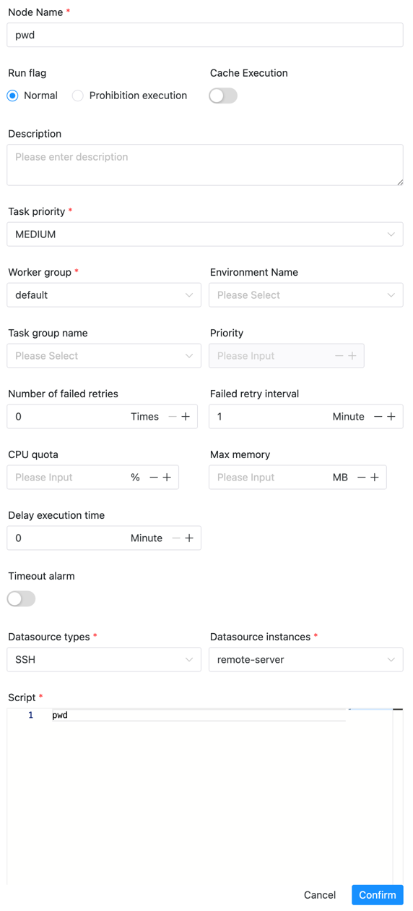

# RemoteShell

## Overview

RemoteShell task type is used to execute commands on remote servers.

## Create Task

- Click Project Management-Project Name-Workflow Definition, click the "Create Workflow" button to enter the DAG editing page.

- Drag  from the toolbar to the canvas to complete the creation.

## Task Parameters

[//]: # (TODO: use the commented anchor below once our website template supports this syntax)
[//]: # (- Please refer to [DolphinScheduler Task Parameters Appendix]&#40;appendix.md#default-task-parameters&#41; `Default Task Parameters` section for default parameters.)

- Please refer to [DolphinScheduler Task Parameters Appendix](appendix.md) `Default Task Parameters` section for default parameters.
- SSH Data Source: Select SSH data source.

## Task Example

### View the path of the remote server (remote-server)

## Precautions

After the task connects to the server, it will not automatically source bashrc and other files. The required environment variables can be imported in the following ways
- Create environment variables in the security center-Environment Management, and then import them through the environment option in the task definition
- Enter the corresponding environment variables directly in the script
