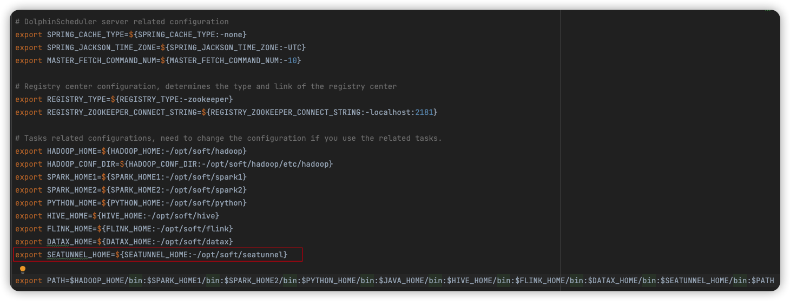
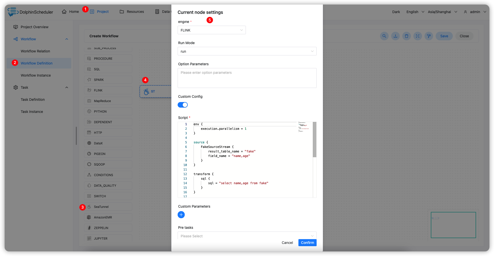

# Apache SeaTunnel

## Overview

`SeaTunnel` task type for creating and executing `SeaTunnel` tasks. When the worker executes this task, it will parse the config file through the `start-seatunnel-spark.sh` or `start-seatunnel-flink.sh` command.
Click [here](https://seatunnel.apache.org/) for more information about `Apache SeaTunnel`.

## Create Task

- Click Project Management -> Project Name -> Workflow Definition, and click the "Create Workflow" button to enter the DAG editing page.
- Drag the  from the toolbar to the drawing board.

## Task Parameter

[//]: # (TODO: use the commented anchor below once our website template supports this syntax)
[//]: # (- Please refer to [DolphinScheduler Task Parameters Appendix]&#40;appendix.md#default-task-parameters&#41; `Default Task Parameters` section for default parameters.)

- Please refer to [DolphinScheduler Task Parameters Appendix](appendix.md) `Default Task Parameters` section for default parameters.
- Engine: Supports FLINK and SPARK
- FLINK
- Run model: supports `run` and `run-application` modes
- Option parameters: used to add the parameters of the Flink engine, such as `-m yarn-cluster -ynm seatunnel`
- SPARK
- Deployment mode: specify the deployment mode, `cluster` `client` `local`
- Master: Specify the `Master` model, `yarn` `local` `spark` `mesos`, where `spark` and `mesos` need to specify the `Master` service address, for example: 127.0.0.1:7077

          > Click [here](https://seatunnel.apache.org/docs/2.1.2/command/usage) for more information on the usage of `Apache SeaTunnel command`

- Custom Configuration: Supports custom configuration or select configuration file from Resource Center

  > Click [here](https://seatunnel.apache.org/docs/2.1.2/concept/config) for more information about `Apache SeaTunnel config` file

- Script: Customize configuration information on the task node, including four parts: `env` `source` `transform` `sink`

## Task Example

This sample demonstrates using the Flink engine to read data from a Fake source and print to the console.

### Configuring the SeaTunnel environment in DolphinScheduler

If you want to use the SeaTunnel task type in the production environment, you need to configure the required environment first. The configuration file is as follows: `/dolphinscheduler/conf/env/dolphinscheduler_env.sh`.



### Configuring SeaTunnel Task Node

According to the above parameter description, configure the required content.



### Config example

```Config

env {
  execution.parallelism = 1
}

source {
  FakeSource {
    result_table_name = "fake"
    field_name = "name,age"
  }
}

transform {
  sql {
    sql = "select name,age from fake"
  }
}

sink {
  ConsoleSink {}
}

```

