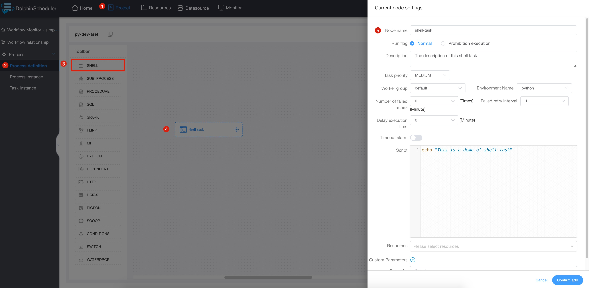
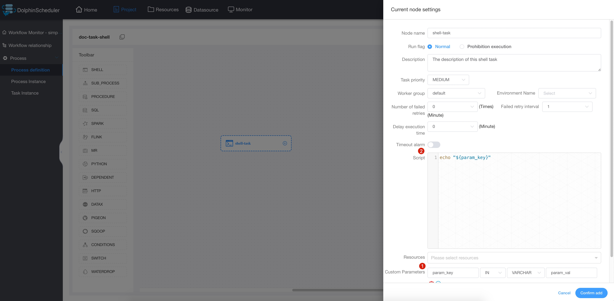

# Shell

## Overview

Shell task type, used to create a shell type task and execute a series of shell scripts. When the worker executes this task, a temporary shell script is generated and executed using the linux user with the same name as the tenant.

## Create Task

- Click `Project Management -> Project Name -> Workflow Definition`, and click the `Create Workflow` button to enter the DAG editing page.
- Drag  from the toolbar  to the canvas.

## Task Parameters

[//]: # (TODO: use the commented anchor below once our website template supports this syntax)
[//]: # (- Please refer to [DolphinScheduler Task Parameters Appendix]&#40;appendix.md#default-task-parameters&#41; `Default Task Parameters` section for default parameters.)

- Please refer to [DolphinScheduler Task Parameters Appendix](appendix.md) `Default Task Parameters` section for default parameters.

|     **Parameter**      |                                              **Description**                                              |
|------------------------|-----------------------------------------------------------------------------------------------------------|
| Script                 | A SHELL program developed by the user.                                                                    |
| User-defined parameter | It is a user-defined parameter of Shell, which will replace the content with `${variable}` in the script. |

## Task Example

### Print a Line 

This example shows how to simulate simple tasks with just one or more simple lines of command. In this example, we will see how to print a line in a log file.



### Use custom parameters

This example simulates a custom parameter task. In order to reuse existing tasks more conveniently, or when faced with dynamic requirements, we will use variables to ensure the reusability of scripts. In this example, we first define the parameter "param_key" in the custom script and set its value to "param_val". Then the echo command is declared in the "script", and the parameter "param_key" is printed out. When we save and run the task, we will see in the log that the value "param_val" corresponding to the parameter "param_key" is printed out.



## Note

The shell task type resolves whether the task log contains ```application_xxx_xxx``` to determine whether is the yarn task. If so, the corresponding application
will be use to judge the running state of the current shell node. At this time, if stops the operation of the workflow, the corresponding ```application_id```
will be killed.

If you want to use resource files in Shell tasks, you can upload corresponding files through the resource center and then use the resources in the Shell task. Reference: [file-manage](../resource/file-manage.md).
