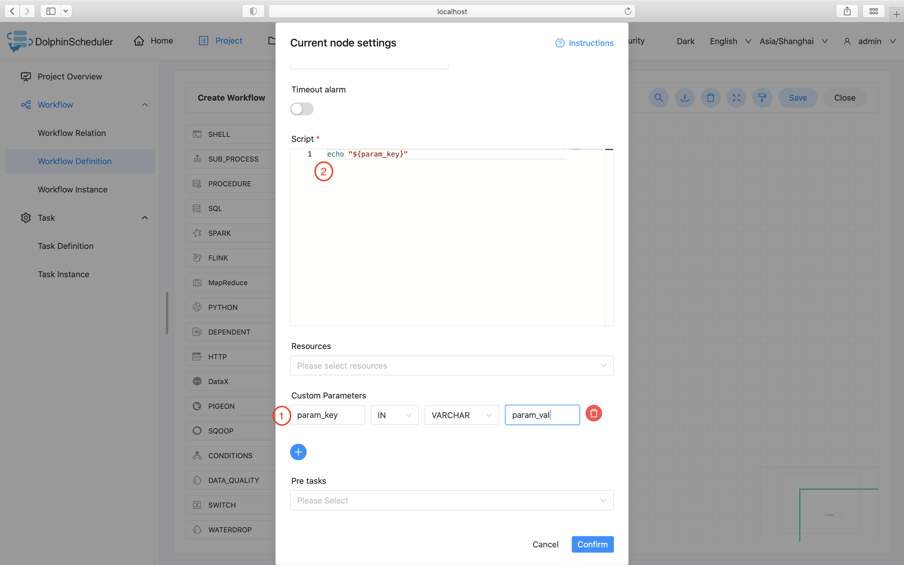

# Shell

## Overview

Shell task type, used to create a shell type task and execute a series of shell scripts. When the worker executes this task, a temporary shell script is generated and executed using the linux user with the same name as the tenant.

## Create Task

- Click `Project Management -> Project Name -> Workflow Definition`, and click the `Create Workflow` button to enter the DAG editing page.
- Drag  from the toolbar  to the canvas.


## Task Parameters

| **Parameter** | **Description** |
| ------- | ---------- |
| Node Name | Set the name of the task. Node names within a workflow definition are unique. |
| Run flag | Indicates whether the node can be scheduled normally. If it is not necessary to execute, you can turn on the prohibiting execution switch. |
| Description | Describes the function of this node. |
| Task priority | When the number of worker threads is insufficient, they are executed in order from high to low according to the priority, and they are executed according to the first-in, first-out principle when the priority is the same. |
| Worker group | The task is assigned to the machines in the worker group for execution. If Default is selected, a worker machine will be randomly selected for execution. |
| Task group name | The group in Resources, if not configured, it will not be used. | 
| Environment Name | Configure the environment in which to run the script. |
| Number of failed retries | The number of times the task is resubmitted after failure. It supports drop-down and manual filling. | 
| Failure Retry Interval | The time interval for resubmitting the task if the task fails. It supports drop-down and manual filling. | 
| Timeout alarm | Check Timeout Alarm and Timeout Failure. When the task exceeds the "timeout duration", an alarm email will be sent and the task execution will fail. |
| Script | A SHELL program developed by the user. |
| Resource | Refers to the list of resource files that need to be called in the script, and the files uploaded or created in Resource Center - File Management.| 
| User-defined parameter | It is a user-defined parameter of Shell, which will replace the content with `${variable}` in the script. |
| Predecessor task | Selecting the predecessor task of the current task will set the selected predecessor task as the upstream of the current task. |

## Task Example

### Print a Line 

This example shows how to simulate simple tasks with just one or more simple lines of command. In this example, we will see how to print a line in a log file.


### Use custom parameters

This example simulates a custom parameter task. In order to reuse existing tasks more conveniently, or when faced with dynamic requirements, we will use variables to ensure the reusability of scripts. In this example, we first define the parameter "param_key" in the custom script and set its value to "param_val". Then the echo command is declared in the "script", and the parameter "param_key" is printed out. When we save and run the task, we will see in the log that the value "param_val" corresponding to the parameter "param_key" is printed out.



## Note

The shell task type resolves whether the task log contains ```application_xxx_xxx``` to determine whether is the yarn task. If so, the corresponding application
will be use to judge the running state of the current shell node. At this time, if stops the operation of the workflow, the corresponding ```application_id```
will be killed.

If you want to use resource files in Shell tasks, you can upload corresponding files through the resource center and then use the resources in the Shell task. Reference: [file-manage](../resource/file-manage.md).
