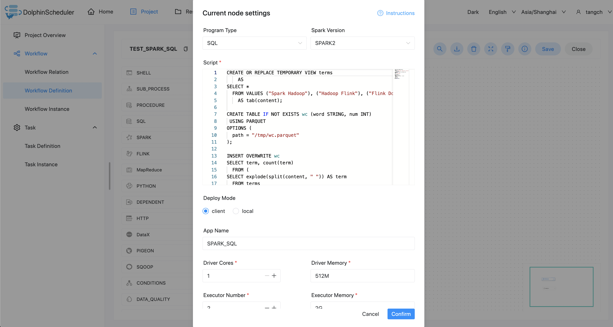

# Spark Node

## Overview

Spark task type for executing Spark application. When executing the Spark task, the worker will submits a job to the Spark cluster by following commands:

(1) `spark submit` method to submit tasks. See [spark-submit](https://spark.apache.org/docs/3.2.1/submitting-applications.html#launching-applications-with-spark-submit) for more details.

(2) `spark sql` method to submit tasks. See [spark sql](https://spark.apache.org/docs/3.2.1/sql-ref-syntax.html) for more details.

## Create Task

- Click `Project Management -> Project Name -> Workflow Definition`, and click the `Create Workflow` button to enter the DAG editing page.
- Drag from the toolbar  to the canvas.

## Task Parameters

[//]: # (TODO: use the commented anchor below once our website template supports this syntax)
[//]: # (- Please refer to [DolphinScheduler Task Parameters Appendix]&#40;appendix.md#default-task-parameters&#41; `Default Task Parameters` section for default parameters.)

- Please refer to [DolphinScheduler Task Parameters Appendix](appendix.md) `Default Task Parameters` section for default parameters.

|       **Parameter**        |                                                                  **Description**                                                                  |
|----------------------------|---------------------------------------------------------------------------------------------------------------------------------------------------|
| Program type               | Supports Java, Scala, Python, and SQL.                                                                                                            |
| The class of main function | The **full path** of Main Class, the entry point of the Spark program.                                                                            |
| Main jar package           | The Spark jar package (upload by Resource Center).                                                                                                |
| SQL scripts                | SQL statements in .sql files that Spark sql runs.                                                                                                 |
| Deployment mode            | <ul><li>spark submit supports three modes: yarn-clusetr, yarn-client and local.</li><li>spark sql supports yarn-client and local modes.</li></ul> |
| Task name                  | Spark task name.                                                                                                                                  |
| Driver core number         | Set the number of Driver core, which can be set according to the actual production environment.                                                   |
| Driver memory size         | Set the size of Driver memories, which can be set according to the actual production environment.                                                 |
| Number of Executor         | Set the number of Executor, which can be set according to the actual production environment.                                                      |
| Executor memory size       | Set the size of Executor memories, which can be set according to the actual production environment.                                               |
| Main program parameters    | Set the input parameters of the Spark program and support the substitution of custom parameter variables.                                         |
| Optional parameters        | Support `--jars`, `--files`,` --archives`, `--conf` format.                                                                                       |
| Resource                   | Appoint resource files in the `Resource` if parameters refer to them.                                                                             |
| Custom parameter           | It is a local user-defined parameter for Spark, and will replace the content with `${variable}` in the script.                                    |
| Predecessor task           | Selecting a predecessor task for the current task, will set the selected predecessor task as upstream of the current task.                        |

## Task Example

### spark submit

#### Execute the WordCount Program

This is a common introductory case in the big data ecosystem, which often apply to computational frameworks such as MapReduce, Flink and Spark. The main purpose is to count the number of identical words in the input text. (Flink's releases attach this example job)

##### Configure the Spark Environment in DolphinScheduler

If you are using the Spark task type in a production environment, it is necessary to configure the required environment first. The following is the configuration file: `bin/env/dolphinscheduler_env.sh`.

##### Upload the Main Package

When using the Spark task node, you need to upload the jar package to the Resource Centre for the execution, refer to the [resource center](../resource/configuration.md).

After finish the Resource Centre configuration, upload the required target files directly by dragging and dropping.

##### Configure Spark Nodes

Configure the required content according to the parameter descriptions above.

### Spark sql

#### Execute DDL and DML statements

This case is to create a view table terms and write three rows of data and a table wc in parquet format and determine whether the table exists. The program type is SQL. Insert the data of the view table terms into the table wc in parquet format.

## Note

JAVA and Scala are only used for identification, and there is no difference when you use the Spark task. If your application is developed by Python, you could just ignore the parameter **Main Class** in the form. Parameter **SQL scripts** is only for SQL type and could be ignored in JAVA, Scala and Python.

SQL does not currently support cluster mode.
