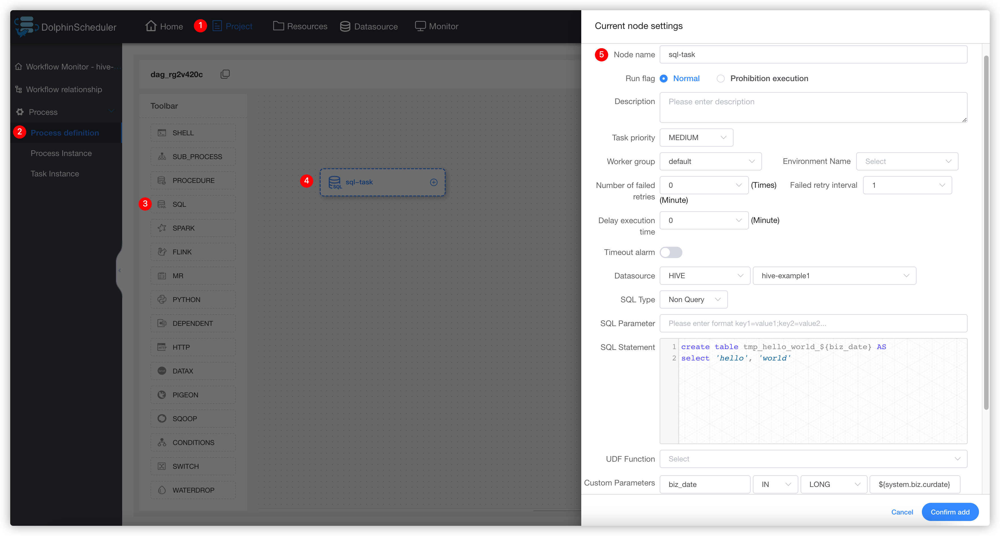

# SQL

## Overview

SQL task type used to connect to databases and execute SQL.

## Create DataSource

Refer to [datasource-setting](../howto/datasource-setting.md) `DataSource Center` section

## Create Task

- Click `Project Management -> Project Name -> Workflow Definition`, and click the `Create Workflow` button to enter the DAG editing page.
- Drag from the toolbar  to the canvas.

## Task Parameter

[//]: # (TODO: use the commented anchor below once our website template supports this syntax)
[//]: # (- Please refer to [DolphinScheduler Task Parameters Appendix]&#40;appendix.md#default-task-parameters&#41; `Default Task Parameters` section for default parameters.)

- Please refer to [DolphinScheduler Task Parameters Appendix](appendix.md) `Default Task Parameters` section for default parameters.

|   **Parameter**   |                                                                                                                                                                                                                                                                                                                                                                                                                                                                                                                            **Description**                                                                                                                                                                                                                                                                                                                                                                                                                                                                                                                            |
|-------------------|-----------------------------------------------------------------------------------------------------------------------------------------------------------------------------------------------------------------------------------------------------------------------------------------------------------------------------------------------------------------------------------------------------------------------------------------------------------------------------------------------------------------------------------------------------------------------------------------------------------------------------------------------------------------------------------------------------------------------------------------------------------------------------------------------------------------------------------------------------------------------------------------------------------------------------------------------------------------------------------------------------------------------------------------------------------------------|
| Data source       | Select the corresponding DataSource.                                                                                                                                                                                                                                                                                                                                                                                                                                                                                                                                                                                                                                                                                                                                                                                                                                                                                                                                                                                                                                  |
| SQL type          | Supports query and non-query. <ul><li>Query: supports `DML select` type commands, which return a result set. You can specify three templates for email notification as form, attachment or form attachment;</li><li>Non-query: support `DDL` all commands and `DML update, delete, insert` three types of commands;<ul><li>Segmented execution symbol: When the data source does not support executing multiple SQL statements at a time, the symbol for splitting SQL statements is provided to call the data source execution method multiple times. Example: 1. When the Hive data source is selected as the data source, this parameter does not need to be filled in. Because the Hive data source itself supports executing multiple SQL statements at one time; 2. When the MySQL data source is selected as the data source, and multi-segment SQL statements are to be executed, this parameter needs to be filled in with a semicolon `;. Because the MySQL data source does not support executing multiple SQL statements at one time.</li></ul></li></ul> |
| SQL parameter     | The input parameter format is `key1=value1;key2=value2...`.                                                                                                                                                                                                                                                                                                                                                                                                                                                                                                                                                                                                                                                                                                                                                                                                                                                                                                                                                                                                           |
| SQL statement     | SQL statement.                                                                                                                                                                                                                                                                                                                                                                                                                                                                                                                                                                                                                                                                                                                                                                                                                                                                                                                                                                                                                                                        |
| UDF function      | For Hive DataSources, you can refer to UDF functions created in the resource center, but other DataSource do not support UDF functions.                                                                                                                                                                                                                                                                                                                                                                                                                                                                                                                                                                                                                                                                                                                                                                                                                                                                                                                               |
| Custom parameters | SQL task type, and stored procedure is a custom parameter order, to set customized parameter type and data type for the method is the same as the stored procedure task type. The difference is that the custom parameter of the SQL task type replaces the `${variable}` in the SQL statement.                                                                                                                                                                                                                                                                                                                                                                                                                                                                                                                                                                                                                                                                                                                                                                       |
| Pre-SQL           | Pre-SQL executes before the SQL statement.                                                                                                                                                                                                                                                                                                                                                                                                                                                                                                                                                                                                                                                                                                                                                                                                                                                                                                                                                                                                                            |
| Post-SQL          | Post-SQL executes after the SQL statement.                                                                                                                                                                                                                                                                                                                                                                                                                                                                                                                                                                                                                                                                                                                                                                                                                                                                                                                                                                                                                            |

## Task Example

### Hive Table Create Example

#### Create a Temporary Table in Hive and Write Data

This example creates a temporary table `tmp_hello_world` in Hive and writes a row of data. Before creating a temporary table, we need to ensure that the table does not exist. So we use custom parameters to obtain the time of the day as the suffix of the table name every time we run, this task can run every different day. The format of the created table name is: `tmp_hello_world_{yyyyMMdd}`.

#### After Running the Task Successfully, Query the Results in Hive

Log in to the bigdata cluster and use 'hive' command or 'beeline' or 'JDBC' and other methods to connect to the 'Apache Hive' for the query. The query SQL is `select * from tmp_hello_world_{yyyyMMdd}`, please replace `{yyyyMMdd}` with the date of the running day. The following shows the query screenshot:

### Use Pre-SQL and Post-SQL Example

Table created in the Pre-SQL, after use in the SQL statement, cleaned in the Post-SQL

## Note

Pay attention to the selection of SQL type. If it is an insert operation, need to change to "Non-Query" type.

To compatible with long session,UDF function are created by the syntax(CREATE OR REPLACE)
