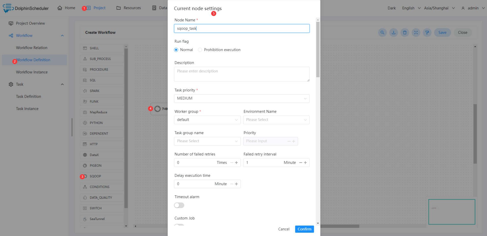
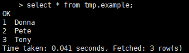

# Sqoop Node

## Overview

Sqoop task type for executing Sqoop application. The workers run `sqoop` to execute  sqoop tasks.

## Create Task

- Click `Project Management -> Project Name -> Workflow Definition`, and click the `Create Workflow` button to enter the DAG editing page.
- Drag from the toolbar  to the canvas.

## Task Parameters

[//]: # (TODO: use the commented anchor below once our website template supports this syntax)
[//]: # (- Please refer to [DolphinScheduler Task Parameters Appendix]&#40;appendix.md#default-task-parameters&#41; `Default Task Parameters` section for default parameters.)

- Please refer to [DolphinScheduler Task Parameters Appendix](appendix.md) `Default Task Parameters` section for default parameters.

|            **Parameter**            |                                                                              **Description**                                                                               |
|-------------------------------------|----------------------------------------------------------------------------------------------------------------------------------------------------------------------------|
| Job Name                            | map-reduce job name                                                                                                                                                        |
| Direct                              | (1) import:Imports an individual table from an RDBMS to HDFS or Hive.  (2) export:Exports a set of files from HDFS or Hive back to an RDBMS.                               |
| Hadoop Params                       | Hadoop custom param for sqoop job.                                                                                                                                         |
| Sqoop Advanced Parameters           | Sqoop advanced param for sqoop job.                                                                                                                                        |
| Data Source - Type                  | Select the corresponding data source type.                                                                                                                                 |
| Data Source - Datasource            | Select the corresponding DataSource.                                                                                                                                       |
| Data Source - ModelType             | (1) Form:Synchronize data from a table, need to fill in the `Table` and `ColumnType`. (2) SQL:Synchronize data of SQL queries result, need to fill in the `SQL Statement`. |
| Data Source - Table                 | Sets the table name to use when importing to Hive.                                                                                                                         |
| Data Source - ColumnType            | (1) All Columns:Import all fields in the selected table.  (2) Some Columns:Import the specified fields in the selected table, need to fill in the `Column`.                |
| Data Source - Column                | Fill in the field name, and separate with commas.                                                                                                                          |
| Data Source - SQL Statement         | Fill in SQL query statement.                                                                                                                                               |
| Data Source - Map Column Hive       | Override mapping from SQL to Hive type for configured columns.                                                                                                             |
| Data Source - Map Column Java       | Override mapping from SQL to Java type for configured columns.                                                                                                             |
| Data Target - Type                  | Select the corresponding data target type.                                                                                                                                 |
| Data Target - Database              | Fill in the Hive database name.                                                                                                                                            |
| Data Target - Table                 | Fill in the Hive table name.                                                                                                                                               |
| Data Target - CreateHiveTable       | Import a table definition into Hive. If set, then the job will fail if the target hive table exits.                                                                        |
| Data Target - DropDelimiter         | Drops `\n`, `\r`, and `\01` from string fields when importing to Hive.                                                                                                     |
| Data Target - OverWriteSrc          | Overwrite existing data in the Hive table.                                                                                                                                 |
| Data Target - Hive Target Dir       | You can also explicitly choose the target directory.                                                                                                                       |
| Data Target - ReplaceDelimiter      | Replace `\n`, `\r`, and `\01` from string fields with user defined string when importing to Hive.                                                                          |
| Data Target - Hive partition Keys   | Fill in the hive partition keys name, and separate with commas.                                                                                                            |
| Data Target - Hive partition Values | Fill in the hive partition Values name, and separate with commas.                                                                                                          |
| Data Target - Target Dir            | Fill in the HDFS target directory.                                                                                                                                         |
| Data Target - DeleteTargetDir       | Delete the target directory if it exists.                                                                                                                                  |
| Data Target - CompressionCodec      | Choice the hadoop codec.                                                                                                                                                   |
| Data Target - FileType              | Choice the storage Type.                                                                                                                                                   |
| Data Target - FieldsTerminated      | Sets the field separator character.                                                                                                                                        |
| Data Target - LinesTerminated       | Sets the end-of-line character.                                                                                                                                            |

## Task Example

This example demonstrates importing data from MySQL into Hive. The MySQL database name is `test` and the table name is `example`. The following figure shows sample data.

### Configuring the Sqoop environment

If you are using the Sqoop task type in a production environment, you must ensure that the worker can execute the `sqoop` command.

### Configuring Sqoop Task Node

you can configure the node content by following the steps in the diagram below.

The key configuration in this sample is shown in the following table.

|            **Parameter**            |                              **Value**                               |
|-------------------------------------|----------------------------------------------------------------------|
| Job Name                            | sqoop_mysql_to_hive_test                                             |
| Data Source - Type                  | MYSQL                                                                |
| Data Source - Datasource            | MYSQL MyTestMySQL(You could change MyTestMySQL to the name you like) |
| Data Source - ModelType             | Form                                                                 |
| Data Source - Table                 | example                                                              |
| Data Source - ColumnType            | All Columns                                                          |
| Data Target - Type                  | HIVE                                                                 |
| Data Target - Database              | tmp                                                                  |
| Data Target - Table                 | example                                                              |
| Data Target - CreateHiveTable       | true                                                                 |
| Data Target - DropDelimiter         | false                                                                |
| Data Target - OverWriteSrc          | true                                                                 |
| Data Target - Hive Target Dir       | (No need to fill in)                                                 |
| Data Target - ReplaceDelimiter      | ,                                                                    |
| Data Target - Hive partition Keys   | (No need to fill in)                                                 |
| Data Target - Hive partition Values | (No need to fill in)                                                 |

### View run results

