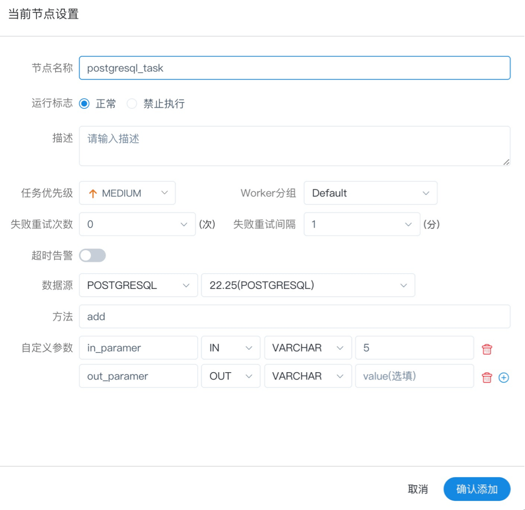

# Stored Procedure

- Execute the stored procedure according to the selected DataSource.

> Drag from the `PROCEDURE` task node into the canvas, as shown in the figure below:

<p align="center">
   
 </p>

## Task Parameters

[//]: # (TODO: use the commented anchor below once our website template supports this syntax)
[//]: # (- Please refer to [DolphinScheduler Task Parameters Appendix]&#40;appendix.md#default-task-parameters&#41; `Default Task Parameters` section for default parameters.)

- Please refer to [DolphinScheduler Task Parameters Appendix](appendix.md) `Default Task Parameters` section for default parameters.

|   **Parameter**   |                                                                                 **Description**                                                                                  |
|-------------------|----------------------------------------------------------------------------------------------------------------------------------------------------------------------------------|
| DataSource        | The DataSource type of the stored procedure supports MySQL and POSTGRESQL, select the corresponding DataSource.                                                                  |
| Method            | The method name of the stored procedure.                                                                                                                                         |
| Custom parameters | The custom parameter types of the stored procedure support `IN` and `OUT`, and the data types support: VARCHAR, INTEGER, LONG, FLOAT, DOUBLE, DATE, TIME, TIMESTAMP and BOOLEAN. |

## Remark

- Prepare: Create a stored procedure in the database, e.g.

  ```
  CREATE PROCEDURE dolphinscheduler.test(in in1 INT, out out1 INT)
  begin
  set out1=in1;
  END
  ```

