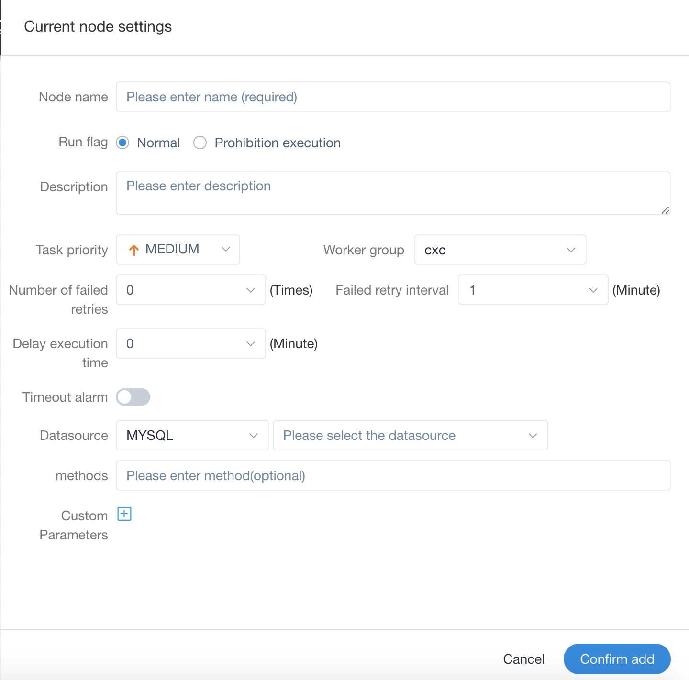

# Stored Procedure

- Execute the stored procedure according to the selected DataSource.

> Drag from the toolbar  task node into the canvas, as shown in the figure below:

   
 

## Task Parameters

| **Parameter** | **Description** |
| ------- | ---------- |
| Node Name | Set the name of the task. Node names within a workflow definition are unique. |
| Run flag | Indicates whether the node can be scheduled normally. If it is not necessary to execute, you can turn on the prohibiting execution switch. |
| Description | Describes the function of this node. |
| Task priority | When the number of worker threads is insufficient, they are executed in order from high to low according to the priority, and they are executed according to the first-in, first-out principle when the priority is the same. |
| Worker group | The task is assigned to the machines in the worker group for execution. If Default is selected, a worker machine will be randomly selected for execution. |
| Task group name | The group in Resources, if not configured, it will not be used. | 
| Environment Name | Configure the environment in which to run the script. |
| Number of failed retries | The number of times the task is resubmitted after failure. It supports drop-down and manual filling. | 
| Failure Retry Interval | The time interval for resubmitting the task if the task fails. It supports drop-down and manual filling. | 
| Timeout alarm | Check Timeout Alarm and Timeout Failure. When the task exceeds the "timeout duration", an alarm email will be sent and the task execution will fail. |
| DataSource | The DataSource type of the stored procedure supports MySQL and POSTGRESQL, select the corresponding DataSource. |
| Method | The method name of the stored procedure. |
| Custom parameters | The custom parameter types of the stored procedure support `IN` and `OUT`, and the data types support: VARCHAR, INTEGER, LONG, FLOAT, DOUBLE, DATE, TIME, TIMESTAMP and BOOLEAN. |
| Predecessor task | Selecting the predecessor task of the current task will set the selected predecessor task as the upstream of the current task. |