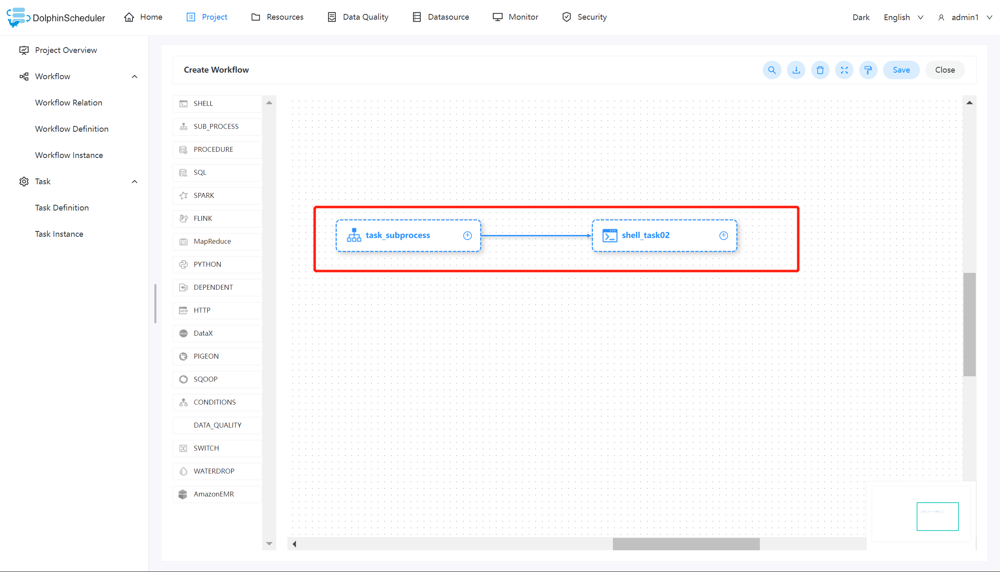

# SubProcess Node

## Overview

The sub-process node is to execute an external workflow definition as a task node.

## Create Task

- Click `Project Management -> Project Name -> Workflow Definition`, and click the `Create Workflow` button to enter the DAG editing page.
- Drag from the toolbar  task node to canvas to create a new SubProcess task.

## Task Parameter

[//]: # (TODO: use the commented anchor below once our website template supports this syntax)
[//]: # (- Please refer to [DolphinScheduler Task Parameters Appendix]&#40;appendix.md#default-task-parameters&#41; `Default Task Parameters` section for default parameters.)

- Please refer to [DolphinScheduler Task Parameters Appendix](appendix.md) `Default Task Parameters` section for default parameters.

| **Parameter** |                                                                              **Description**                                                                              |
|---------------|---------------------------------------------------------------------------------------------------------------------------------------------------------------------------|
| Child node    | It is the workflow definition of the selected sub-process. Enter the child node in the upper right corner to jump to the workflow definition of the selected sub-process. |

## Task Example

This example simulates a common task type, here we use a child node task to recall the [Shell](shell.md) to print out "hello". This means executing a shell task as a child node.

### Create a Shell task

Create a shell task to print "hello" and define the workflow as `test_dag01`.

## Create the Sub_process task

To use the sub_process, you need to create the sub-node task, which is the workflow `test_dag01` we created in the first step. After that, as shown in the diagram below, select the corresponding sub-node in position ⑤.

After creating the sub_process, create a corresponding shell task for printing "world" and link both together. Save the current workflow and run it to get the expected result.

## Note

When using `sub_process` to recall a sub-node task, you need to ensure that the defined sub-node is online status, otherwise, the sub_process workflow will not work properly.
