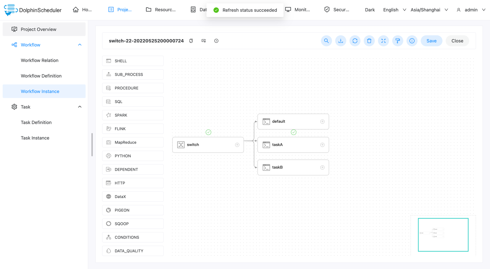

# Switch

## Overview

The switch is a conditional judgment node, decide the branch executes according to the value of [global variable](../parameter/global.md) and the expression result written by the user.

**Note**: Execute expressions using javax.script.ScriptEngine.eval.

## Create Task

- Click `Project Management -> Project Name -> Workflow Definition`, and click the `Create Workflow` button to enter the DAG editing page.
- Drag from the toolbar  task node to canvas to create a task.

**Note**: After created a switch task, you must first configure the upstream and downstream, then configure the parameter of task branches.

## Task Parameters

[//]: # (TODO: use the commented anchor below once our website template supports this syntax)
[//]: # (- Please refer to [DolphinScheduler Task Parameters Appendix]&#40;appendix.md#default-task-parameters&#41; `Default Task Parameters` section for default parameters.)

- Please refer to [DolphinScheduler Task Parameters Appendix](appendix.md) `Default Task Parameters` section for default parameters.

| **Parameter** |                                                                                                **Description**                                                                                                |
|---------------|---------------------------------------------------------------------------------------------------------------------------------------------------------------------------------------------------------------|
| Condition     | You can configure multiple conditions for the switch task. When the conditions are satisfied, execute the configured branch. You can configure multiple different conditions to satisfy different businesses. |
| Branch flow   | The default branch flow, when all the conditions are not satisfied, execute this branch flow.                                                                                                                 |

## Task Example

This is demonstrated using one switch task and three shell tasks.

### Create a workflow

Create a new switch task, and three shell tasks downstream. The shell task is not required.
The switch task needs to be connected with the downstream task to configure the relationship before the downstream task can be selected.

### Set conditions

Configure the conditions and default branches. If the conditions are met, the specified branch will be taken. If the conditions are not met, the default branch will be taken.
In the figure, if the value of the variable is "A", the branch taskA is executed, if the value of the variable is "B", the branch taskB is executed, and default is executed if both are not satisfied.

Conditions use global variables, please refer to [Global Parameter](../parameter/global.md).
The value of the global variable configured here is A.

If executed correctly, then taskA will be executed correctly.

### Execute

Execute and see if it works as expected. It can be seen that the specified downstream tasksA are executed as expected.

