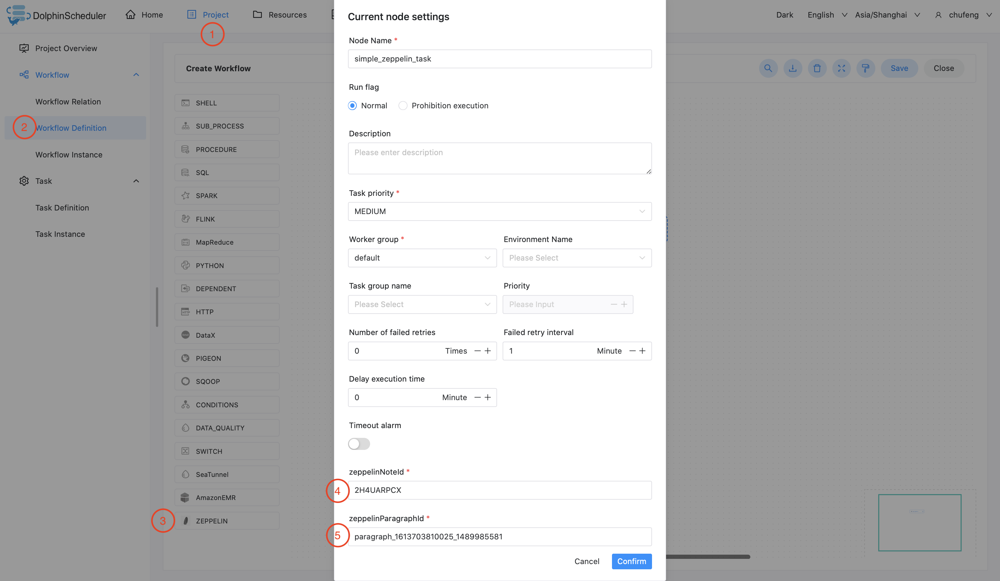
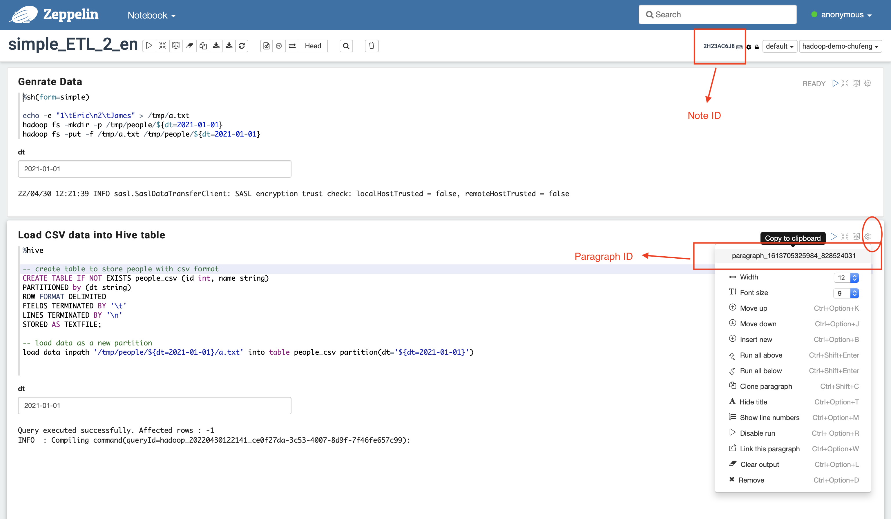

# Apache Zeppelin

## Overview

Use `Zeppelin Task` to create a zeppelin-type task and execute zeppelin notebook paragraphs. When the worker executes `Zeppelin Task`,
it will call `Zeppelin Client API` to trigger zeppelin notebook paragraph. Click [here](https://zeppelin.apache.org/) for details about `Apache Zeppelin Notebook`. 

## Create Task

- Click Project Management-Project Name-Workflow Definition, and click the "Create Workflow" button to enter the DAG editing page.
- Drag  from the toolbar to the canvas.

## Task Parameter

- Node name: The node name in a workflow definition is unique.
- Run flag: Identifies whether this node can be scheduled normally, if it does not need to be executed, you can turn on the prohibition switch.
- Descriptive information: Describe the function of the node.
- Task priority: When the number of worker threads is insufficient, execute in the order of priority from high to low, and tasks with the same priority will execute in a first-in first-out order.
- Worker grouping: Assign tasks to the machines of the worker group to execute. If `Default` is selected, randomly select a worker machine for execution.
- Number of failed retry attempts: The failure task resubmitting times. It supports drop-down and hand-filling.
- Failed retry interval: The time interval for resubmitting the task after a failed task. It supports drop-down and hand-filling.
- Timeout alarm: Check the timeout alarm and timeout failure. When the task exceeds the "timeout period", an alarm email will send and the task execution will fail.
- Zeppelin Note ID: The unique note id for a zeppelin notebook note.
- Zeppelin Paragraph ID: The unique paragraph id for a zeppelin notebook paragraph. If you want to schedule a whole note at a time, leave this field blank.
- Zeppelin Parameters: Parameters in json format used for zeppelin dynamic form.

## Task Example

### Zeppelin Paragraph Task Example

This example illustrates how to create a zeppelin paragraph task node.

